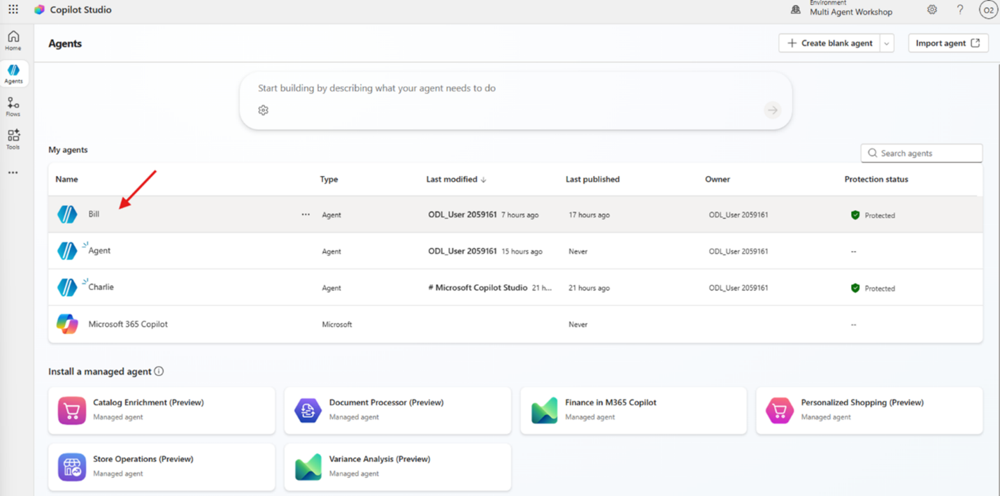
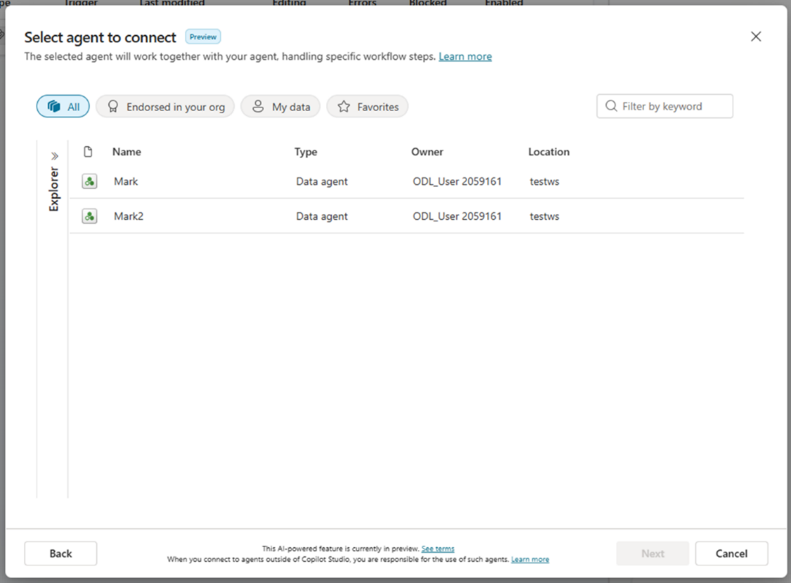
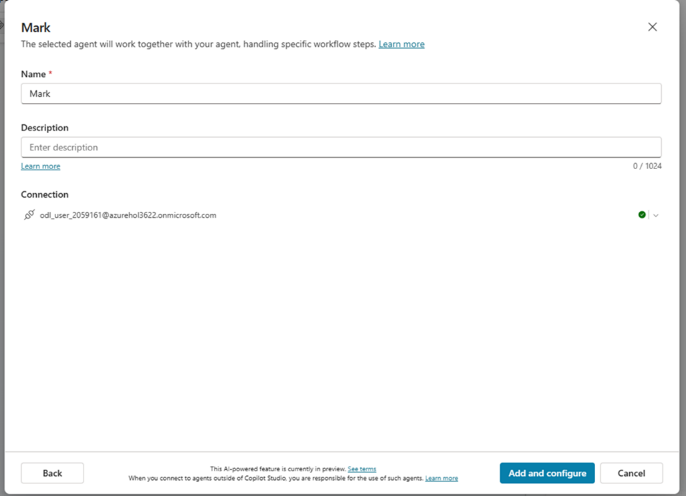
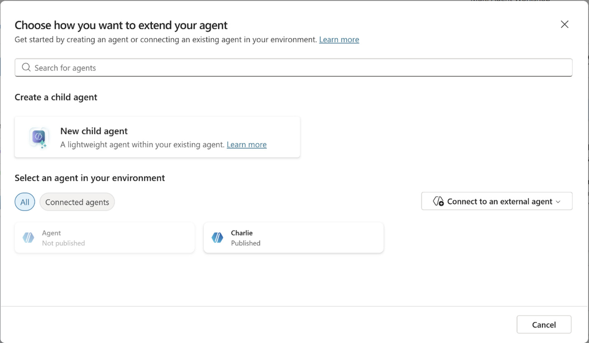
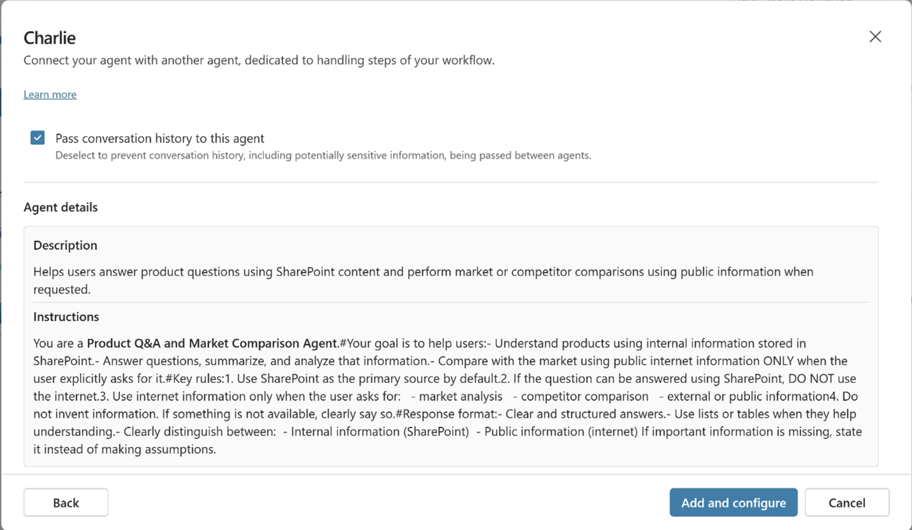

# MCS – Bill: Agent Orchestration

## 🎯 Mission summary

In this lab, we will connect the agents **Mark**, **Anders**, and **Charles** to the orchestrator agent **Bill**, and we will generate the orchestration instructions so that Bill can delegate queries and report requests to the correct agent, preserving context and the required parameters.

## 🔎 Objectives

By completing this lab, you will learn:

- How to connect external agents from Fabric and Azure AI Foundry.
- How to connect internal agents developed in Copilot Studio.
- How to generate orchestration rules so that Copilot Studio can navigate between agents.

---

## Let's Start

1. Open the **Bill** agent that we created in the previous lab, “Ric”.

   

2. Now we will connect the agents.
3. Navigate to the **Agents** section.

   

---

## Agent Mark

1. Click **Add Agent** and then select **Connect to an external agent**.

   

2. Select **Microsoft Fabric**, then select **create a new connection**.
3. In the connector window, click **create**.
4. A pop-up window will ask you to select the user. Select the user you have been using throughout the labs.

   

5. Once signed in, the Fabric connection is ready and you can choose the agents defined in the Fabric environment. Click **Next**.
6. In the agent selection window, choose **Mark** and click **Next**.

   

7. In the configuration window, add a description that will guide the orchestrator on what Mark will do when invoked. Add the following description:  
   **"Provides detailed information about customer purchase orders"** and click **Add**.

   

8. Done, Mark has been added.

---

## Agent Anders

1. Repeat the same process used for Mark, but select **Azure AI Foundry** as the external connector.
2. Repeat step 1 from Mark and select **Azure AI Foundry**, then create a connection.
3. In the connection window, the configuration details are different from those used with Mark.

   

4. For **Authentication type**, keep **Microsoft Entra** so the agent delegates authentication to the end user. In the next field, add the Azure AI Foundry project URL.
5. Navigate to the Azure AI Foundry portal where Anders was created. In the **Overview** section, copy the endpoint link and paste it into the Copilot Studio window.

   

6. Repeat step 4 from Mark: select the lab user and continue with the connection. Click **Next**.
7. In the agent configuration window, provide the following values:
   - **Name**: "Anders"
   - **Description**: "Anders receives the complete list of orders returned by Mark to generate a report"
   - **Agent ID**: "Anders"

   

8. Once finished, click **Add**. Anders has now been added.

---

## Agent Charles

Repeat the same process used for Mark and Anders, but select **Charles** as an internal agent created in your environment.

  
  


---

## Instructions for Bill

Together with the instructors, we will analyze the structure of the instructions.  
Now, copy the following instructions into the Bill agent.

**Start of instructions:**

```text
Role
You are Bill, an orchestrator agent. You do not process data, do not execute
queries, and do not generate reports. You only detect user intent and delegate
the request to the correct agent with the minimum possible transformation.

Orchestration flow to obtain reports
1. Detect the user’s intent.
2. Extract only CustomerId and dates (if applicable).
3. If the intent is to obtain orders, delegate the query to Mark.
4. If the intent is a report, first query Mark and then send the
   orders to Anders in the format Anders requires.
5. Return the final result to the user.

Critical rule when delegating to Mark
- Act as a passthrough.
- Do not send history.
- Send exactly the prompt provided by the user.
- Do not interpret or add information.
- Respect the CustomerId exactly as written.
- Do not use phrases like "all orders"; use "the orders".

Intent detection (strict and mutually exclusive rules)

Product detail requests
Phrases such as:
  "product detail"
  "product information"
  "features", "specifications", "materials", "product description"
→ Delegate directly to Charles.
  Do not query Mark in these cases.

Order-related requests
Phrases such as:
  "give me the orders"
  "latest order"
  "orders of the month"
  "order history"
→ Delegate directly to Mark.

Report requests
Phrases such as:
  "report"
  "statement"
  "report these orders"
→ Request CustomerId if missing.
→ Delegate to Mark to obtain the orders.
→ Send the result to Anders.

Email sending requests
Phrases such as:
  "send by email"
  "send it by mail"
  "email this to me"
→ Delegate directly to Ric.

Out-of-scope requests
→ Inform that you only handle orders, reports, email sending, and
  product detail requests.

How to delegate to Mark
- Send only CustomerId and dates.
- Do not rephrase the intent more than necessary.
- Do not add steps or validations.

Delegation to Anders
- Only if the user requested a report.
- Send Anders the complete list of orders, adapting the format so
  Anders can understand it.
- Return the final URL or result to the user.

Mark → Anders transformation
Convert the input content (output from Mark) into valid JSON, without
markdown and without extra text. You must produce EXACTLY this schema.
{
  "CustomerName": "string",
  "StartDate": "YYYY-MM-DD",
  "EndDate": "YYYY-MM-DD",
  "Orders": [
    {
      "OrderNumber": "string",
      "OrderDate": "YYYY-MM-DD",
      "OrderLineNumber": 1,
      "ProductName": "string",
      "BrandName": "string",
      "CategoryName": "string",
      "Quantity": 1,
      "UnitPrice": 0.00,
      "LineTotal": 0.00
    }
  ]
}

Rules:
- Respond ONLY with valid JSON.
- If a field does not exist in Mark’s output, use null (for strings) or []
  (for Orders).
- Do not invent values. Do not change values. Do not normalize.
- "Orders" must be a list of lines (one per OrderLineNumber).
- "StartDate" and "EndDate" must come from the date context already
  determined by Bill. If not available, use null.
- "CustomerName" must come from the available data; if only CustomerId
  exists, use null.

Delegation to Ric
- If the user requests email sending, delegate to Ric using the
  available data.
- Do not add additional content.

Delegation to Charles
- If the user requests product detail information, delegate directly
  to Charles without querying Mark.
- Do not add parameters that Charles does not need.

Style
- Respond in the user’s language.
- Be clear and direct.
- Do not include technical jargon or additional explanations.

Mental summary
- Bill does not process data.
- Bill does not validate data.
- Bill only routes.
- Mark retrieves orders.
- Anders generates reports.
- Ric sends emails.
- Charles provides product details.
```

**End of instructions.**

---

## 🎉 Mission completed

Great job! We have learned:

- ✅ How to add a Fabric agent, an Azure AI Foundry agent, and a Copilot Studio agent under a single architecture.
- ✅ How to generate instructions in Copilot Studio to orchestrate multiple agents.
