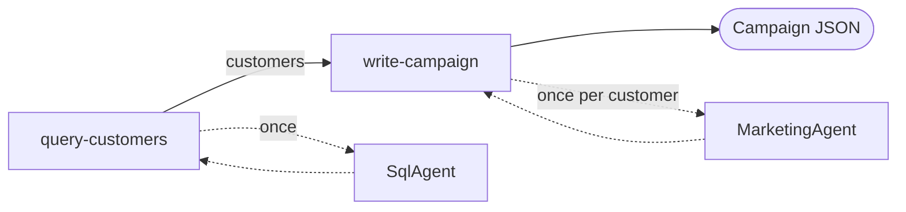
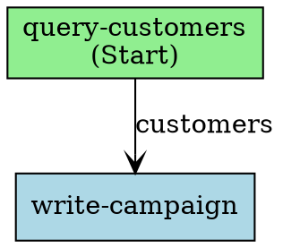
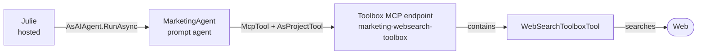

# Lab 4: Julie, the Campaign Orchestrator (hosted agent)

## Table of contents

- [Lab 4: Julie, the Campaign Orchestrator (hosted agent)](#lab-4-julie-the-campaign-orchestrator-hosted-agent)
	- [Table of contents](#table-of-contents)
	- [Introduction](#introduction)
  - [Advanced Foundry Agents Concepts](#advanced-foundry-agents-concepts)
    - [Workflow Agents](#workflow-agents)
    - [Hosted Agents](#hosted-agents)
    - [Toolbox-Based Tools (MCP)](#toolbox-based-tools-mcp)
    - [Implemented use case: personalized retail campaigns](#implemented-use-case-personalized-retail-campaigns)
	- [Setup continuity](#setup-continuity)
	- [Quick checklist](#quick-checklist)
		- [1) Verify SQL connection values](#1-verify-sql-connection-values)
		- [2) Alternative if you are not following the full lab sequence](#2-alternative-if-you-are-not-following-the-full-lab-sequence)
		- [3) Behavior when Fabric values are not provided](#3-behavior-when-fabric-values-are-not-provided)
	- [Manual configuration of permissions in Fabric (required for Lab 4)](#manual-configuration-of-permissions-in-fabric-required-for-lab-4)
		- [Part A — Workspace access](#part-a--workspace-access)
		- [Part B — SQL user and database permissions](#part-b--sql-user-and-database-permissions)
		- [Recommended validation](#recommended-validation)
	- [Julie project architecture (detailed)](#julie-project-architecture-detailed)
	- [What kind of agent is Julie now?](#what-kind-of-agent-is-julie-now)
	- [How the orchestration is implemented](#how-the-orchestration-is-implemented)
		- [The graph](#the-graph)
		- [Data modes: working without Fabric](#data-modes-working-without-fabric)
		- [The loop: one message per customer](#the-loop-one-message-per-customer)
		- [Seeing the graph](#seeing-the-graph)
	- [Definition of specialized agents](#definition-of-specialized-agents)
		- [SqlAgent](#sqlagent)
		- [MarketingAgent](#marketingagent)
		- [Julie (hosted)](#julie-hosted)
	- [Toolbox, Web Search, and MCP: how MarketingAgent searches](#toolbox-web-search-and-mcp-how-marketingagent-searches)
		- [What is a Toolbox in Microsoft Foundry?](#what-is-a-toolbox-in-microsoft-foundry)
		- [Web Search: the engine behind the Toolbox](#web-search-the-engine-behind-the-toolbox)
		- [MCP: the protocol that connects the agent with the Toolbox](#mcp-the-protocol-that-connects-the-agent-with-the-toolbox)
		- [From theory to our case: how we wired it into MarketingAgent](#from-theory-to-our-case-how-we-wired-it-into-marketingagent)
	- [What does Program.cs do exactly?](#what-does-programcs-do-exactly)
	- [Identity and permissions of the hosted agent](#identity-and-permissions-of-the-hosted-agent)
	- [Lab steps](#lab-steps)
		- [Step 1: Configure appsettings.json](#step-1-configure-appsettingsjson)
		- [Step 2: Ensure Fabric permissions are configured](#step-2-ensure-fabric-permissions-are-configured)
		- [Step 3: Deploy and run Julie](#step-3-deploy-and-run-julie)
		- [Step 4: Verify the role assignment](#step-4-verify-the-role-assignment)
		- [Step 5: Test the end-to-end flow](#step-5-test-the-end-to-end-flow)
		- [Lab validation](#lab-validation)
	- [Troubleshooting](#troubleshooting)
	- [Challenges](#challenges)
		- [Challenge 1: Improve the MarketingAgent prompt for current campaigns](#challenge-1-improve-the-marketingagent-prompt-for-current-campaigns)
		- [Challenge 2: Create a no-code agent with Code Interpreter](#challenge-2-create-a-no-code-agent-with-code-interpreter)

---

## Introduction

In this lab you will build and validate Julie, the marketing campaign orchestrator, as a **hosted agent** in Microsoft Foundry, written with the **Microsoft Agent Framework**.

Julie receives a natural language description of a customer segment and returns an e-mail campaign in JSON. She does it as a **deterministic workflow**: an explicit graph of two nodes, each wrapping one prompt agent, with `MarketingAgent` called once per customer so every recipient gets a message about the category they actually buy.

- `query-customers` — asks `SqlAgent` for the segment (T-SQL executed through the OpenAPI tool `SqlExecutor`), and falls back to clearly marked demo customers when Fabric SQL is not configured.
- `write-campaign` — loops over those customers, asks `MarketingAgent` for one message each, and assembles the final JSON.

> ✅ The lab runs end to end **even without Fabric**, using demo data that is always flagged as such. See [Data modes](#data-modes-working-without-fabric).

You will progressively configure the environment, verify permissions and SQL connectivity, deploy Julie's source code to Foundry, and run the end-to-end flow to obtain the final campaign output in JSON format.

## Advanced Foundry Agents Concepts

This lab enriches the Contoso Retail scenario with three complementary capabilities:

- **Workflow Agents**: explicit, deterministic orchestration built with the Microsoft Agent Framework.
- **Hosted Agents**: custom agent applications deployed and operated by Microsoft Foundry.
- **Toolbox-Based Tools (MCP)**: centrally managed tools exposed through a single endpoint compatible with the Model Context Protocol (MCP).

Together, these concepts show how to coordinate specialized agents, connect them to enterprise data and centrally governed tools, and deploy the orchestration as a Foundry agent.

### Workflow Agents

A workflow is an explicit graph of nodes and edges. The graph defines the order of execution and the data passed between steps.

Julie uses two nodes:

- `query-customers` obtains the customer segment through `SqlAgent`.
- `write-campaign` invokes `MarketingAgent` once for each customer and produces the campaign JSON.

The workflow is created with `WorkflowBuilder` and is represented by a `Workflow` object. `Workflow` is not itself an agent and does not expose an HTTP endpoint. `workflow.AsAIAgent(...)` adapts the graph to the `AIAgent` interface so it can receive requests and return responses.

The first node derives from `ChatProtocolExecutor`. This framework executor adapts the Foundry chat protocol, including incoming `ChatMessage` values and the `TurnToken`, to the workflow's typed messages. The node then emits a `CustomerQuery` object for the next node.

The specialized prompt agents remain `AIAgent` instances inside the workflow nodes. This structure allows the nodes to control typed data, error handling, fallback behavior, and per-customer iteration while still using the capabilities of the prompt agents.

### Hosted Agents

Julie is deployed as a Foundry hosted agent. The hosted project contains a web application that:

1. Creates the workflow.
2. Converts the workflow to an `AIAgent`.
3. Registers the agent with the Foundry Responses protocol.
4. Starts the web host.

The local deployer uploads the hosted project source through `CreateAgentVersionFromCodeAsync`. Foundry performs the remote build, creates the managed container, and exposes the hosted agent through its endpoint. This process does not require a Dockerfile, Docker commands, or an Azure Container Registry.

Foundry manages the hosted runtime, identity, version, endpoint, and operational integration. The hosted agent uses its managed identity to access the project and the prompt agents it invokes.

### Toolbox-Based Tools (MCP)

Besides tools embedded directly in an agent's definition (the pattern Anders uses with `OpenAPITool`), Foundry offers a second model: a **Toolbox** that centralizes a set of tools behind a single endpoint compatible with **MCP** (Model Context Protocol), an open standard for exposing tools to AI agents.

`MarketingAgent` uses this model for its **Web Search** tool: instead of a key-based connection (as Grounding with Bing Search required), the agent connects to a Toolbox's MCP endpoint via `McpTool` + `AsProjectTool` — the same generic mechanism you'd use to connect to any external MCP server.

This enables a third integration pattern, alongside those of Workflow Agents and Hosted Agents:

- The tool is versioned and governed at the **project** level, not the agent's.
- It can be replaced or versioned without recompiling or redeploying the agent that consumes it.
- The same connection mechanism (MCP) works both for Foundry's own tools (a Toolbox) and for third-party MCP servers.

See [Toolbox, Web Search, and MCP: how MarketingAgent searches](#toolbox-web-search-and-mcp-how-marketingagent-searches) for the full theory, protocol details, and a step-by-step walkthrough of the implementation.

### Implemented use case: personalized retail campaigns

Julie implements a retail campaign workflow:

1. A user describes the target customer segment in natural language.
2. `SqlAgent` generates the T-SQL query required to identify matching customers and their preferred product category.
3. `SqlExecutor` runs the query against the Fabric Warehouse.
4. `query-customers` converts the result into typed `Customer` records.
5. `write-campaign` calls `MarketingAgent` once per customer, providing the customer's name and preferred category.
6. Julie returns one personalized marketing message per customer in a JSON campaign document.

`MarketingAgent` uses Web Search (via a Foundry Toolbox) to incorporate current information into the messages. The result includes the campaign name, data source, demo-data indicators, warnings, and the personalized messages.

The workflow supports three data modes:

- `auto`: use Fabric when available and use clearly marked demo data when it is not.
- `real`: require Fabric data and surface SQL errors.
- `demo`: use the built-in fictional customers without querying Fabric.

Demo customers use `@example.invalid` addresses, and the response includes `dataSource`, `isDemoData`, and `warning` fields so test data cannot be mistaken for production data.

> **Agent type requirement:** the `kind` of an agent is immutable. If an existing agent has a different kind, the deployer recreates it as a hosted agent.

## Setup continuity

This lab assumes you have already completed:

- The base Foundry infrastructure deployment (`en/labs/foundry/codespaces-setup.md`)
- The Fabric data flow from **Lab 1** (`../fabric/lab01-data-setup.en.md`)

## Quick checklist

### 1) Verify SQL connection values

For the updated setup, these values are used:

- `FabricWarehouseSqlEndpoint`
- `FabricWarehouseDatabase`

They are obtained from the Fabric Warehouse SQL connection string:

- `FabricWarehouseSqlEndpoint` = `Data Source` without `,1433`
- `FabricWarehouseDatabase` = `Initial Catalog`

### 2) Alternative if you are not following the full lab sequence

If you are not following the full sequence of labs, for Lab 4 you can also use a standalone SQL database (for example Azure SQL Database), adjusting those two values to the corresponding host and database name.

### 3) Behavior when Fabric values are not provided

If you do not provide these values during setup, the infrastructure deployment does not fail, but the SQL connection for Lab 4 is not configured automatically and must be adjusted manually in the Function App.

In that situation `SqlExecutor` returns an HTTP 400 and `SqlAgent` cannot return rows. With the default `JULIE_DATA_MODE=auto`, Julie **still completes successfully** using demo customers, and the answer says so explicitly. See [Data modes](#data-modes-working-without-fabric).

## Manual configuration of permissions in Fabric (required for Lab 4)

After deployment, make sure that the Managed Identity of the Function App has access to the workspace and to the `retail` SQL database.

### Part A — Workspace access

1. Open the workspace where the `retail` database was deployed.
2. Go to **Manage access**.
3. Click **Add people or groups**.
4. Search for and add the Function App identity.
	- Expected name: `func-contosoretail-[suffix]`
	- Example: `func-contosoretail-siwhb`
5. For the role, select **Contributor**.
6. Click **Add**.

### Part B — SQL user and database permissions

1. Within the same workspace, open the `retail` database.
2. Click **New Query**.
3. Run the following T-SQL code to create the external user:

```sql
CREATE USER [func-contosoretail-[suffix]] FROM EXTERNAL PROVIDER;
```

Real example:

```sql
CREATE USER [func-contosoretail-siwhb] FROM EXTERNAL PROVIDER;
```

4. Then assign read permissions:

```sql
ALTER ROLE db_datareader ADD MEMBER [func-contosoretail-[suffix]];
```

Real example:

```sql
ALTER ROLE db_datareader ADD MEMBER [func-contosoretail-siwhb];
```

### Recommended validation

- Wait 1–3 minutes for permission propagation.

## Julie project architecture (detailed)

The solution is now split into **two projects**:

```text
en/labs/foundry/code/agents/
├── JulieAgent/            ← deployer + local chat client (runs on your machine)
│   ├── SqlAgent.cs             definition of the T-SQL prompt agent
│   ├── MarketingAgent.cs       definition of the Web-Search-enabled prompt agent (Toolbox)
│   ├── Program.cs              creates the sub-agents, deploys Julie, grants RBAC, opens the chat
│   ├── db-structure.txt        database schema injected into SqlAgent
│   └── appsettings.json
└── JulieHosted/           ← the agent itself (runs inside Foundry)
    ├── Program.cs              workflow graph, Responses protocol, query + loop nodes
    ├── hosted.csproj
    └── appsettings.json
```

> 🔎 `JulieAgent.cs`, which used to hold the CSDL YAML workflow definition, **no longer exists**. Its job is now done by `JulieHosted/Program.cs`.

> ⚠️ `JulieHosted` is deliberately a sibling of `JulieAgent`, not a subfolder. If it were nested, the parent `.csproj` would absorb its sources and the build would fail with `CS8802` (multiple entry points).

## What kind of agent is Julie now?

Julie is a **hosted agent** whose behaviour is an **Agent Framework workflow**: a containerized application that Foundry builds from your source code, runs, scales, and exposes through the **Responses** protocol.

- `SqlAgent` and `MarketingAgent` remain **prompt agents**. They keep their own instructions, tools (OpenAPI, Web Search) and versioning, and they are still visible and editable in the portal playground. Julie calls each of them from inside one of her nodes.
- Julie herself has no model and no instructions: she is the graph plus two nodes of code.

## How the orchestration is implemented

Julie is an **Agent Framework workflow**: an explicit graph of nodes and edges. `JulieHosted/Program.cs` builds the graph, turns it into an agent, and serves it:

```csharp
Workflow workflow = new WorkflowBuilder(queryCustomers)
    .AddEdge(queryCustomers, writeCampaign, label: "customers")
    .WithOutputFrom(writeCampaign)
    .Build();

AIAgent julie = workflow.AsAIAgent(
    name: "Julie",
    includeExceptionDetails: true,
    includeWorkflowOutputsInResponse: true);

var builder = AgentHost.CreateBuilder(args);
builder.Services.AddFoundryResponses(julie);
builder.RegisterProtocol("responses", endpoints => endpoints.MapFoundryResponses());
```

`Workflow.AsAIAgent(...)` returns an ordinary `AIAgent` (a `WorkflowHostAgent`), which is why the workflow can be served through the same Responses protocol as any other hosted agent.

### The graph



Two nodes, each one wrapping a prompt agent:

| Node | What it does |
|---|---|
| `query-customers` | Asks `SqlAgent` for the segment, parses the rows, and **falls back to demo customers** when Fabric SQL is unavailable |
| `write-campaign` | Loops over the customers, calls `MarketingAgent` once each, and assembles the JSON |

### Data modes: working without Fabric

`JULIE_DATA_MODE` decides what happens when the SQL side is not available:

| Mode | Behaviour |
|---|---|
| `auto` (default) | Try `SqlAgent`; on failure or empty result, use clearly marked demo customers |
| `real` | Never fall back — a SQL failure fails the run, which is what you want when diagnosing |
| `demo` | Never query SQL at all, useful for offline rehearsals |

The deployer passes it through from `appsettings.json`:

```json
"JulieDataMode": "auto"
```

The fallback is **explicit, never silent**. Demo customers use `@example.invalid` addresses, and the campaign carries `dataSource`, `isDemoData` and a `warning` explaining exactly why real data was not used.

### The loop: one message per customer

This is the part that makes the campaign useful. `write-campaign` calls `MarketingAgent` **once per customer**, passing that customer's name and favourite category:

```csharp
[YieldsOutput(typeof(string))]
internal sealed class WriteCampaign(AIAgent marketingAgent) : Executor<CustomerQuery>("write-campaign")
{
    public override async ValueTask HandleAsync(
        CustomerQuery query, IWorkflowContext context, CancellationToken cancellationToken = default)
    {
        List<object> messages = [];

        foreach (var customer in query.Customers)
        {
            if (string.IsNullOrWhiteSpace(customer.Email)) continue;

            var reply = await marketingAgent.RunAsync(
                $"Customer: {customer.FullName}. Favorite category: {customer.FavoriteCategory}.",
                cancellationToken: cancellationToken);

            messages.Add(new
            {
                to = customer.Email,
                subject = $"{customer.FirstName}, news about {customer.FavoriteCategory}",
                body = reply.Text
            });
        }
        // ... serialize the campaign and yield it
    }
}
```

A customer who buys **Bikes** gets a message about a cycling event; a customer who buys **Clothing** gets one about fashion week. Each recipient, their own text.

> 💡 The graph API has no dynamic fan-out (N customers → N parallel invocations of the same node), so the loop lives inside the node. That is what makes per-customer personalization possible today.

### Seeing the graph

The workflow can print itself as Graphviz DOT, and the agent does so on startup:

```csharp
Console.WriteLine(workflow.ToDotString());
```

This is the real output for Julie's graph:



Save it as `julie.dot` and render it with [Graphviz](https://graphviz.org/download/):

```bash
dot -Tsvg julie.dot -o julie.svg
```

The value is not the picture itself: the diagram is generated **from the running graph**, so it cannot drift away from the code.

### Startup behavior

The hosted application resolves the prompt agents before building the graph. If startup configuration is incomplete, the application builds a one-node workflow that reports the startup error through the same Responses endpoint:

```csharp
catch (Exception ex)
{
    StartupFailure failure = new(ex.Message);
    workflow = new WorkflowBuilder(failure).WithOutputFrom(failure).Build();
}
```

The container starts and the response contains `WORKFLOW_ERROR: ...` with the startup cause.

The graph executes the declared sequence: customer query, personalized campaign generation, and campaign output. The per-customer loop is implemented inside `write-campaign`.

## Definition of specialized agents

### SqlAgent

`SqlAgent.cs` defines a `prompt`-type agent with strict instructions to return exactly 4 columns (`FirstName`, `LastName`, `PrimaryEmail`, `FavoriteCategory`) and uses `db-structure.txt` as context.

Full instructions:

```text
You are **SqlAgent**, an agent specialized in generating T-SQL queries
for the Contoso Retail database.

Your **ONLY** responsibility is to receive a natural language description
of a customer segment and generate a valid T-SQL query that returns
**EXACTLY** these columns:
- FirstName (customer first name)
- LastName (customer last name)
- PrimaryEmail (customer email address)
- FavoriteCategory (the product category in which the customer has spent the most money)

To determine **FavoriteCategory**, you must JOIN the
orders, order lines, and products tables, group by category, and select
the one with the highest total amount (SUM of LineTotal).

DATABASE STRUCTURE:
{dbStructure}

RULES:
1. ALWAYS return EXACTLY the 4 columns: FirstName, LastName, PrimaryEmail, FavoriteCategory.
2. Use appropriate JOINs between customer, orders, orderline, product, and productcategory.
3. For FavoriteCategory, use a subquery or CTE that groups by category
   and selects the highest spend (SUM(ol.LineTotal)).
4. Include only active customers (IsActive = 1).
5. Include only customers with a non-null and non-empty PrimaryEmail.
6. DO NOT execute the query; only generate it.
7. Return ONLY the T-SQL code, with no explanation, no markdown,
   and no code blocks. Pure SQL only.
8. Always respond in English if you need to add any SQL comments.
```

Design rationale:

- Explicitly restricting columns reduces ambiguity in the output.
- Enforcing pure SQL (no markdown) avoids ambiguity when chaining the output with Julie.
- Injecting `db-structure.txt` improves join accuracy and table naming.

```csharp
return new PromptAgentDefinition(modelDeployment)
{
    Instructions = GetInstructions(dbStructure)
};
```

### MarketingAgent

`MarketingAgent.cs` is also a `prompt` agent, but incorporates Web Search through a Foundry Toolbox exposed as an MCP server:

Full instructions:

```text
You are **MarketingAgent**, an agent specialized in creating personalized marketing messages
for Contoso Retail customers.

Your workflow is as follows:

1. You receive the full name of a customer and their favorite purchase category.
2. You use the Web Search tool to look for recent or upcoming events
   related to that category. For example:
   - If the category is "Bikes", look for cycling events.
   - If the category is "Clothing", look for fashion events.
   - If the category is "Accessories", look for technology or lifestyle events.
   - If the category is "Components", look for engineering or manufacturing events.
3. From the search results, select the most relevant and current event.
4. Generate a brief and motivational marketing message (maximum 3 paragraphs) that:
   - Greets the customer by name.
   - Mentions the event found and why it is relevant to the customer.
   - Invites the customer to visit the Contoso Retail online catalog
     to find the best products in the category and be prepared for the event.
   - Uses a warm, enthusiastic, and professional tone.
   - Is written in English.

5. Return **ONLY** the text of the marketing message. No JSON, no metadata,
   and no additional explanations. Just the message ready to be sent by email.

IMPORTANT: If you do not find relevant events, generate a general message about
current trends in that category and invite the customer to explore the latest
offerings from Contoso Retail.
```

Design rationale:

- Separating marketing into its own agent decouples creativity from SQL logic.
- Web Search provides current context without "polluting" Julie with web searches.
- Limiting format/output simplifies later consolidation into campaign JSON.
- The Toolbox centralizes the tool at the project level: it can be versioned or its search engine swapped without recompiling `MarketingAgent`.

```csharp
McpTool mcpTool = ResponseTool.CreateMcpTool(
    serverLabel: "marketing-websearch",
    serverUri: toolboxMcpEndpoint,
    serverDescription: "Foundry Toolbox with the Web Search tool",
    toolCallApprovalPolicy: GlobalMcpToolCallApprovalPolicy.NeverRequireApproval);
ProjectsAgentTool webSearchTool = ProjectsAgentTool.AsProjectTool(mcpTool);

return new DeclarativeAgentDefinition(modelDeployment)
{
    Instructions = Instructions,
    Tools = { webSearchTool }
};
```

> 🔎 **Toolbox vs. direct tool**: unlike Anders (`OpenAPITool` embedded directly), MarketingAgent consumes Web Search through a **Toolbox** exposed as an MCP server. See the [Toolbox, Web Search, and MCP](#toolbox-web-search-and-mcp-how-marketingagent-searches) section below for the full theory and how it's wired into this use case.

### Julie (hosted)

Julie has **no instructions and no model of her own**. That is the point of the change: the orchestration is the graph, not a prompt. The model work happens inside `SqlAgent` and `MarketingAgent`, each with its own deployment and tools.

What used to be a long prompt full of "first call this, then call that" is now the shape of the graph plus one node of code:

| Old (workflow YAML / tools) | New (Agent Framework workflow) |
|---|---|
| Order written in prose or YAML actions | Order is the edges of the graph |
| A model decides whether to obey | The runtime executes the edges |
| Output format asked for in the prompt | Output built by `WriteCampaign` in C# |
| Could invent recipients | Cannot: the loop only iterates rows that came from SQL |

The anti-hallucination problem disappears by construction. The old workflow version invented recipients such as *John Doe* and *Jane Smith* when SQL returned nothing; here the loop has nothing to iterate, so the campaign comes back empty with a note.

## Toolbox, Web Search, and MCP: how MarketingAgent searches

This section digs into the theory behind `MarketingAgent`'s search tool: what a Toolbox is, what Web Search is, how the MCP protocol connects them, and how all of that translates into this lab's actual code.

### What is a Toolbox in Microsoft Foundry?

A **Toolbox** is a Foundry resource that groups a curated set of tools (web search, APIs, other MCP servers, etc.) behind a **single MCP-compatible endpoint**. Instead of each agent declaring its own tools one by one, the Toolbox centralizes them at the **project** level, and any agent pointing at that endpoint automatically "inherits" them.

Microsoft describes a Toolbox's lifecycle in four pillars:

| Pillar | What it solves |
|---|---|
| **Build** | Create the Toolbox and configure which tools it contains (a data-plane call via the SDK, no Bicep/ARM involved) |
| **Discover** | Any MCP client (including an agent) can list which tools the Toolbox exposes without needing to know them in advance |
| **Consume** | Agents connect to the Toolbox's MCP endpoint to invoke the tools at runtime |
| **Govern** | The Toolbox versions its content (`v1`, `v2`, ...) and centralizes permissions/authentication at the project level, independently of each agent consuming it |

The key design point is that the Toolbox **decouples the tool from the agent**: you can add, remove, or version a tool inside the Toolbox without touching or recompiling any agent that consumes it — something impossible with the "tool embedded directly" pattern that Anders uses.

In the .NET SDK this shows up as **two distinct type families**:

| Family | Examples | Where it can be used |
|---|---|---|
| `ProjectsAgentTool` (direct tool) | `OpenAPITool`, `BingGroundingTool`, `AzureAISearchTool` | Directly in the `Tools` of a `DeclarativeAgentDefinition` — Anders' pattern |
| `ToolboxTool` (toolbox tool) | `WebSearchToolboxTool`, `AzureAISearchToolboxTool`, `OpenApiToolboxTool`, `MCPToolboxTool` | **Only** inside a Toolbox version (`AgentToolboxes.CreateVersion(...)`); never directly in an agent's definition |

### Web Search: the engine behind the Toolbox

`WebSearchToolboxTool` is the tool we added to `MarketingAgent`'s Toolbox. It is Microsoft Foundry's **generally available (GA)** web search engine, fully managed by Microsoft:

- **Requires no external resource**: unlike Grounding with Bing Search (which required creating a `Microsoft.Bing/accounts` account and an API-key connection, as the previous version of this lab did), Web Search needs no account, connection, or additional credential of its own — Microsoft manages the underlying resource for you.
- **Still has a cost**: even though it requires no provisioning, Web Search is billed the same way as Grounding with Bing Search (they're the same engine under the hood). Not needing to create a resource doesn't mean it's free.
- **It's Microsoft's official recommendation** for replacing Grounding with Bing Search in new projects.
- **Only exists as a `ToolboxTool`**: there is no (yet) direct `WebSearchTool` for prompt agents in the SDK — that's why this change required introducing a Toolbox, and wasn't a simple tool-type swap.

> 💡 This is different from [**Web IQ**](https://aka.ms/WebIQLearn): it still works on invitation-based access, though it's expected to become the recommended option in the future.

### MCP: the protocol that connects the agent with the Toolbox

**MCP (Model Context Protocol)** is an open standard, based on JSON-RPC 2.0, for exposing tools to AI agents through a uniform interface: an MCP client opens a session against an MCP server, can list which tools it exposes (`list_tools`), and invoke them (`call_tool`), regardless of the technology behind the server.

Every Foundry Toolbox **is, simply put, an MCP server** hosting whichever tools you configured. It exposes two endpoint variants:

| Endpoint | Pattern | When to use it |
|---|---|---|
| **Developer** (version-specific) | `{project_endpoint}/toolboxes/{name}/versions/{version}/mcp?api-version=v1` | Test or validate a specific version before promoting it to default |
| **Consumer** (always the default version) | `{project_endpoint}/toolboxes/{name}/mcp?api-version=v1` | Connect agents — using this endpoint means promoting a new Toolbox version never requires touching or recompiling the agent |

Authentication against the Toolbox endpoint uses Microsoft Entra ID with the caller's own identity (the agent, for a hosted agent; the process invoking the API, for a prompt agent) — there's no need to manage separate tokens or API keys, since Web Search itself needs no third-party authentication either.

**How does a *prompt* (non-hosted) agent connect to that MCP server?** Unlike hosted agents — which use Agent Framework's `HostedMcpToolboxAITool`, resolved at runtime through a logical `foundry-toolbox://` scheme that only Foundry's own sandbox understands —, a prompt agent like `MarketingAgent` uses the OpenAI SDK's **generic** MCP mechanism, in two steps:

```csharp
// 1) A generic McpTool, pointing at ANY MCP server by http(s) URL
//    (the Toolbox's "consumer" endpoint is just one particular case)
McpTool mcpTool = ResponseTool.CreateMcpTool(
    serverLabel: "marketing-websearch",
    serverUri: toolboxMcpEndpoint,
    toolCallApprovalPolicy: GlobalMcpToolCallApprovalPolicy.NeverRequireApproval);

// 2) The bridge that makes it compatible with the agent's declarative definition
ProjectsAgentTool webSearchTool = ProjectsAgentTool.AsProjectTool(mcpTool);
```

This detail matters: **the same mechanism works with any external MCP server**, not just a Foundry Toolbox. A Toolbox is nothing more than Foundry's own implementation of an MCP server, with the added benefit of versioning and centralized governance at the project level — but the agent-side "wiring" is identical to what you'd use to connect to any public MCP server.

### From theory to our case: how we wired it into MarketingAgent

The full flow, from when `Program.cs` starts up to when `MarketingAgent` responds with a real event, is:



Step by step, as implemented in [Program.cs](code/agents/JulieAgent/Program.cs) and [MarketingAgent.cs](code/agents/JulieAgent/MarketingAgent.cs):

1. **`Program.cs`** creates (or reuses, if it already exists) a Toolbox version called `marketing-websearch-toolbox` containing a single `WebSearchToolboxTool` — no connection or credentials, just like creating an agent.
2. It computes the Toolbox's **consumer** endpoint URL from the project endpoint: `{foundryEndpoint}/toolboxes/marketing-websearch-toolbox/mcp?api-version=v1`.
3. It passes that URL to `MarketingAgent.GetAgentDefinition(modelDeployment, toolboxMcpEndpoint)`, which builds the `McpTool` + `AsProjectTool` and attaches it as the agent's only tool.
4. When **Julie** (hosted agent, unchanged) invokes `MarketingAgent` as a sub-agent — via `projectClient.AsAIAgent(...).RunAsync(...)`, the same mechanism it uses to call `SqlAgent` —, `MarketingAgent`'s model decides to invoke the search tool; Foundry opens an MCP session against the Toolbox, runs the search with `WebSearchToolboxTool`, and returns the results to the model like any other tool call.

This was already validated end-to-end in production: when testing the full flow, Julie generated a marketing campaign citing a real, current event (*UCI Gran Fondo World Series 2026*) for a customer in the "Bikes" segment — confirming that the full Toolbox → MCP → prompt agent → hosted agent chain works just as it did before with Bing, but without needing any external connection or resource.

With that, the map of the three ways of consuming tools that coexist in this workshop looks like this:

| Agent | Type | How it consumes its tool |
|---|---|---|
| **Anders** | prompt | `OpenAPITool` embedded directly in the agent's definition |
| **MarketingAgent** | prompt | `McpTool` + `AsProjectTool` pointing at a **Toolbox**'s MCP endpoint |
| **Julie** | hosted (workflow) | Has no tools of its own — orchestrates `SqlAgent` and `MarketingAgent` as sub-agents from code |

## What does Program.cs do exactly?

`JulieAgent/Program.cs` contains no campaign business logic; its role is operational:

1. Load `appsettings.json`.
2. Read `db-structure.txt`.
3. Download the Function App OpenAPI spec (if available).
4. Create or reuse the Web Search Toolbox used by `MarketingAgent` (no connection or credentials needed: it's a data-plane call, same as creating an agent).
5. Create or reuse the **prompt** sub-agents in Foundry.
6. Deploy **Julie** as a hosted agent from the `JulieHosted` source folder.
7. Grant Julie's identity the role it needs on the project.
8. Open an interactive chat with Julie.

The `EnsureAgent(...)` helper implements the **find → decide override → create version** pattern for the two prompt agents:

```csharp
await EnsureAgent(SqlAgent.Name, SqlAgent.GetAgentDefinition(modelDeployment, dbStructure, openApiSpecJson));
await EnsureAgent(MarketingAgent.Name, MarketingAgent.GetAgentDefinition(modelDeployment, marketingToolboxEndpoint));
```

Julie is deployed from source with `CreateAgentVersionFromCodeAsync`:

```csharp
HostedAgentDefinition julieDefinition = new(cpu: "0.5", memory: "1Gi")
{
    Versions = { new ProtocolVersionRecord(ProjectsAgentProtocol.Responses, "2.0.0") },
    CodeConfiguration = new(
        runtime: "dotnet_10",
        entryPoint: ["dotnet", "julie-hosted.dll"],
        dependencyResolution: CodeDependencyResolution.RemoteBuild)
};
julieDefinition.EnvironmentVariables.Add("FOUNDRY_PROJECT_ENDPOINT", foundryEndpoint);
julieDefinition.EnvironmentVariables.Add("AZURE_AI_MODEL_DEPLOYMENT_NAME", modelDeployment);

ProjectsAgentVersion julieVersion = await agentsClient.CreateAgentVersionFromCodeAsync(
    agentName: julieAgentName,
    filePath: hostedSourcePath,
    metadata: new AgentVersionFromCodeMetadata(julieDefinition));
```

The deployer then polls until the version reaches `active` and routes the agent endpoint to it:

```csharp
await agentsClient.PatchAgentAsync(julieAgentName, new PatchAgentOptions
{
    AgentEndpoint = new AgentEndpointConfiguration
    {
        VersionSelector = new([new FixedRatioVersionSelectionRule(julieVersion.Version, 100)]),
        ProtocolConfiguration = new() { Responses = new ResponsesProtocolConfiguration() }
    }
});
```

Finally, the chat targets the hosted agent endpoint:

```csharp
ProjectResponsesClient responseClient = projectClient.ProjectOpenAIClient
    .GetProjectResponsesClientForAgentEndpoint(julieAgentName);
```

> ⚠️ **Local build output breaks the remote build.** The SDK uploads the folder as-is; a stale `bin/` or `obj/` makes the remote compilation fail with `CS2001`. The deployer deletes both folders before packaging. For the same reason, leftover files from `dotnet new web` (such as a `Properties/` folder) were removed: subfolders are not uploaded, but the build still looks for them and fails with `MSB3030`.

> ⚠️ **Package versions.** The official quickstart pins `Azure.AI.Projects 2.1.0-beta.4`, which is **incompatible** with Agent Framework and produces `NU1605`. Both projects in this lab use `Azure.AI.Projects 3.0.0-beta.2`.

## Identity and permissions of the hosted agent

A hosted agent runs under **its own Microsoft Entra identity**, exposed as `instance_identity.principal_id` on the agent object. That identity starts with **no roles at all**, so Julie cannot even read the definitions of `SqlAgent` and `MarketingAgent` until you grant her access.

Symptom when the role is missing:

```text
HTTP 403: Forbidden
Identity(object id: ...) does not have permissions for
Microsoft.CognitiveServices/accounts/AIServices/agents/read actions.
```

Two things are worth knowing:

| Role | What it grants | Enough for Julie? |
|---|---|---|
| `Foundry Agent Consumer` | only `.../endpoints/interact/action` | ❌ No — Julie still gets 403 on `agents/read` |
| `Foundry User` | `Microsoft.CognitiveServices/*` data actions | ✅ Yes |

- The role must be assigned at the **project** scope (`.../accounts/<account>/projects/<project>`). Assigning it only at the account scope was not enough in practice.
- The `principal_id` **changes every time the agent object is deleted and recreated**, which is exactly what happens when you migrate Julie from `workflow` to `hosted`.

Because of that last point, **the deployer performs the assignment itself** on every run, right after Julie becomes active:

```text
[RBAC] Granting 'Foundry User' to Julie's identity 95c37595-306b-434c-9033-da90333cc2bd...
[RBAC] Role assigned. It may take about a minute to take effect.
```

If your account is not allowed to create role assignments, the deployer does not crash: it prints the exact command to run instead.

```bash
az role assignment create \
  --role "Foundry User" \
  --assignee-object-id <principal-id> \
  --assignee-principal-type ServicePrincipal \
  --scope "/subscriptions/<sub>/resourceGroups/rg-contoso-retail/providers/Microsoft.CognitiveServices/accounts/ais-contosoretail-<suffix>/projects/aip-contosoretail-<suffix>"
```

> 🔐 To let the deployer do this for you, your own account needs **Foundry Project Manager** on the project or **Owner** on the resource group. See `setup.md`.

## Lab steps

### Step 1: Configure appsettings.json

Open `en/labs/foundry/code/agents/JulieAgent/appsettings.json` and replace all `<suffix>` values with the outputs from the deployment:

```json
{
  "FoundryProjectEndpoint": "https://ais-contosoretail-<suffix>.services.ai.azure.com/api/projects/aip-contosoretail-<suffix>",
  "ModelDeploymentName": "gpt-deployment",
  "FunctionAppBaseUrl": "https://func-contosoretail-<suffix>.azurewebsites.net/api",
  "SubscriptionId": "<subscription-id>",
  "ResourceGroupName": "rg-contoso-retail",
  "JulieDataMode": "auto"
}
```

All these values are obtained from the deployment script output (or from the portal → AI Foundry resource → **Project settings** → **Overview**). `SubscriptionId` and `ResourceGroupName` are only used to grant Julie the **Foundry User** role on the project; they are unrelated to `MarketingAgent`'s Web Search tool, which needs no connection or credentials.

### Step 2: Ensure Fabric permissions are configured

Before running, confirm that you have already completed the **Manual configuration of permissions in Fabric** section in this document (Parts A and B). If you haven't, the Function App will not be able to execute SQL against the Warehouse and `SqlAgent` will fail.

### Step 3: Deploy and run Julie

From the terminal, at the root of the repository:

```bash
cd /workspaces/multi-agentic-workshop/en/labs/foundry/code/agents/JulieAgent
dotnet run
```

On startup, the program:

1. Downloads the OpenAPI spec from the Function App (may take a few seconds).
2. Asks whether to recreate `SqlAgent` and `MarketingAgent`. Answer `n` to keep the existing ones.
3. Checks the `kind` of the existing `Julie`. If she is still a `workflow`, it asks permission to delete her, because the `kind` cannot be changed in place.
4. Uploads the `JulieHosted` folder and waits for Foundry to build and provision it.
5. Assigns the `Foundry User` role to Julie's new identity.
6. Opens an interactive chat in the terminal.

Expected output:

```text
[Foundry] Searching for agent 'SqlAgent'...
[Foundry] Agent 'SqlAgent' found
[Foundry] Delete 'SqlAgent' and recreate it from scratch? (y/N): n
[Foundry] Keeping existing 'SqlAgent'.
...
[Foundry] Agent 'Julie' not found. A new one will be created.
[Foundry] Uploading Julie hosted agent source from .../JulieHosted...
[Foundry] Julie version 1 created. Waiting for provisioning...
[Foundry] Provisioning status: creating (1/60)
[Foundry] Provisioning status: creating (2/60)
[Foundry] Provisioning status: active (3/60)
[Foundry] Julie endpoint routed to version 1
[RBAC] Granting 'Foundry User' to Julie's identity 95c37595-...
[RBAC] Role assigned. It may take about a minute to take effect.

[Foundry] All agents are ready.

=== Chat with Julie (type 'exit' to quit) ===
```

> ⏱️ The first deployment takes a few minutes because Foundry compiles the project remotely. Subsequent runs with unchanged source are much faster.

### Step 4: Verify the role assignment

```bash
az role assignment list \
  --scope "/subscriptions/<sub>/resourceGroups/rg-contoso-retail/providers/Microsoft.CognitiveServices/accounts/ais-contosoretail-<suffix>/projects/aip-contosoretail-<suffix>" \
  --query "[?roleDefinitionName=='Foundry User'].{principal:principalId, role:roleDefinitionName}" -o table
```

Julie's `principal_id` must appear in the list. If it does not, run the `az role assignment create` command from the previous section.

### Step 5: Test the end-to-end flow

Type a prompt describing the customer segment for the campaign. For example:

```text
Create a campaign for customers who have purchased bicycles
```

```text
Generate a campaign for customers whose favorite category is Clothing
```

The graph runs in order: `query-customers` gets the segment, `write-campaign` asks `MarketingAgent` for one message per customer:

```json
{
  "campaignName": "Contoso Retail campaign",
  "dataSource": "fabric",
  "isDemoData": false,
  "warning": null,
  "messageCount": 2,
  "messages": [
    {
      "to": "ana.torres@example.com",
      "subject": "Ana, news about Bikes",
      "body": "Dear Ana Torres, this year's Tour de France, running from July 4 to July 26, 2026..."
    },
    {
      "to": "luis.garcia@example.com",
      "subject": "Luis, news about Clothing",
      "body": "Dear Luis Garcia, Milan Women's Fashion Week, taking place September 22-28, 2026..."
    }
  ]
}
```

> ✅ The two bodies are **different**: one talks about cycling, the other about fashion, because each came from its own `MarketingAgent` call with that customer's category.

**Without Fabric configured**, the run still succeeds. This is real output from the lab environment:

```json
{
  "campaignName": "Contoso Retail campaign (DEMO DATA)",
  "dataSource": "demo",
  "isDemoData": true,
  "warning": "Fabric SQL is not available (HTTP 400 (invalid_request_error: tool_user_error)). These customers are fictional.",
  "messageCount": 3,
  "messages": [
    { "to": "ana.torres@example.invalid",  "subject": "Ana, news about Bikes",        "body": "...Tour de France 2026..." },
    { "to": "luis.garcia@example.invalid", "subject": "Luis, news about Clothing",    "body": "...New York, London, Milan and Paris Fashion Weeks..." },
    { "to": "mia.chen@example.invalid",    "subject": "Mia, news about Accessories",  "body": "...CES 2026, AI-enhanced earbuds, next-gen smartwatches..." }
  ]
}
```

The marketing half works exactly as it would with real data — three customers, three different topics — while `dataSource`, `isDemoData` and `warning` make it impossible to mistake the result for real customers.

With `JULIE_DATA_MODE=real` the same situation fails instead, with status `Failed` and the full `SqlExecutor` error, which is what you want while diagnosing the connection.

### Lab validation

The lab is considered complete when:

- [ ] `SqlAgent`, `MarketingAgent` and `Julie` appear in the Foundry portal (AI Foundry → your project → **Agents**).
- [ ] `Julie` is listed as a **hosted** agent with an `active` version.
- [ ] Julie's identity holds the `Foundry User` role on the project.
- [ ] The agent logs show the DOT graph printed at startup, with the two nodes.
- [ ] A campaign prompt returns one message **per customer**, each about that customer's own category.
- [ ] With Fabric configured, the answer carries `"dataSource": "fabric"`.
- [ ] Without Fabric, the run still succeeds and carries `"isDemoData": true` plus a warning — nothing is passed off as real.

---

## Troubleshooting

| Symptom | Cause | Fix |
|---|---|---|
| The answer comes back **empty** but nothing failed | `includeWorkflowOutputsInResponse` left at its default `false` | Set it to `true` in `AsAIAgent(...)` |
| `Workflow does not support ChatProtocol` | The start node only accepts `List<ChatMessage>` | Derive the start node from `ChatProtocolExecutor`, which also handles `TurnToken` |
| The campaign appears **twice** in one answer | An agent node forwarded its incoming messages, so the graph ran for the user turn and again for the answer | Wrap the agent inside a node, or set `ForwardIncomingMessages = false` |
| Every customer gets the same generic text | `MarketingAgent` is being called once for the whole segment | Call it inside the loop, once per customer, as `WriteCampaign` does |
| `"isDemoData": true` unexpectedly | Fabric SQL is unreachable and `JULIE_DATA_MODE=auto` fell back | Read the `warning` field; set `JULIE_DATA_MODE=real` to see the raw failure |
| Status `Failed` mentioning `SqlExecutor` | Fabric SQL is not configured **and** `JULIE_DATA_MODE=real` | Complete the Fabric section, or switch back to `auto` to keep the lab running |
| A custom node between two agent nodes is skipped | Not supported by the graph API | Wrap each agent inside a node of your own instead |
| `HTTP 424 session_not_ready` | The container crashed at startup | Keep the graph construction inside the `try/catch` that falls back to the one-node error workflow |
| `HTTP 403 ... agents/read` | Julie's identity has no role, or only `Foundry Agent Consumer` | Assign `Foundry User` at the **project** scope and wait ~1 minute |
| Status `Failed` mentioning `SqlExecutor` | The Fabric SQL connection is not configured | Complete the Fabric permissions section and the Function App settings |
| Remote build fails with `CS2001` | A local `bin/` or `obj/` was uploaded | The deployer deletes them; do not re-create them between the build and the upload |
| Remote build fails with `MSB3030` | The project references a subfolder that is not uploaded (for example `Properties/`) | Remove the leftover files generated by `dotnet new web` |
| `NU1605` package downgrade | `Azure.AI.Projects 2.1.0-beta.4` from the quickstart | Use `3.0.0-beta.2` in both projects |
| `CS8802` multiple entry points | `JulieHosted` nested inside `JulieAgent` | Keep `JulieHosted` as a sibling folder |
| Julie cannot change from workflow to hosted | The `kind` of an agent is immutable | Let the deployer delete and recreate the agent object |

---

## Challenges

### Challenge 1: Improve the MarketingAgent prompt for current campaigns

#### Context

When testing Julie's flow, MarketingAgent may generate messages based on outdated news or events (for example, events from previous years). This happens because the current prompt does not instruct Web Search to filter by date, nor does it tell the agent to discard old results.

#### Objective

Ensure that MarketingAgent **always** generates marketing messages based on current or upcoming events, never on events that have already passed.

#### Part A — Iterate the prompt in the Playground

1. Open the **Azure AI Foundry** portal at [https://ai.azure.com](https://ai.azure.com).
2. Navigate to your project and open the **Agents** section.
3. Locate the **MarketingAgent** agent and open it.
4. In the **Instructions** panel, modify the prompt to solve the outdated events problem.
5. Use the **Chat** panel in the playground to test iteratively. Send messages like:
   - `"Generate a marketing message for John Smith, whose favorite category is Bikes"`
   - `"Generate a message for Maria López, category Clothing"`
6. Iterate the prompt until **all** responses reference current or upcoming events.

> 💡 **Tip:** The playground allows you to modify and test the prompt immediately, without recompiling or redeploying. Use it to experiment quickly.

#### Part B — Bring the improved prompt to the code

Once you have a prompt that works correctly in the playground:

1. Copy the final instructions from the playground.
2. Open the `MarketingAgent.cs` file in the `JulieAgent` project.
3. Replace the contents of the `Instructions` property with the improved prompt.
4. Run `dotnet run` and overwrite MarketingAgent when prompted.
5. Verify that the behavior is identical to what you validated in the playground.

#### Success criteria

- In the playground, MarketingAgent generates messages that only reference current or upcoming events.
- The same prompt, transferred to the code, produces the same result when running Julie end-to-end.

---

### Challenge 2: Create a no-code agent with Code Interpreter

#### Context

Azure AI Foundry offers a visual **no-code/low-code** experience for creating agents directly from the portal. In addition to Web Search (which we already use in `MarketingAgent`), Foundry offers other integrated tools. In this challenge you will use **Code Interpreter** — a tool that allows the agent to write and execute Python code to analyze data, perform calculations, and generate charts.

#### Objective

Create an agent called **"SalesAnalyst"** from the Azure AI Foundry visual interface that analyzes Contoso Retail sales data and generates visualizations.

#### Steps

1. Open the **Azure AI Foundry** portal at [https://ai.azure.com](https://ai.azure.com).
2. Navigate to your project (`aip-contosoretail-<suffix>`).
3. In the side menu, go to **Agents**.
4. Click **+ New Agent**.
5. Configure the agent:
   - **Name:** `SalesAnalyst`
   - **Model:** Select `gpt-deployment`
   - **Instructions:** Copy and paste the following instructions:

```text
You are SalesAnalyst, a sales data analyst for Contoso Retail.

Your role is to receive sales data (as text, CSV, or as a description),
analyze it, and generate useful insights for the commercial team.

Capabilities:
1. When you receive sales data, use Code Interpreter to:
   - Calculate totals, averages, and trends.
   - Generate bar, line, or pie charts as appropriate.
   - Identify the best-selling products or categories.
2. Present the results clearly and in an executive format.
3. If the user uploads a CSV file, analyze it automatically.

Rules:
- Always respond in English.
- Generate charts whenever the data allows it.
- Always include an executive text summary in addition to the chart.
- Use professional colors in visualizations.
```

6. In the **Tools** section, click **+ Add tool**.
7. Select **Code Interpreter**.
8. Click **Save** (or **Create**).

#### Testing

Use the **Chat** panel to test with these conversations:

a. `"I have these sales by category: Bikes $45,000, Clothing $12,000, Accessories $8,500, Components $23,000. Generate a pie chart and tell me which category is the strongest."`

b. `"Compare Q1 vs Q2 sales: Q1 — Bikes: 120 units, Clothing: 340, Accessories: 210. Q2 — Bikes: 155, Clothing: 290, Accessories: 380. Generate a comparative chart and analyze the trend."`

c. `"Calculate the percentage growth of each category between Q1 and Q2 and rank them from highest to lowest growth."`

#### Success criteria

- The agent generates **Python code** that executes within the conversation.
- Responses include **charts** visible directly in the chat.
- The agent provides an **executive summary** in English along with each visualization.
- The **Code Interpreter** tool appears as enabled in the agent configuration.

#### Reflection

- How does Code Interpreter differ from the other tools (Web Search, OpenAPI)?
- What types of business tasks could you automate with an agent that executes code?
- Compare the experience of creating this agent visually vs. the programmatic creation of the previous agents:
  - What advantages does each approach have?
  - What limitations does the no-code approach have that the SDK doesn't?
