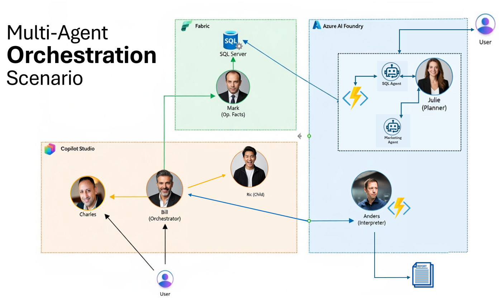

## <a id="descripcion-general"></a>Overview

This workshop guides participants through the design and implementation of a **multi‑agent** architecture using Microsoft services, applied to a **Contoso Retail**-style business scenario. The goal is not to build a production system, but to understand how to **orchestrate agents with clearly defined responsibilities** to answer different kinds of business questions over the same dataset.

The architecture is organized into three well‑defined layers:

- **Microsoft Fabric** as the data layer: hosts the retail SQL database and a Data Agent that answers natural-language questions.
- **Microsoft Foundry** as the reasoning and execution layer: agents that generate HTML reports via OpenAPI and plan marketing campaigns by querying the database.
- **Copilot Studio** as the orchestration and conversational experience layer: an orchestrator agent that connects all agents, a product agent with knowledge in SharePoint, and a child agent that sends email.

We will explore orchestration capabilities in both Copilot Studio and Microsoft Foundry.

------

## <a id="escenario"></a>Business scenario: Contoso Retail

Contoso is a retail company that sells products to both corporate and individual customers. Its data model includes information about customers, accounts, orders, order lines, invoices, payments, products, and categories.

On top of this model, the business needs to answer two main types of recurring questions:

1. **Operational questions**, focused on understanding what happened in a specific case.
2. **Analytical questions**, focused on understanding patterns, trends, and business signals.

The workshop shows how a single architecture can serve both needs without duplicating systems or logic.

------

## <a id="flujos"></a>Business flows covered

### <a id="flujo-operativo"></a>Operational flow

The operational flow answers concrete requests about customers, orders, and billing. In this flow, the objective is to reconstruct transactional facts precisely and produce visual artifacts (HTML reports) that summarize the information.

The implemented pipeline works as follows:

1. The user asks for operational information (for example, an order report for a specific customer).
2. **Bill** (the orchestrator) delegates to **Mark** (Fabric) to retrieve the exact transactional facts: orders, order lines, amounts, dates, and so on.
3. **Bill** delegates to **Anders** (Foundry) to generate a visual report from those data. Anders calls the `OrdersReporter` Azure Function via its OpenAPI tool, which builds an HTML report and uploads it to Blob Storage.
4. Anders returns the URL of the published report and Bill consolidates the final answer for the user.

Examples of operational questions:

- Generate a report of the orders for Izabella Celma.
- What are the orders and products for Marco Rivera?
- I need a visual summary of a customer’s recent purchases.

### <a id="flujo-analitico"></a>Analytical and planning flow

The analytical flow answers strategic and exploratory questions. Here the goal is not to explain a single case, but to identify relevant signals that help prioritize actions and generate concrete plans.

In this flow, **Julie** (Foundry) acts as the orchestrator agent for marketing campaigns, defined as a `workflow`. Julie coordinates a 5‑step flow: (1) extracts the customer segment filter from the user’s prompt, (2) calls **SqlAgent** to generate the corresponding T‑SQL query, (3) executes the T‑SQL against the Fabric database via the OpenAPI tool (`SqlExecutor` in the `FxContosoRetail` Azure Function), (4) for each returned customer, calls **MarketingAgent** (which uses Bing Search to find relevant events and generates a personalized marketing message), and (5) organizes everything into a JSON email campaign.

Examples of analytical and planning questions:

- Create a campaign for customers who have bought bicycles.
- Plan a retention campaign for inactive customers.

------

## <a id="arquitectura"></a>Architecture and agents



### <a id="capa-datos"></a>Microsoft Fabric – Data layer

- **Mark (Data Agent)**
  Fabric Data Agent that interprets natural language and queries the semantic model built over the `db_retail` SQL database (tables `customer`, `orders`, `orderline`, `product`). It reconstructs exact transactional facts and returns them as traceable data, without interpretation.

#### Database documentation

To better understand the data model used by the Fabric agents, detailed documentation of the Contoso Retail database has been added. This documentation includes:

- **ER diagram (Entity–Relationship)** showing relationships between the main tables
- **Table schemas** with all columns and data types

You can find the full documentation here: [Database Documentation](./assets/database.md)

### <a id="capa-razonamiento"></a>Microsoft Foundry – Reasoning layer

- **Anders (Executor Agent)**
  Executes operational actions by calling external services through an OpenAPI tool. It receives order data and calls the `OrdersReporter` endpoint on the `FxContosoRetail` Azure Function, which generates an HTML report and publishes it to Blob Storage, returning the document URL. It uses the `Azure.AI.Agents.Persistent` SDK with a GPT‑4.1 model to interpret the request, build the JSON payload, and orchestrate the API call.
- **Julie (Planner Agent)**
  Orchestrator agent for marketing campaigns, defined as `kind: "workflow"`. It coordinates three tools: **SqlAgent** (`type: "agent"`), which generates T‑SQL queries from natural language; an Azure Function tool called **SqlExecutor** (`type: "openapi"`), which executes the SQL against the Fabric database (the same Function App `FxContosoRetail` used earlier by Anders); and **MarketingAgent** (`type: "agent"`), which uses Bing Search to find relevant events and generates personalized marketing messages per customer. The final result is a JSON campaign with email drafts ready to send.

### <a id="capa-orquestacion"></a>Copilot Studio – Orchestration layer

- **Charles (Product Q&A Agent)**
  Product analyst agent that answers questions using documentation stored in SharePoint as its knowledge base. It can also perform competitive analysis and market comparisons using public information on demand.
- **Bill (Orchestrator)**
  Central orchestrator. Detects user intent and delegates to the appropriate agent: connects external Fabric agents (Mark) and Foundry agents (Anders) with internal Copilot Studio agents (Charles, Ric). It is published in Microsoft 365 and Teams.
- **Ric (Child Agent)**
  Child agent of Bill responsible for sending emails to the user with the requested information (for example, query results or links to reports).

------

## <a id="objetivo"></a>Workshop goals

By the end of the workshop, participants will understand:

- How to separate data, reasoning, and user experience.
- How to design agents with clearly defined responsibilities.
- How to orchestrate operational and analytical flows over a single business domain.
- How to use Copilot Studio or Microsoft Foundry as the central control layer in multi‑agent solutions.

This repository serves as a practical, reusable guide to understand and replicate this architectural pattern in real‑world scenarios.

## <a id="laboratorios"></a>Workshop contents

The workshop is divided into independent but connected labs, organized by architectural layer. It is recommended to follow them in order.

### 1. Microsoft Fabric labs

- [Lab 1 – Environment setup: Fabric capacity, workspace, SQL database, and semantic model](./labs/fabric/lab01-data-setup.md)
- [Lab 2 – Mark Agent: Data Agent over the retail semantic model](./labs/fabric/lab02-mark-facts-agent.md)

### 2. Azure AI Foundry labs

- [Foundry infrastructure setup](./labs/foundry/setup.md)
- [Lab 3 – Anders Agent: OpenAPI support, Function App deployment, and executor agent run](./labs/foundry/lab03-anders-executor-agent.md)
- [Lab 4 – Julie Agent: workflow agent with SqlAgent and MarketingAgent sub‑agents](./labs/foundry/lab04-julie-planner-agent.md)

### 3. Copilot Studio labs

- [Lab 5 – Copilot Studio setup: environment, solution, and publisher](./labs/copilot/lab05-mcs-setup.md)
- [Lab 6 – Charles Agent: product Q&A with SharePoint and market analysis](./labs/copilot/lab06-charles-copilot-agent.md)
- [Lab 7 – Ric Agent: child agent for email sending + initial Bill configuration](./labs/copilot/lab07-ric-child-agent.md)
- [Lab 8 – Bill Orchestrator: connecting external (Mark, Anders) and internal (Charles) agents and defining orchestration rules](./labs/copilot/lab08-bill-orchestrator.md)
- [Lab 9 – Publishing Bill in Microsoft 365 / Teams and end‑to‑end tests](./labs/copilot/lab09-bill-publishing.md)

---

## <a id="resultado"></a>Expected outcome

By the end of the workshop, participants will have built and understood:

- How to design agents with clear responsibilities.
- How to separate data, reasoning, and user experience.
- How to orchestrate multiple agents from Copilot Studio.
- How to reuse the same architectural pattern for different business scenarios.

This repository serves as a practical and reusable guide for designing multi‑agent solutions in real projects.

---

## <a id="requisitos"></a>Prerequisites

### <a id="conocimientos"></a>Knowledge

- Basic knowledge of Azure.
- General familiarity with data and analytics concepts.
- No deep prior experience with Fabric, Foundry, or Copilot Studio is required.

### <a id="requisitos-tecnicos"></a>Technical requirements (install before the workshop)

Each participant must have the following tools installed on their machine **before arriving at the workshop**:

| Tool | Description | Download |
|------|-------------|----------|
| **.NET 8 SDK** | Compile and run Azure Functions and Foundry agents | [Download](https://dotnet.microsoft.com/download/dotnet/8.0) |
| **Azure CLI** | Authenticate to Azure, deploy resources, and assign RBAC roles | [Install](https://learn.microsoft.com/cli/azure/install-azure-cli) |
| **Azure Functions Core Tools v4** | Publish Azure Functions to Azure | [Install](https://learn.microsoft.com/azure/azure-functions/functions-run-local#install-the-azure-functions-core-tools) |
| **PowerShell 7+** | Run infrastructure deployment scripts. **Required on all OSes** (including Windows). Do not use PowerShell 5.1. | [Install](https://learn.microsoft.com/powershell/scripting/install/installing-powershell) · Windows: `winget install Microsoft.PowerShell` |
| **Git** | Clone the workshop repository | [Download](https://git-scm.com/downloads) |
| **VS Code** (recommended) | Code editor with extensions for Azure and .NET | [Download](https://code.visualstudio.com/) |

> [!TIP]
> On **macOS**, you can install all tools with Homebrew:
> ```bash
> brew install dotnet-sdk azure-cli azure-functions-core-tools@4 powershell git
> brew install --cask visual-studio-code
> ```

> [!TIP]
> On **Linux** (Ubuntu/Debian), you can install PowerShell 7 with:
> ```bash
> # Install PowerShell 7
> sudo apt-get update && sudo apt-get install -y wget apt-transport-https software-properties-common
> wget -q "https://packages.microsoft.com/config/ubuntu/$(lsb_release -rs)/packages-microsoft-prod.deb"
> sudo dpkg -i packages-microsoft-prod.deb && rm packages-microsoft-prod.deb
> sudo apt-get update && sudo apt-get install -y powershell
> # Other tools
> sudo apt-get install -y dotnet-sdk-8.0 azure-cli git
> ```
> See full instructions at: [Install PowerShell on Linux](https://learn.microsoft.com/powershell/scripting/install/installing-powershell-on-linux)

> [!TIP]
> On **Windows**, you can install all tools with winget:
> ```powershell
> winget install Microsoft.DotNet.SDK.8 Microsoft.AzureCLI Microsoft.Azure.FunctionsCoreTools Microsoft.PowerShell Git.Git Microsoft.VisualStudioCode
> ```

### Verify the installation

After installing, verify that everything is available by running these commands in a terminal:

```powershell
dotnet --version        # Should show 8.x.x
az --version            # Should show azure-cli 2.x.x
func --version          # Should show 4.x.x
pwsh --version          # Should show PowerShell 7.x.x (REQUIRED on all OSes)
git --version           # Should show git version 2.x.x
```

### Configure ExecutionPolicy (Windows only)

PowerShell on Windows may block script execution by default. Run this **once** in `pwsh`:

```powershell
Set-ExecutionPolicy -ExecutionPolicy RemoteSigned -Scope CurrentUser
```

This allows running local scripts and downloaded scripts that are signed. It only affects the current user and does not require administrator permissions.

### Azure resources

- An active **Azure subscription** with **Owner** or **Contributor** permissions
- The **temporary tenant name** assigned for the workshop (provided on the day of the event)

---

## <a id="notas"></a>Final notes

This workshop is designed as a **pedagogical and architectural** exercise. The focus is on flow design and collaboration between agents, not on extreme optimization of models or queries.

[➡️ Next: Lab 1 – Environment setup in Microsoft Fabric](./labs/fabric/lab01-data-setup.md)
