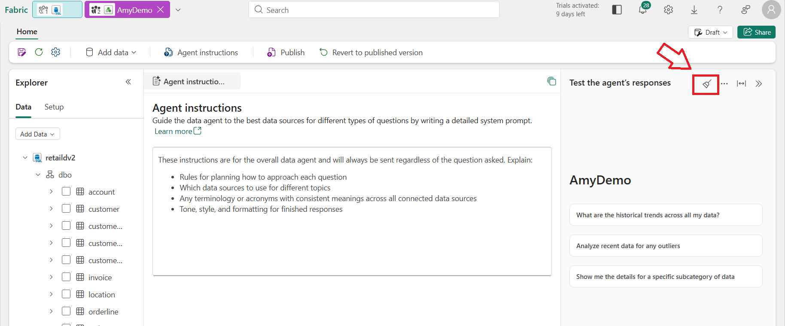
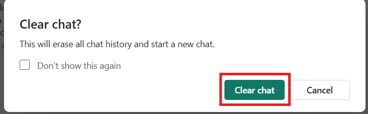

# Challenge

1. Crear un workspace en fabric: **wsfcagentic2**
2. Crear en Fabric la base de datos **retail2**
3. Ejecutar los scripts [Create databasev2.sql ](SQLScripts/CreateDatabasev2.sql).
4. Crear un Data Agente llamado **Amy** que se encargue de recuperar la información de los pagos asociados a una orden.  
   Use solo tablas como fuente de datos y no un modelo semántico.
5. Prueba las siguientes instrucciones:
   
   a. ¿Me puedes dar la información de los pagos de la orden `b71b11f7-e976-4bb6-ab5d-4d9c177258e8`?  
   Iniciar una nueva sesión de chat:

   

   Confirmar nueva sesión:
   
   

   b. ¿Cuál es el estado de la orden `b71b11f7-e976-4bb6-ab5d-4d9c177258e8`?  

   Iniciar una nueva sesión de chat.
   Confirmar nueva sesión.

   c. ¿Cuál es la suma de todos los pagos de la orden `002d82fb-ccff-4b81-8556-d59563b97a9f`?  
   
   Iniciar una nueva sesión de chat.
   Confirmar nueva sesión.

   d. ¿Cuál es valor total de la orden `002d82fb-ccff-4b81-8556-d59563b97a9f`? 
   
   Iniciar una nueva sesión de chat.
   Confirmar nueva sesión.

   e. **OPCIONAL:** ¿Existe una anomalía de pagos para la orden 002d82fb-ccff-4b81-8556-d59563b97a9f? Una anomalía de pagos se define como la situación en la que el valor total de los pagos es diferente al valor de una orden cuyo estado es Completada.

## Mission Complete

1. Elimine los ítems que creó en este reto para liberar recursos en la capacidad de Microsoft Fabric.
