# Lab Fabric Opcional: Crear un agente usando un Modelo Semantico

## 1. Crear Modelo Semántico 

En Microsoft Fabric, un modelo semántico es la capa de negocio que da significado a los datos técnicos y los hace fáciles de analizar, reutilizar y gobernar.

a. Ir al workspace

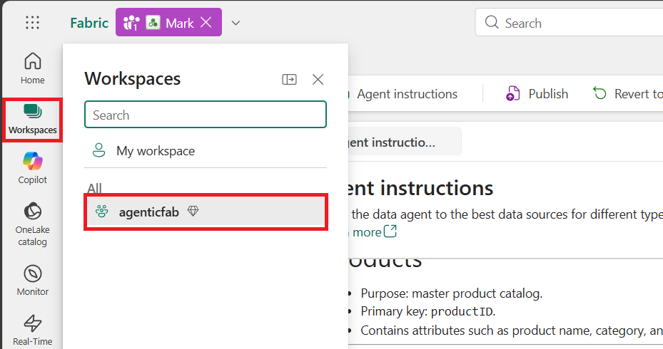

b. Abrir el SQL Analytics Endpoint de la base de datos db_retail

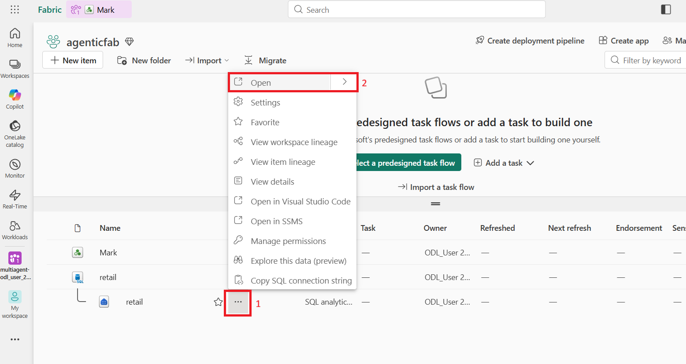

c. Crear un nuevo modelo semántico

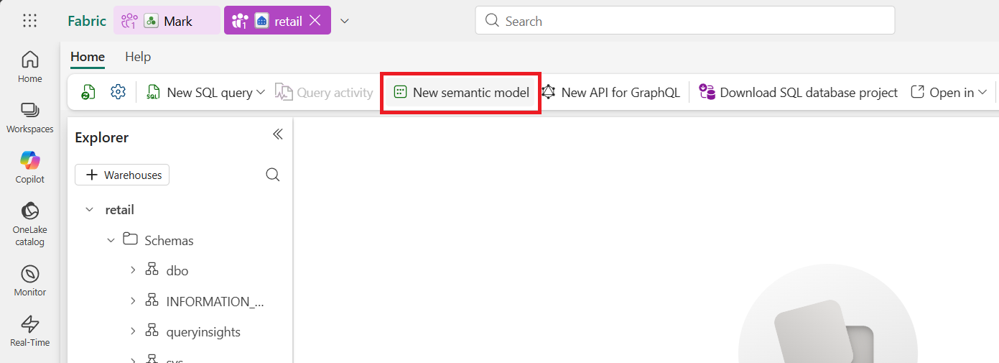

d. Configurar el modelo semántico:

i. Nombre: sm_retail  
ii. Workspace correspondiente  
iii. Tablas: customer, orders, orderline, product  
iv. Confirmar

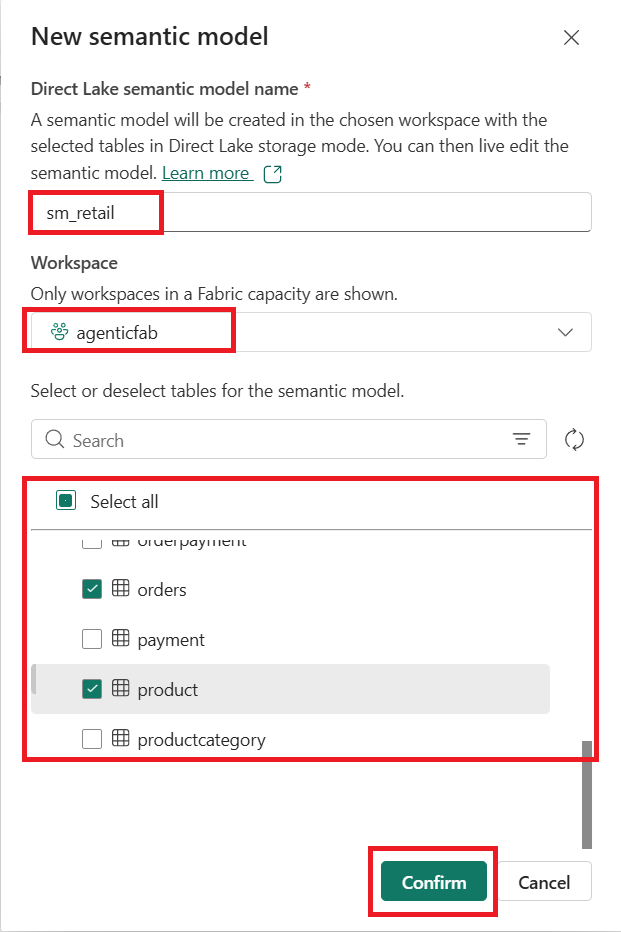

e. Abrir el modelo semántico creado

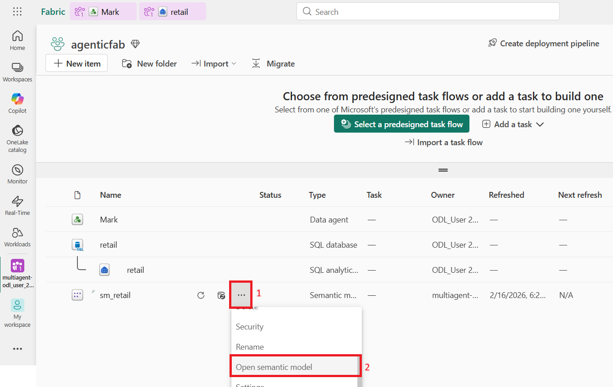

f. Cambiar a la vista de edición

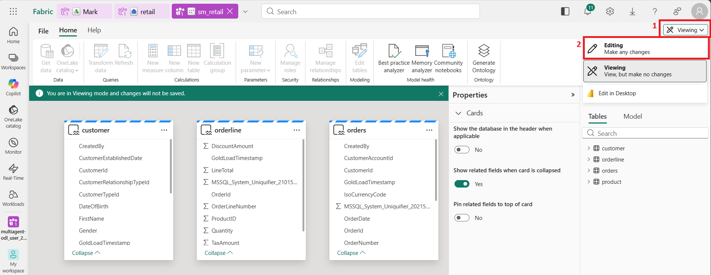

g. Crear relaciones del modelo semántico:

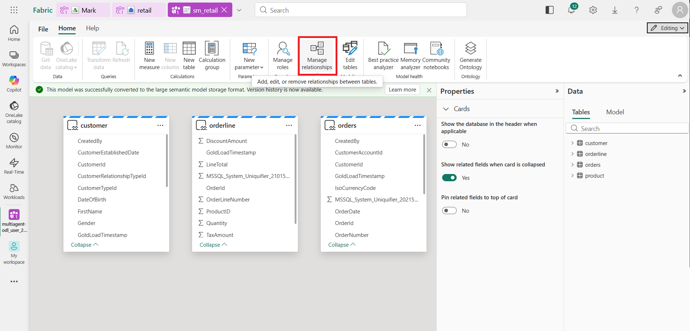
Agregar relación 
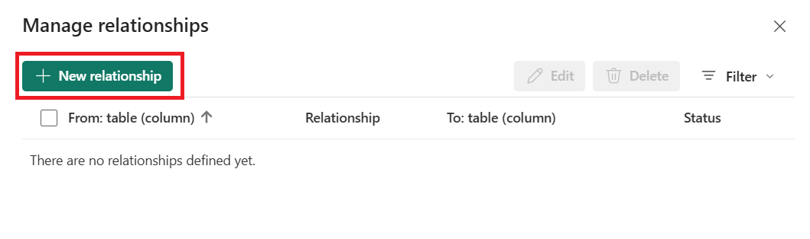

i. Customer → Orders (1:*)  

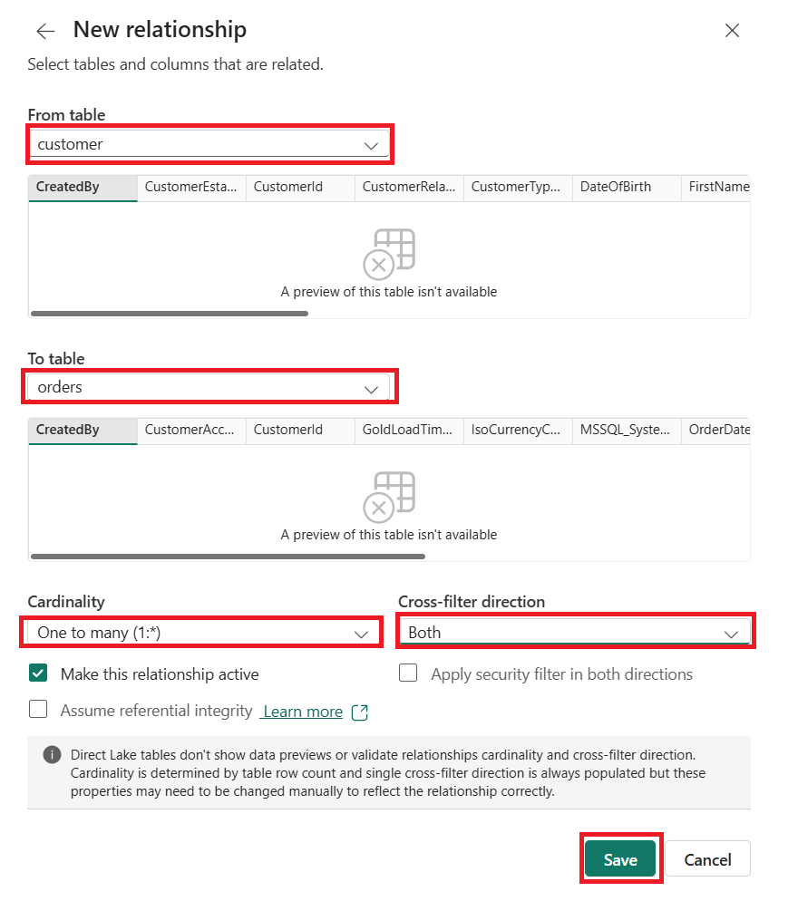

ii. Orders → Orderline (1:*)  

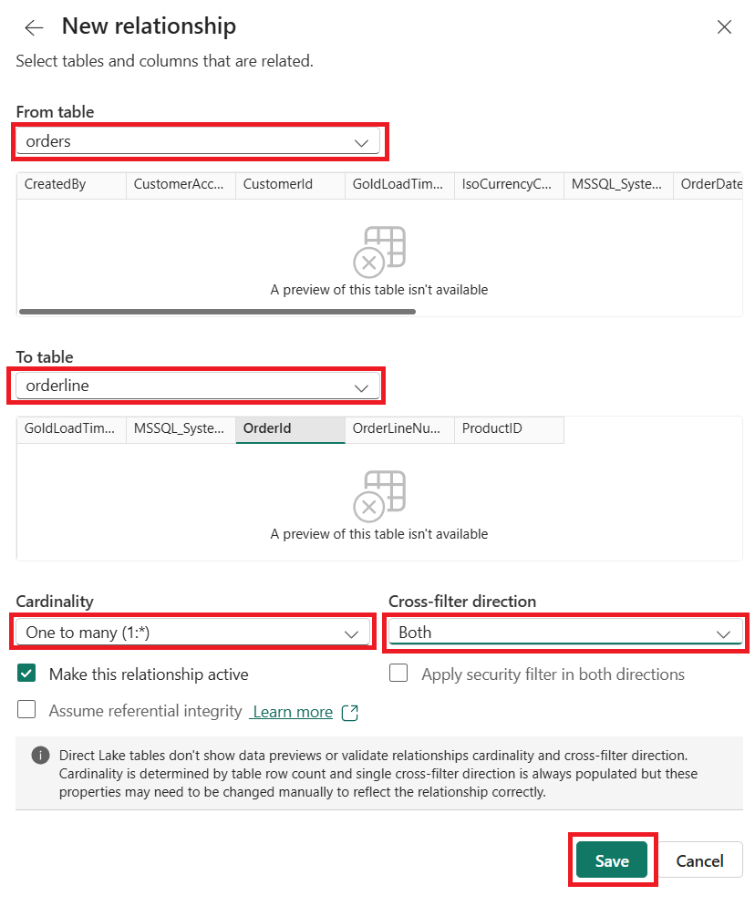

iii. Orderline → Product (1:1)

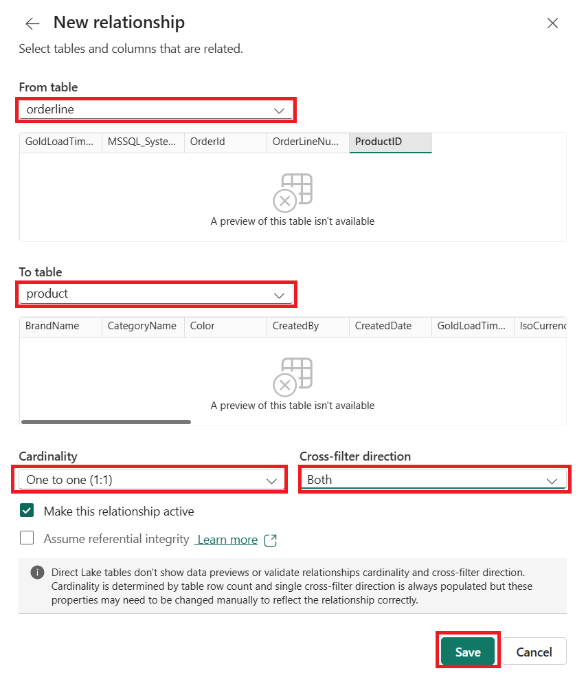

h. Resultado final del modelo semántico

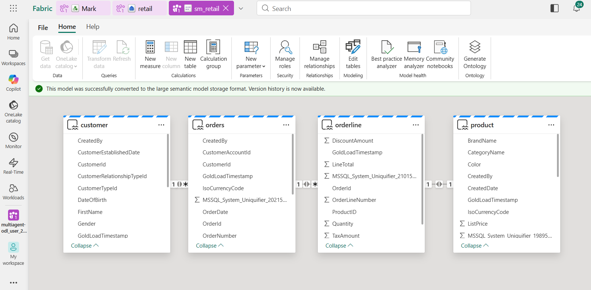

---

## 2. Usar el modelo Semántico como Fuente de datos del Data Agent

Implementar el punto 4 de [Data setup](lab01-data-setup.md)

### a. Puedes crear un nuevo data Agent o Eliminar la fuente de datos de Mark

i. Eliminar la fuente de datos de Mark

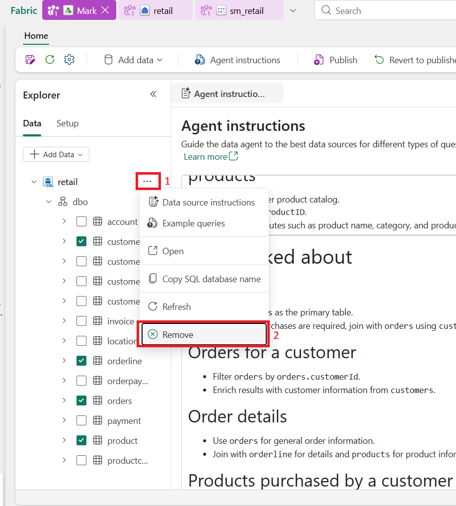

ii. Eliminar la instrucciones de la sección "Agent Instructions"

### b. Agregar la nueva fuente de datos
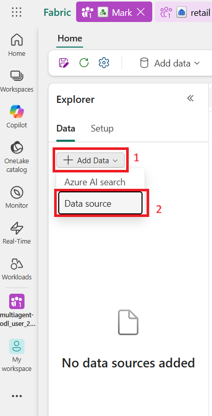

### c. Seleccionar el modelo semántico

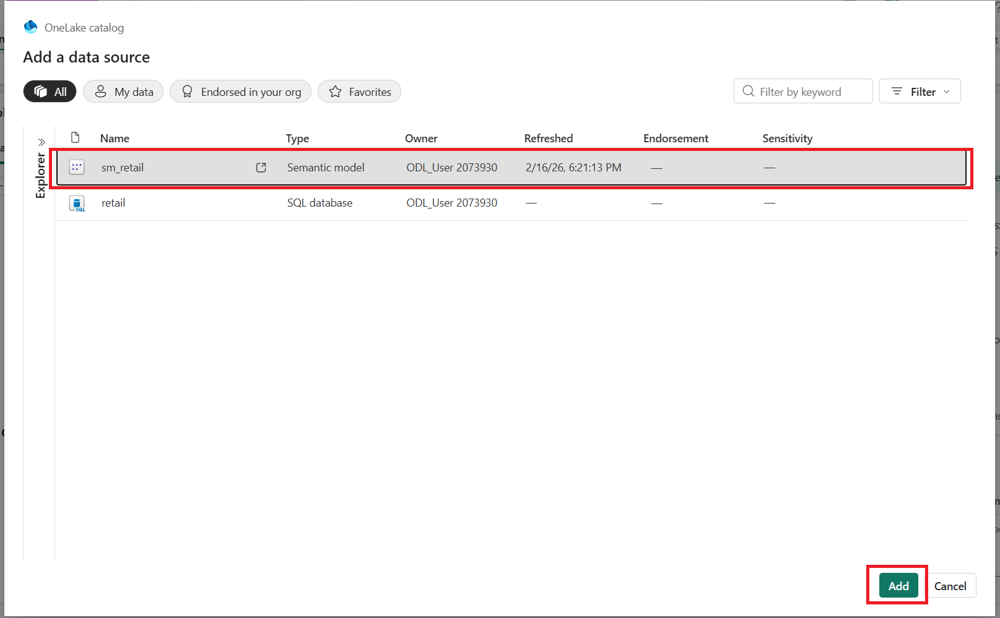

### d. Incluir las tablas Customer, Orders, Orderline, y Product
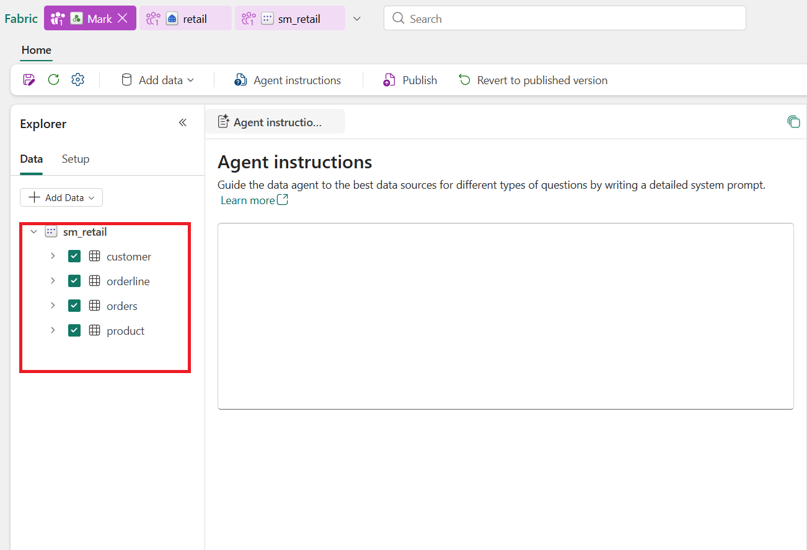

### e. Revisa el agente y si no responde de la forma esperada, agrega las instrucciones en la sección Agent Instructions.

### f. Si deseas puedes publicar una nueva versión del data agent o dejar la versión construida en el punto anterior

## 3. Challenge

Ir a [Challenge](Challenge.md)

## Mission Complete

