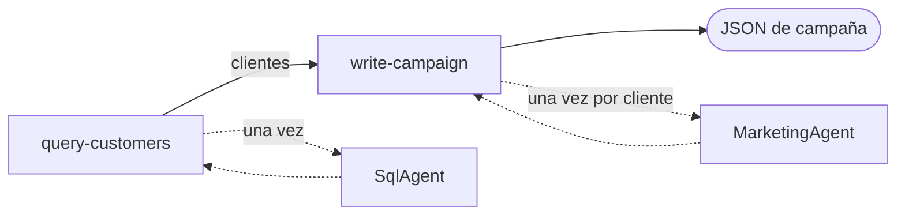
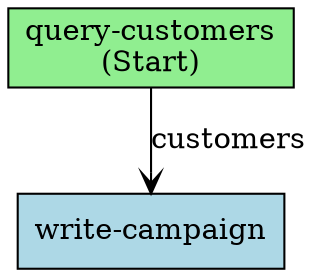
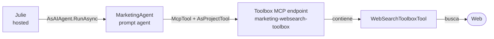

# Lab 4: Julie, la orquestadora de campañas (agente hospedado)

## Tabla de contenido

- [Lab 4: Julie, la orquestadora de campañas (agente hospedado)](#lab-4-julie-la-orquestadora-de-campañas-agente-hospedado)
	- [Tabla de contenido](#tabla-de-contenido)
	- [Introducción](#introducción)
  - [Advanced Foundry Agents Concepts](#advanced-foundry-agents-concepts)
    - [Workflow Agents](#workflow-agents)
    - [Hosted Agents](#hosted-agents)
    - [Toolbox-Based Tools (MCP)](#toolbox-based-tools-mcp)
    - [Caso de uso implementado: campañas de retail personalizadas](#caso-de-uso-implementado-campañas-de-retail-personalizadas)
	- [Continuidad del setup](#continuidad-del-setup)
	- [Checklist rápido](#checklist-rápido)
		- [1) Verificar valores de conexión SQL](#1-verificar-valores-de-conexión-sql)
		- [2) Alternativa si no sigues toda la secuencia de labs](#2-alternativa-si-no-sigues-toda-la-secuencia-de-labs)
		- [3) Comportamiento cuando no se pasan valores de Fabric](#3-comportamiento-cuando-no-se-pasan-valores-de-fabric)
	- [Configuración manual de permisos en Fabric (obligatorio para Lab 4)](#configuración-manual-de-permisos-en-fabric-obligatorio-para-lab-4)
		- [Parte A — Acceso al Workspace](#parte-a--acceso-al-workspace)
		- [Parte B — Usuario SQL y permisos en la base](#parte-b--usuario-sql-y-permisos-en-la-base)
		- [Validación recomendada](#validación-recomendada)
	- [Arquitectura del proyecto Julie (detalle)](#arquitectura-del-proyecto-julie-detalle)
	- [¿Qué tipo de agente es Julie ahora?](#qué-tipo-de-agente-es-julie-ahora)
	- [Cómo se implementa la orquestación](#cómo-se-implementa-la-orquestación)
		- [El grafo](#el-grafo)
		- [Modos de datos: funcionar sin Fabric](#modos-de-datos-funcionar-sin-fabric)
		- [El bucle: un mensaje por cliente](#el-bucle-un-mensaje-por-cliente)
		- [Ver el grafo](#ver-el-grafo)
	- [Definición de agentes especializados](#definición-de-agentes-especializados)
		- [SqlAgent](#sqlagent)
		- [MarketingAgent](#marketingagent)
		- [Julie (hospedada)](#julie-hospedada)
	- [Toolbox, Web Search y MCP: cómo busca MarketingAgent](#toolbox-web-search-y-mcp-cómo-busca-marketingagent)
		- [¿Qué es un Toolbox en Microsoft Foundry?](#qué-es-un-toolbox-en-microsoft-foundry)
		- [Web Search: el motor detrás del Toolbox](#web-search-el-motor-detrás-del-toolbox)
		- [MCP: el protocolo que conecta el agente con el Toolbox](#mcp-el-protocolo-que-conecta-el-agente-con-el-toolbox)
		- [De la teoría a nuestro caso: cómo lo conectamos en MarketingAgent](#de-la-teoría-a-nuestro-caso-cómo-lo-conectamos-en-marketingagent)
	- [¿Qué hace exactamente Program.cs?](#qué-hace-exactamente-programcs)
	- [Identidad y permisos del agente hospedado](#identidad-y-permisos-del-agente-hospedado)
	- [Pasos del laboratorio](#pasos-del-laboratorio)
		- [Paso 1: Configurar appsettings.json](#paso-1-configurar-appsettingsjson)
		- [Paso 2: Asegurarte de que los permisos de Fabric están configurados](#paso-2-asegurarte-de-que-los-permisos-de-fabric-están-configurados)
		- [Paso 3: Desplegar y ejecutar Julie](#paso-3-desplegar-y-ejecutar-julie)
		- [Paso 4: Verificar la asignación de rol](#paso-4-verificar-la-asignación-de-rol)
		- [Paso 5: Probar el flujo end-to-end](#paso-5-probar-el-flujo-end-to-end)
		- [Validación del laboratorio](#validación-del-laboratorio)
	- [Solución de problemas](#solución-de-problemas)
	- [Challenges](#challenges)
		- [Challenge 1: Mejorar el prompt de MarketingAgent para campañas actuales](#challenge-1-mejorar-el-prompt-de-marketingagent-para-campañas-actuales)
		- [Challenge 2: Crear un agente no-code con Code Interpreter](#challenge-2-crear-un-agente-no-code-con-code-interpreter)

---

## Introducción

En este laboratorio construirás y validarás a Julie, la orquestadora de campañas de marketing, como **agente hospedado** en Microsoft Foundry, escrito con el **Microsoft Agent Framework**.

Julie recibe la descripción en lenguaje natural de un segmento de clientes y devuelve una campaña de correo en JSON. Lo hace como un **workflow determinista**: un grafo explícito de dos nodos, cada uno envolviendo a un agente de prompt, con `MarketingAgent` llamado una vez por cliente para que cada destinatario reciba un mensaje sobre la categoría que realmente compra.

- `query-customers` — pide el segmento a `SqlAgent` (T-SQL ejecutado mediante la tool OpenAPI `SqlExecutor`), y cae a clientes de demostración claramente marcados cuando Fabric SQL no está configurado.
- `write-campaign` — recorre esos clientes, pide a `MarketingAgent` un mensaje para cada uno y monta el JSON final.

> ✅ El laboratorio funciona de principio a fin **incluso sin Fabric**, usando datos de demostración siempre marcados como tales. Ver [Modos de datos](#modos-de-datos-funcionar-sin-fabric).

Progresivamente configurarás el entorno, verificarás permisos y conexión SQL, desplegarás el código fuente de Julie en Foundry y ejecutarás el flujo end-to-end para obtener la salida final de campaña en formato JSON.

## Advanced Foundry Agents Concepts

Este laboratorio amplía el escenario de Contoso Retail con tres capacidades complementarias:

- **Workflow Agents**: orquestación explícita y determinista construida con Microsoft Agent Framework.
- **Hosted Agents**: aplicaciones de agentes personalizadas desplegadas y operadas por Microsoft Foundry.
- **Toolbox-Based Tools (MCP)**: herramientas administradas de forma centralizada y expuestas a través de un único endpoint compatible con el Model Context Protocol (MCP).

Juntos, estos conceptos muestran cómo coordinar agentes especializados, conectarlos con datos y herramientas empresariales gobernadas de forma centralizada, y desplegar la orquestación como un agente de Foundry.

### Workflow Agents

Un workflow es un grafo explícito de nodos y aristas. El grafo define el orden de ejecución y los datos que pasan entre los pasos.

Julie utiliza dos nodos:

- `query-customers` obtiene el segmento de clientes mediante `SqlAgent`.
- `write-campaign` invoca `MarketingAgent` una vez por cliente y produce el JSON de la campaña.

El workflow se crea con `WorkflowBuilder` y se representa mediante un objeto `Workflow`. `Workflow` no es un agente y no expone un endpoint HTTP. `workflow.AsAIAgent(...)` adapta el grafo a la interfaz `AIAgent` para que pueda recibir solicitudes y devolver respuestas.

El primer nodo hereda de `ChatProtocolExecutor`. Este executor del framework adapta el protocolo de chat de Foundry, incluidos los valores `ChatMessage` entrantes y `TurnToken`, a los mensajes tipados del workflow. Después, el nodo emite un objeto `CustomerQuery` para el siguiente nodo.

Los agentes de prompt especializados siguen siendo instancias de `AIAgent` dentro de los nodos del workflow. Esta estructura permite que los nodos controlen los datos tipados, el manejo de errores, el comportamiento alternativo y la iteración por cliente, sin perder las capacidades de los agentes de prompt.

### Hosted Agents

Julie se despliega como un agente hospedado de Foundry. El proyecto hospedado contiene una aplicación web que:

1. Crea el workflow.
2. Convierte el workflow en un `AIAgent`.
3. Registra el agente con el protocolo Responses de Foundry.
4. Inicia el servidor web.

El deployer local sube el código fuente del proyecto hospedado mediante `CreateAgentVersionFromCodeAsync`. Foundry realiza la compilación remota, crea el contenedor administrado y expone el agente hospedado mediante su endpoint. Este proceso no requiere Docker, un Dockerfile ni Azure Container Registry.

Foundry administra el runtime hospedado, la identidad, las versiones, el endpoint y la integración operativa. El agente hospedado utiliza su identidad administrada para acceder al proyecto y a los agentes de prompt que invoca.

### Toolbox-Based Tools (MCP)

Además de las herramientas embebidas directamente en la definición de un agente (el patrón que usa Anders con `OpenAPITool`), Foundry ofrece un segundo modelo: un **Toolbox** que centraliza un conjunto de herramientas detrás de un único endpoint compatible con **MCP** (Model Context Protocol), un estándar abierto para exponer herramientas a agentes de IA.

`MarketingAgent` usa este modelo para su herramienta de **Web Search**: en vez de una conexión con clave (como exigía Grounding with Bing Search), el agente se conecta al endpoint MCP de un Toolbox mediante `McpTool` + `AsProjectTool` — el mismo mecanismo genérico que usarías para conectarte a cualquier servidor MCP externo.

Esto habilita un tercer patrón de integración, además de los de Workflow Agents y Hosted Agents:

- La herramienta se versiona y gobierna a nivel de **proyecto**, no del agente.
- Se puede reemplazar o versionar sin recompilar ni redesplegar el agente que la consume.
- El mismo mecanismo de conexión (MCP) sirve tanto para herramientas propias de Foundry (un Toolbox) como para servidores MCP de terceros.

Ver [Toolbox, Web Search y MCP: cómo busca MarketingAgent](#toolbox-web-search-y-mcp-cómo-busca-marketingagent) para la teoría completa, los detalles del protocolo y el recorrido paso a paso de la implementación.

### Caso de uso implementado: campañas de retail personalizadas

Julie implementa un workflow para campañas de retail:

1. El usuario describe en lenguaje natural el segmento de clientes objetivo.
2. `SqlAgent` genera la consulta T-SQL para identificar a los clientes y su categoría de producto preferida.
3. `SqlExecutor` ejecuta la consulta contra Fabric Warehouse.
4. `query-customers` convierte el resultado en registros tipados `Customer`.
5. `write-campaign` llama a `MarketingAgent` una vez por cliente, pasando su nombre y categoría preferida.
6. Julie devuelve un mensaje de marketing personalizado por cliente en un documento JSON de campaña.

`MarketingAgent` utiliza Web Search (vía un Toolbox de Foundry) para incorporar información actual a los mensajes. El resultado incluye el nombre de la campaña, el origen de los datos, los indicadores de datos de demostración, las advertencias y los mensajes personalizados.

El workflow admite tres modos de datos:

- `auto`: usa Fabric cuando está disponible y datos de demostración claramente marcados cuando no lo está.
- `real`: exige datos de Fabric y muestra los errores de SQL.
- `demo`: utiliza los clientes ficticios integrados sin consultar Fabric.

Los clientes de demostración utilizan direcciones `@example.invalid`, y la respuesta incluye los campos `dataSource`, `isDemoData` y `warning` para que los datos de prueba no se confundan con datos de producción.

> **Requisito sobre el tipo de agente:** el `kind` de un agente es inmutable. Si un agente existente tiene otro tipo, el deployer lo recrea como agente hospedado.

## Continuidad del setup

Este laboratorio asume que ya completaste:

- El despliegue base de infraestructura de Foundry (`es/labs/foundry/setup.md` o `codespaces-setup.md`)
- El flujo de datos en Fabric del **Lab 1** (`../fabric/lab01-data-setup.md`)

## Checklist rápido

### 1) Verificar valores de conexión SQL

Para el setup actualizado se usan estos valores:

- `FabricWarehouseSqlEndpoint`
- `FabricWarehouseDatabase`

Se obtienen del connection string SQL del Warehouse de Fabric:

- `FabricWarehouseSqlEndpoint` = `Data Source` sin `,1433`
- `FabricWarehouseDatabase` = `Initial Catalog`

### 2) Alternativa si no sigues toda la secuencia de labs

Si no estás siguiendo toda la secuencia de laboratorios, para Lab 4 también puedes usar una base SQL standalone (por ejemplo Azure SQL Database), ajustando esos dos valores al host y nombre de base correspondientes.

### 3) Comportamiento cuando no se pasan valores de Fabric

Si no proporcionas estos valores durante el setup, el despliegue de infraestructura no falla, pero la conexión SQL para Lab 4 no se configura automáticamente y debe ajustarse manualmente en la Function App.

En esa situación `SqlExecutor` devuelve un HTTP 400 y `SqlAgent` no puede devolver filas. Con el valor por defecto `JULIE_DATA_MODE=auto`, Julie **termina igualmente con éxito** usando clientes de demostración, y la respuesta lo dice explícitamente. Ver [Modos de datos](#modos-de-datos-funcionar-sin-fabric).

## Configuración manual de permisos en Fabric (obligatorio para Lab 4)

Después del despliegue, asegúrate de que la Managed Identity de la Function App tenga acceso al workspace y a la base SQL de `retail`.

### Parte A — Acceso al Workspace

1. Abre el workspace donde se desplegó la base de datos de `retail`.
2. Ve a **Manage access**.
3. Haz click en **Add people or groups**.
4. Busca y agrega la identidad de la Function App.
	- Nombre esperado: `func-contosoretail-[sufijo]`
	- Ejemplo: `func-contosoretail-siwhb`
5. En el rol, selecciona **Contributor** (si tu Fabric está en inglés) o **Colaborador** (si está en español).
6. Haz click en **Add**.

### Parte B — Usuario SQL y permisos en la base

1. Dentro del mismo workspace, abre la base de datos `retail`.
2. Haz click en **New Query**.
3. Ejecuta el siguiente código T-SQL para crear el usuario externo:

```sql
CREATE USER [func-contosoretail-[sufijo]] FROM EXTERNAL PROVIDER;
```

Ejemplo real:

```sql
CREATE USER [func-contosoretail-siwhb] FROM EXTERNAL PROVIDER;
```

4. Luego asigna permisos de lectura:

```sql
ALTER ROLE db_datareader ADD MEMBER [func-contosoretail-[sufijo]];
```

Ejemplo real:

```sql
ALTER ROLE db_datareader ADD MEMBER [func-contosoretail-siwhb];
```

### Validación recomendada

- Espera 1–3 minutos para propagación de permisos.

## Arquitectura del proyecto Julie (detalle)

La solución está ahora repartida en **dos proyectos**:

```text
es/labs/foundry/code/agents/
├── JulieAgent/            ← deployer + cliente de chat local (se ejecuta en tu máquina)
│   ├── SqlAgent.cs             definición del agente de prompt que genera T-SQL
│   ├── MarketingAgent.cs       definición del agente de prompt con Web Search (Toolbox)
│   ├── Program.cs              crea los sub-agentes, despliega Julie, asigna RBAC, abre el chat
│   ├── db-structure.txt        esquema de la BD inyectado en SqlAgent
│   └── appsettings.json
└── JulieHosted/           ← la propia agente (se ejecuta dentro de Foundry)
    ├── Program.cs              grafo del workflow, protocolo Responses, nodos de consulta y bucle
    ├── hosted.csproj
    └── appsettings.json
```

> 🔎 `JulieAgent.cs`, que contenía la definición del workflow en CSDL YAML, **ya no existe**. Su trabajo lo hace ahora `JulieHosted/Program.cs`.

> ⚠️ `JulieHosted` es deliberadamente hermano de `JulieAgent`, no una subcarpeta. Si estuviera anidado, el `.csproj` padre absorbería sus fuentes y la compilación fallaría con `CS8802` (múltiples puntos de entrada).

## ¿Qué tipo de agente es Julie ahora?

Julie es un **agente hospedado** cuyo comportamiento es un **workflow de Agent Framework**: una aplicación en contenedor que Foundry compila a partir de tu código fuente, ejecuta, escala y expone a través del protocolo **Responses**.

- `SqlAgent` y `MarketingAgent` siguen siendo **agentes de prompt**. Conservan sus instrucciones, sus herramientas (OpenAPI, Web Search) y su versionado, y se siguen viendo y editando en el playground del portal. Julie llama a cada uno desde dentro de uno de sus nodos.
- Julie no tiene modelo ni instrucciones propias: es el grafo más dos nodos de código.

## Cómo se implementa la orquestación

`JulieHosted/Program.cs` construye un `AIAgent` y lo registra con las extensiones de hosting de Foundry:

```csharp
Workflow workflow = new WorkflowBuilder(queryCustomers)
    .AddEdge(queryCustomers, writeCampaign, label: "clientes")
    .WithOutputFrom(writeCampaign)
    .Build();

AIAgent julie = workflow.AsAIAgent(
    name: "Julie",
    includeExceptionDetails: true,
    includeWorkflowOutputsInResponse: true);

var builder = AgentHost.CreateBuilder(args);
builder.Services.AddFoundryResponses(julie);
builder.RegisterProtocol("responses", endpoints => endpoints.MapFoundryResponses());
```

`Workflow.AsAIAgent(...)` devuelve un `AIAgent` normal (un `WorkflowHostAgent`), y por eso el workflow se puede servir por el mismo protocolo Responses que cualquier otro agente hospedado.

### El grafo



Dos nodos, cada uno envolviendo a un agente de prompt:

| Nodo | Qué hace |
|---|---|
| `query-customers` | Pide el segmento a `SqlAgent`, interpreta las filas y **cae a clientes de demostración** cuando Fabric SQL no está disponible |
| `write-campaign` | Recorre los clientes, llama a `MarketingAgent` una vez por cada uno y monta el JSON |

### Modos de datos: funcionar sin Fabric

`JULIE_DATA_MODE` decide qué pasa cuando el lado SQL no está disponible:

| Modo | Comportamiento |
|---|---|
| `auto` (por defecto) | Intenta `SqlAgent`; si falla o no devuelve nada, usa clientes de demostración claramente marcados |
| `real` | Nunca cae al plan B — un fallo de SQL hace fallar la ejecución, que es lo que quieres al diagnosticar |
| `demo` | No consulta SQL en absoluto, útil para ensayos sin conexión |

El deployer lo pasa desde `appsettings.json`:

```json
"JulieDataMode": "auto"
```

El plan B es **explícito, nunca silencioso**. Los clientes de demostración usan direcciones `@example.invalid`, y la campaña lleva `dataSource`, `isDemoData` y un `warning` que explica exactamente por qué no se usaron datos reales.

### El bucle: un mensaje por cliente

Esta es la parte que hace útil la campaña. `write-campaign` llama a `MarketingAgent` **una vez por cliente**, pasándole el nombre y la categoría favorita de ese cliente:

```csharp
[YieldsOutput(typeof(string))]
internal sealed class WriteCampaign(AIAgent marketingAgent) : Executor<CustomerQuery>("write-campaign")
{
    public override async ValueTask HandleAsync(
        CustomerQuery query, IWorkflowContext context, CancellationToken cancellationToken = default)
    {
        List<object> messages = [];

        foreach (var customer in query.Customers)
        {
            if (string.IsNullOrWhiteSpace(customer.Email)) continue;

            var reply = await marketingAgent.RunAsync(
                $"Cliente: {customer.FullName}. Categoría favorita: {customer.FavoriteCategory}.",
                cancellationToken: cancellationToken);

            messages.Add(new
            {
                to = customer.Email,
                subject = $"{customer.FirstName}, novedades en {customer.FavoriteCategory}",
                body = reply.Text
            });
        }
        // ... serializa la campaña y la emite
    }
}
```

Un cliente que compra **Bikes** recibe un mensaje sobre un evento de ciclismo; uno que compra **Clothing**, uno sobre la semana de la moda. Cada destinatario, su propio texto.

> 💡 La API de grafos no tiene fan-out dinámico (N clientes → N invocaciones paralelas del mismo nodo), así que el bucle vive dentro del nodo. Eso es lo que hace posible hoy la personalización por cliente.

### Ver el grafo

El workflow puede imprimirse a sí mismo como DOT de Graphviz, y el agente lo hace al arrancar:

```csharp
Console.WriteLine(workflow.ToDotString());
```

Esta es la salida real del grafo de Julie:



Guárdalo como `julie.dot` y renderízalo con [Graphviz](https://graphviz.org/download/):

```bash
dot -Tsvg julie.dot -o julie.svg
```

Lo valioso no es el dibujo en sí: el diagrama se genera **a partir del grafo en ejecución**, así que no puede desviarse del código.

### Comportamiento durante el arranque

La aplicación hospedada resuelve los agentes de prompt antes de construir el grafo. Si falta alguna configuración de arranque, crea un workflow de un solo nodo que informa del error mediante el mismo endpoint Responses:

```csharp
catch (Exception ex)
{
    StartupFailure failure = new(ex.Message);
    workflow = new WorkflowBuilder(failure).WithOutputFrom(failure).Build();
}
```

El contenedor arranca y la respuesta contiene `WORKFLOW_ERROR: ...` con la causa del problema.

El grafo ejecuta la secuencia declarada: consulta de clientes, generación de la campaña personalizada y salida de la campaña. El bucle por cliente está implementado dentro de `write-campaign`.

## Definición de agentes especializados

### SqlAgent

`SqlAgent.cs` define un agente de tipo `prompt` con instrucciones estrictas para retornar exactamente 4 columnas (`FirstName`, `LastName`, `PrimaryEmail`, `FavoriteCategory`) y usa `db-structure.txt` como contexto.

Instrucciones completas:

```text
Eres SqlAgent, un agente especializado en generar consultas T-SQL
para la base de datos de Contoso Retail.

Tu ÚNICA responsabilidad es recibir una descripción en lenguaje natural
de un segmento de clientes y generar una consulta T-SQL válida que retorne
EXACTAMENTE estas columnas:
- FirstName (nombre del cliente)
- LastName (apellido del cliente)
- PrimaryEmail (correo electrónico del cliente)
- FavoriteCategory (la categoría de producto en la que el cliente ha gastado más dinero)

Para determinar la FavoriteCategory, debes hacer JOIN entre las tablas de
órdenes, líneas de orden y productos, agrupar por categoría y seleccionar
la que tenga el mayor monto total (SUM de LineTotal).

ESTRUCTURA DE LA BASE DE DATOS:
{dbStructure}

REGLAS:
1. SIEMPRE retorna EXACTAMENTE las 4 columnas: FirstName, LastName, PrimaryEmail, FavoriteCategory.
2. Usa JOINs apropiados entre customer, orders, orderline, product y productcategory.
3. Para FavoriteCategory, usa una subconsulta o CTE que agrupe por categoría
	y seleccione la de mayor gasto (SUM(ol.LineTotal)).
4. Solo incluye clientes activos (IsActive = 1).
5. Solo incluye clientes que tengan PrimaryEmail no nulo y no vacío.
6. NO ejecutes la consulta, solo genérala.
7. Retorna ÚNICAMENTE el código T-SQL, sin explicación, sin markdown,
	sin bloques de código. Solo el SQL puro.
8. Responde siempre en español si necesitas agregar algún comentario SQL.
```

Racional de diseño:

- Restringir explícitamente las columnas reduce ambigüedad en la salida.
- Obligar SQL puro (sin markdown) evita ambigüedad al encadenar la salida con Julie.
- Inyectar `db-structure.txt` mejora precisión de joins y nombres de tablas.

```csharp
return new PromptAgentDefinition(modelDeployment)
{
	Instructions = GetInstructions(dbStructure)
};
```

### MarketingAgent

`MarketingAgent.cs` también es `prompt`, pero incorpora Web Search a través de un Toolbox de Foundry expuesto como servidor MCP:

Instrucciones completas:

```text
Eres MarketingAgent, un agente especializado en crear mensajes de marketing
personalizados para clientes de Contoso Retail.

Tu flujo de trabajo es el siguiente:

1. Recibes el nombre completo de un cliente y su categoría de compra favorita.
2. Usas la herramienta de Web Search para buscar eventos recientes o próximos
	relacionados con esa categoría. Por ejemplo:
	- Si la categoría es "Bikes", busca eventos de ciclismo.
	- Si la categoría es "Clothing", busca eventos de moda.
	- Si la categoría es "Accessories", busca eventos de tecnología o lifestyle.
	- Si la categoría es "Components", busca eventos de ingeniería o manufactura.
3. De los resultados de búsqueda, selecciona el evento más relevante y actual.
4. Genera un mensaje de marketing breve y motivacional (máximo 3 párrafos) que:
	- Salude al cliente por su nombre.
	- Mencione el evento encontrado y por qué es relevante para el cliente.
	- Invite al cliente a visitar el catálogo online de Contoso Retail
	  para encontrar los mejores productos de la categoría y estar preparado
	  para el evento.
	- Tenga un tono cálido, entusiasta y profesional.
	- Esté en español.

5. Retorna ÚNICAMENTE el texto del mensaje de marketing. Sin JSON, sin metadata,
	sin explicaciones adicionales. Solo el mensaje listo para enviar por correo.

IMPORTANTE: Si no encuentras eventos relevantes, genera un mensaje general sobre
tendencias actuales en esa categoría e invita al cliente a explorar las novedades
de Contoso Retail.
```

Racional de diseño:

- Separar marketing en un agente propio desacopla creatividad de la lógica SQL.
- Web Search aporta contexto actual sin "contaminar" a Julie con búsquedas web.
- Limitar formato/salida facilita consolidación posterior en JSON de campaña.
- El Toolbox centraliza la herramienta a nivel de proyecto: se puede versionar o cambiar de motor de búsqueda sin recompilar `MarketingAgent`.

```csharp
McpTool mcpTool = ResponseTool.CreateMcpTool(
	serverLabel: "marketing-websearch",
	serverUri: toolboxMcpEndpoint,
	serverDescription: "Toolbox de Foundry con la herramienta Web Search",
	toolCallApprovalPolicy: GlobalMcpToolCallApprovalPolicy.NeverRequireApproval);
ProjectsAgentTool webSearchTool = ProjectsAgentTool.AsProjectTool(mcpTool);

return new DeclarativeAgentDefinition(modelDeployment)
{
	Instructions = Instructions,
	Tools = { webSearchTool }
};
```

> 🔎 **Toolbox vs. tool directo**: a diferencia de Anders (`OpenAPITool` embebido directamente), MarketingAgent consume Web Search a través de un **Toolbox** de Foundry expuesto como servidor MCP. Ver la sección [Toolbox, Web Search y MCP](#toolbox-web-search-y-mcp-cómo-busca-marketingagent) más abajo para la explicación completa de la teoría y de cómo se integra en este caso de uso.

### Julie (hospedada)

Julie **no tiene instrucciones ni modelo propios**. Ese es justo el sentido del cambio: la orquestación es el grafo, no un prompt. El trabajo del modelo ocurre dentro de `SqlAgent` y `MarketingAgent`, cada uno con su propio despliegue y sus herramientas.

Lo que antes era un prompt largo lleno de "primero llama a esto, luego a lo otro" es ahora la forma del grafo más un nodo de código:

| Antes (YAML de workflow / herramientas) | Ahora (workflow de Agent Framework) |
|---|---|
| El orden, escrito en prosa o en acciones YAML | El orden son las aristas del grafo |
| Un modelo decide si obedece | El runtime ejecuta las aristas |
| El formato de salida se pide en el prompt | La salida la monta `WriteCampaign` en C# |
| Podía inventar destinatarios | No puede: el bucle solo recorre filas que vinieron del SQL |

El problema de las alucinaciones desaparece por construcción. La antigua versión workflow inventaba destinatarios como *John Doe* y *Jane Smith* cuando el SQL no devolvía nada; aquí el bucle no tiene nada que recorrer, así que la campaña vuelve vacía y con una nota.

## Toolbox, Web Search y MCP: cómo busca MarketingAgent

Esta sección profundiza en la teoría detrás de la herramienta de búsqueda de `MarketingAgent`: qué es un Toolbox, qué es Web Search, cómo los conecta el protocolo MCP, y cómo se traduce todo eso en el código real de este laboratorio.

### ¿Qué es un Toolbox en Microsoft Foundry?

Un **Toolbox** es un recurso de Foundry que agrupa un conjunto curado de herramientas (búsqueda web, APIs, otros servidores MCP, etc.) detrás de un **único endpoint compatible con MCP**. En vez de que cada agente declare sus propias herramientas una por una, el Toolbox las centraliza a nivel de **proyecto**, y cualquier agente que apunte a ese endpoint las "hereda" automáticamente.

Microsoft describe el ciclo de vida de un Toolbox en cuatro pilares:

| Pilar | Qué resuelve |
|---|---|
| **Build** | Crear el Toolbox y configurar qué herramientas contiene (una llamada de data-plane vía SDK, sin Bicep/ARM de por medio) |
| **Discover** | Cualquier cliente MCP (incluido un agente) puede listar qué herramientas expone el Toolbox sin necesidad de conocerlas de antemano |
| **Consume** | Los agentes se conectan al endpoint MCP del Toolbox para invocar las herramientas en tiempo de ejecución |
| **Govern** | El Toolbox versiona su contenido (`v1`, `v2`, ...) y centraliza permisos/autenticación a nivel de proyecto, independientemente de cada agente que lo consuma |

El punto clave de diseño es que el Toolbox **desacopla la herramienta del agente**: se puede añadir, quitar o versionar una herramienta dentro del Toolbox sin tocar ni recompilar ningún agente que lo consuma — algo imposible con el patrón de "tool embebido directamente" que usa Anders.

En el SDK de .NET esto se refleja en **dos familias de tipos distintas**:

| Familia | Ejemplos | Dónde se puede usar |
|---|---|---|
| `ProjectsAgentTool` (tool directo) | `OpenAPITool`, `BingGroundingTool`, `AzureAISearchTool` | Directamente en `Tools` de un `DeclarativeAgentDefinition` — el patrón de Anders |
| `ToolboxTool` (tool de toolbox) | `WebSearchToolboxTool`, `AzureAISearchToolboxTool`, `OpenApiToolboxTool`, `MCPToolboxTool` | **Solo** dentro de una versión de Toolbox (`AgentToolboxes.CreateVersion(...)`); nunca directamente en la definición de un agente |

### Web Search: el motor detrás del Toolbox

`WebSearchToolboxTool` es la herramienta que agregamos al Toolbox de `MarketingAgent`. Es el motor de búsqueda web **ya disponible con carácter general (GA)** de Microsoft Foundry, administrado íntegramente por Microsoft:

- **No requiere ningún recurso externo**: a diferencia de Grounding with Bing Search (que exigía crear una cuenta `Microsoft.Bing/accounts` y una conexión con API key, como hacía la versión anterior de este laboratorio), Web Search no necesita ninguna cuenta, conexión ni credencial adicional propia — Microsoft administra el recurso subyacente por ti.
- **Sigue teniendo costo**: aunque no requiere aprovisionar nada, Web Search se factura igual que Grounding with Bing Search (son el mismo motor por debajo). No es gratis solo porque no haya que crear un recurso.
- **Es la recomendación oficial de Microsoft** para reemplazar Grounding with Bing Search en proyectos nuevos.
- **Solo existe como `ToolboxTool`**: no hay (todavía) un `WebSearchTool` directo para agentes de prompt en el SDK — por eso este cambio requirió introducir un Toolbox, y no fue un simple *swap* del tipo de herramienta.

> 💡 Esto es distinto de [**Web IQ**](https://aka.ms/WebIQLearn): todavía funciona con acceso por invitación, aunque se espera que a futuro sea la opción recomendada.

### MCP: el protocolo que conecta el agente con el Toolbox

**MCP (Model Context Protocol)** es un estándar abierto, basado en JSON-RPC 2.0, para exponer herramientas a agentes de IA a través de una interfaz uniforme: un cliente MCP abre una sesión contra un servidor MCP, puede listar qué herramientas expone (`list_tools`) e invocarlas (`call_tool`), sin importar qué tecnología hay detrás del servidor.

Cada Toolbox de Foundry **es, ni más ni menos, un servidor MCP** que aloja las herramientas que configuraste. Expone dos variantes de endpoint:

| Endpoint | Patrón | Cuándo usarlo |
|---|---|---|
| **Developer** (versión específica) | `{project_endpoint}/toolboxes/{nombre}/versions/{version}/mcp?api-version=v1` | Probar o validar una versión concreta antes de promoverla a default |
| **Consumer** (siempre la versión por defecto) | `{project_endpoint}/toolboxes/{nombre}/mcp?api-version=v1` | Conectar agentes — al usar este endpoint, promover una nueva versión del Toolbox nunca exige tocar ni recompilar el agente |

La autenticación contra el endpoint del Toolbox usa Microsoft Entra ID con la propia identidad del llamador (el agente, en el caso de un agente hospedado; el proceso que invoca a la API, en el caso de un agente de prompt) — no hace falta gestionar tokens ni API keys por separado, ya que Web Search tampoco necesita autenticarse contra ningún tercero.

**¿Cómo conecta un agente de *prompt* (no hospedado) con ese servidor MCP?** A diferencia de los agentes hospedados — que usan `HostedMcpToolboxAITool` de Agent Framework, resuelto en tiempo de ejecución vía un esquema lógico `foundry-toolbox://` propio del sandbox de Foundry —, un agente de prompt como `MarketingAgent` usa el mecanismo **genérico** de MCP del SDK de OpenAI, en dos pasos:

```csharp
// 1) Un McpTool genérico, apuntando a CUALQUIER servidor MCP por URL http(s)
//    (el endpoint "consumer" del Toolbox es solo un caso particular)
McpTool mcpTool = ResponseTool.CreateMcpTool(
    serverLabel: "marketing-websearch",
    serverUri: toolboxMcpEndpoint,
    toolCallApprovalPolicy: GlobalMcpToolCallApprovalPolicy.NeverRequireApproval);

// 2) El puente que lo hace compatible con la definición declarativa del agente
ProjectsAgentTool webSearchTool = ProjectsAgentTool.AsProjectTool(mcpTool);
```

Este detalle es importante: **el mismo mecanismo funciona con cualquier servidor MCP externo**, no solo con un Toolbox de Foundry. Un Toolbox no es más que la implementación propia de Foundry de un servidor MCP, con el beneficio añadido de versionado y gobierno centralizado a nivel de proyecto — pero el "cableado" del lado del agente es idéntico al que usarías para conectarte a cualquier servidor MCP público.

### De la teoría a nuestro caso: cómo lo conectamos en MarketingAgent

El flujo completo, desde que `Program.cs` arranca hasta que `MarketingAgent` responde con un evento real, es:



Paso a paso, tal como está implementado en [Program.cs](code/agents/JulieAgent/Program.cs) y [MarketingAgent.cs](code/agents/JulieAgent/MarketingAgent.cs):

1. **`Program.cs`** crea (o reutiliza, si ya existe) una versión de Toolbox llamada `marketing-websearch-toolbox` que contiene un único `WebSearchToolboxTool` — sin conexión ni credenciales, igual que crear un agente.
2. Calcula la URL del endpoint **consumer** del Toolbox a partir del endpoint del proyecto: `{foundryEndpoint}/toolboxes/marketing-websearch-toolbox/mcp?api-version=v1`.
3. Pasa esa URL a `MarketingAgent.GetAgentDefinition(modelDeployment, toolboxMcpEndpoint)`, que construye el `McpTool` + `AsProjectTool` y lo adjunta como única herramienta del agente.
4. Cuando **Julie** (agente hospedado, sin cambios) invoca a `MarketingAgent` como sub-agente — vía `projectClient.AsAIAgent(...).RunAsync(...)`, el mismo mecanismo que usa para llamar a `SqlAgent` —, el modelo de `MarketingAgent` decide invocar la herramienta de búsqueda; Foundry abre una sesión MCP contra el Toolbox, ejecuta la búsqueda con `WebSearchToolboxTool` y devuelve los resultados al modelo como cualquier otra llamada a herramienta.

Esto ya se validó de punta a punta en producción: al probar el flujo completo, Julie generó una campaña de marketing citando un evento real y vigente (*UCI Gran Fondo World Series 2026*) para un cliente del segmento "Bikes" — confirmando que la cadena completa Toolbox → MCP → agente de prompt → agente hospedado funciona igual que funcionaba antes con Bing, pero sin necesitar ninguna conexión ni recurso externo.

Con esto, el mapa de las tres formas de consumir herramientas que conviven en este taller queda así:

| Agente | Tipo | Cómo consume su herramienta |
|---|---|---|
| **Anders** | prompt | `OpenAPITool` embebido directamente en la definición del agente |
| **MarketingAgent** | prompt | `McpTool` + `AsProjectTool` apuntando al endpoint MCP de un **Toolbox** |
| **Julie** | hospedado (workflow) | No tiene herramientas propias — orquesta a `SqlAgent` y `MarketingAgent` como sub-agentes desde código |

## ¿Qué hace exactamente Program.cs?

`JulieAgent/Program.cs` no contiene lógica de negocio de campañas; su papel es operativo:

1. Cargar `appsettings.json`.
2. Leer `db-structure.txt`.
3. Descargar la spec OpenAPI de la Function App (si está disponible).
4. Crear o reutilizar el Toolbox de Web Search que usa `MarketingAgent` (sin conexión ni credenciales: es una llamada de data-plane, igual que crear un agente).
5. Crear o reutilizar los sub-agentes de **prompt** en Foundry.
6. Desplegar a **Julie** como agente hospedado desde la carpeta de código `JulieHosted`.
7. Conceder a la identidad de Julie el rol que necesita sobre el proyecto.
8. Abrir un chat interactivo con Julie.

El helper `EnsureAgent(...)` implementa el patrón **buscar → decidir sobrescritura → crear versión** para los dos agentes de prompt:

```csharp
await EnsureAgent(SqlAgent.Name, SqlAgent.GetAgentDefinition(modelDeployment, dbStructure, openApiSpecJson));
await EnsureAgent(MarketingAgent.Name, MarketingAgent.GetAgentDefinition(modelDeployment, marketingToolboxEndpoint));
```

Julie se despliega desde el código fuente con `CreateAgentVersionFromCodeAsync`:

```csharp
HostedAgentDefinition julieDefinition = new(cpu: "0.5", memory: "1Gi")
{
    Versions = { new ProtocolVersionRecord(ProjectsAgentProtocol.Responses, "2.0.0") },
    CodeConfiguration = new(
        runtime: "dotnet_10",
        entryPoint: ["dotnet", "julie-hosted.dll"],
        dependencyResolution: CodeDependencyResolution.RemoteBuild)
};
julieDefinition.EnvironmentVariables.Add("FOUNDRY_PROJECT_ENDPOINT", foundryEndpoint);
julieDefinition.EnvironmentVariables.Add("AZURE_AI_MODEL_DEPLOYMENT_NAME", modelDeployment);

ProjectsAgentVersion julieVersion = await agentsClient.CreateAgentVersionFromCodeAsync(
    agentName: julieAgentName,
    filePath: hostedSourcePath,
    metadata: new AgentVersionFromCodeMetadata(julieDefinition));
```

Después el deployer consulta el estado hasta que la versión llega a `active` y enruta el endpoint del agente hacia ella:

```csharp
await agentsClient.PatchAgentAsync(julieAgentName, new PatchAgentOptions
{
    AgentEndpoint = new AgentEndpointConfiguration
    {
        VersionSelector = new([new FixedRatioVersionSelectionRule(julieVersion.Version, 100)]),
        ProtocolConfiguration = new() { Responses = new ResponsesProtocolConfiguration() }
    }
});
```

Por último, el chat apunta al endpoint del agente hospedado:

```csharp
ProjectResponsesClient responseClient = projectClient.ProjectOpenAIClient
    .GetProjectResponsesClientForAgentEndpoint(julieAgentName);
```

> ⚠️ **La salida de compilación local rompe el build remoto.** El SDK sube la carpeta tal cual; un `bin/` u `obj/` obsoleto hace que la compilación remota falle con `CS2001`. El deployer borra ambas carpetas antes de empaquetar. Por la misma razón se eliminaron los archivos sobrantes de `dotnet new web` (como la carpeta `Properties/`): las subcarpetas no se suben, pero la compilación las busca y falla con `MSB3030`.

> ⚠️ **Versiones de paquetes.** El quickstart oficial fija `Azure.AI.Projects 2.1.0-beta.4`, que es **incompatible** con Agent Framework y produce `NU1605`. Ambos proyectos de este laboratorio usan `Azure.AI.Projects 3.0.0-beta.2`.

## Identidad y permisos del agente hospedado

Un agente hospedado se ejecuta con **su propia identidad de Microsoft Entra**, expuesta como `instance_identity.principal_id` en el objeto agente. Esa identidad nace **sin ningún rol**, así que Julie ni siquiera puede leer las definiciones de `SqlAgent` y `MarketingAgent` hasta que le concedas acceso.

Síntoma cuando falta el rol:

```text
HTTP 403: Forbidden
Identity(object id: ...) does not have permissions for
Microsoft.CognitiveServices/accounts/AIServices/agents/read actions.
```

Dos cosas conviene saber:

| Rol | Qué concede | ¿Suficiente para Julie? |
|---|---|---|
| `Foundry Agent Consumer` | solo `.../endpoints/interact/action` | ❌ No — Julie sigue recibiendo 403 en `agents/read` |
| `Foundry User` | data actions `Microsoft.CognitiveServices/*` | ✅ Sí |

- El rol debe asignarse en el ámbito del **proyecto** (`.../accounts/<cuenta>/projects/<proyecto>`). Asignarlo solo en el ámbito de la cuenta no fue suficiente en la práctica.
- El `principal_id` **cambia cada vez que se borra y se recrea el objeto agente**, que es exactamente lo que ocurre al migrar a Julie de `workflow` a `hosted`.

Por este último punto, **el deployer hace la asignación él mismo** en cada ejecución, justo después de que Julie quede activa:

```text
[RBAC] Concediendo 'Foundry User' a la identidad de Julie 95c37595-306b-434c-9033-da90333cc2bd...
[RBAC] Rol asignado. Puede tardar aproximadamente un minuto en hacerse efectivo.
```

Si tu cuenta no puede crear asignaciones de rol, el deployer no se cae: imprime el comando exacto para que lo ejecutes.

```bash
az role assignment create \
  --role "Foundry User" \
  --assignee-object-id <principal-id> \
  --assignee-principal-type ServicePrincipal \
  --scope "/subscriptions/<sub>/resourceGroups/rg-contoso-retail/providers/Microsoft.CognitiveServices/accounts/ais-contosoretail-<suffix>/projects/aip-contosoretail-<suffix>"
```

> 🔐 Para que el deployer pueda hacerlo por ti, tu propia cuenta necesita **Foundry Project Manager** sobre el proyecto u **Owner** en el grupo de recursos. Ver `setup.md`.

## Pasos del laboratorio

### Paso 1: Configurar appsettings.json

Abre `es/labs/foundry/code/agents/JulieAgent/appsettings.json` y reemplaza todos los valores `<suffix>` con los outputs del despliegue:

```json
{
  "FoundryProjectEndpoint": "https://ais-contosoretail-<suffix>.services.ai.azure.com/api/projects/aip-contosoretail-<suffix>",
  "ModelDeploymentName": "gpt-deployment",
  "FunctionAppBaseUrl": "https://func-contosoretail-<suffix>.azurewebsites.net/api",
  "SubscriptionId": "<subscription-id>",
  "ResourceGroupName": "rg-contoso-retail",
  "JulieDataMode": "auto"
}
```

Todos estos valores se obtienen de la salida del script de despliegue (o del portal → recurso de AI Foundry → **Project settings** → **Overview**). `SubscriptionId` y `ResourceGroupName` solo se usan para conceder a Julie el rol **Foundry User** sobre el proyecto; no tienen relación con la herramienta de Web Search de `MarketingAgent`, que no necesita ninguna conexión ni credencial.

### Paso 2: Asegurarte de que los permisos de Fabric están configurados

Antes de ejecutar, confirma que ya completaste la sección **Configuración manual de permisos en Fabric** de este documento (Partes A y B). Si no lo has hecho, la Function App no podrá ejecutar SQL contra el Warehouse y `SqlAgent` fallará.

### Paso 3: Desplegar y ejecutar Julie

Desde la terminal, en la raíz del repositorio:

```bash
cd /workspaces/multi-agentic-workshop/es/labs/foundry/code/agents/JulieAgent
dotnet run
```

Al arrancar, el programa:

1. Descarga la spec OpenAPI de la Function App (puede tardar unos segundos).
2. Pregunta si quieres recrear `SqlAgent` y `MarketingAgent`. Responde `n` para conservar los existentes.
3. Comprueba el `kind` de la `Julie` existente. Si todavía es un `workflow`, pide permiso para borrarla, porque el `kind` no se puede cambiar sobre la marcha.
4. Sube la carpeta `JulieHosted` y espera a que Foundry la compile y la aprovisione.
5. Asigna el rol `Foundry User` a la nueva identidad de Julie.
6. Abre un chat interactivo en la terminal.

Salida esperada:

```text
[Foundry] Buscando agente 'SqlAgent'...
[Foundry] Agente 'SqlAgent' encontrado
[Foundry] ¿Borrar 'SqlAgent' y recrearlo desde cero? (s/N): n
[Foundry] Se conserva 'SqlAgent' existente.
...
[Foundry] Agente 'Julie' no encontrado. Se creará uno nuevo.
[Foundry] Subiendo el código del agente hospedado Julie desde .../JulieHosted...
[Foundry] Versión 1 de Julie creada. Esperando el aprovisionamiento...
[Foundry] Estado del aprovisionamiento: creating (1/60)
[Foundry] Estado del aprovisionamiento: creating (2/60)
[Foundry] Estado del aprovisionamiento: active (3/60)
[Foundry] Endpoint de Julie enrutado a la versión 1
[RBAC] Concediendo 'Foundry User' a la identidad de Julie 95c37595-...
[RBAC] Rol asignado. Puede tardar aproximadamente un minuto en hacerse efectivo.

[Foundry] Todos los agentes están listos.

=== Chat con Julie (escribe 'salir' para terminar) ===
```

> ⏱️ El primer despliegue tarda unos minutos porque Foundry compila el proyecto de forma remota. Las ejecuciones siguientes con el código sin cambios son mucho más rápidas.

### Paso 4: Verificar la asignación de rol

```bash
az role assignment list \
  --scope "/subscriptions/<sub>/resourceGroups/rg-contoso-retail/providers/Microsoft.CognitiveServices/accounts/ais-contosoretail-<suffix>/projects/aip-contosoretail-<suffix>" \
  --query "[?roleDefinitionName=='Foundry User'].{principal:principalId, role:roleDefinitionName}" -o table
```

El `principal_id` de Julie debe aparecer en la lista. Si no aparece, ejecuta el comando `az role assignment create` de la sección anterior.

### Paso 5: Probar el flujo end-to-end

Escribe un prompt describiendo el segmento de clientes para la campaña. Por ejemplo:

```text
Crea una campaña para clientes que hayan comprado bicicletas
```

```text
Genera una campaña para clientes cuya categoría favorita sea Clothing
```

El grafo se ejecuta en orden: `query-customers` obtiene el segmento y `write-campaign` pide a `MarketingAgent` un mensaje por cliente:

```json
{
  "campaignName": "Campaña de Contoso Retail",
  "dataSource": "fabric",
  "isDemoData": false,
  "warning": null,
  "messageCount": 2,
  "messages": [
    {
      "to": "ana.torres@ejemplo.com",
      "subject": "Ana, novedades en Bikes",
      "body": "Hola Ana Torres, el Tour de Francia 2026, del 4 al 26 de julio..."
    },
    {
      "to": "luis.garcia@ejemplo.com",
      "subject": "Luis, novedades en Clothing",
      "body": "Hola Luis García, la Semana de la Moda de Milán, del 22 al 28 de septiembre de 2026..."
    }
  ]
}
```

> ✅ Los dos cuerpos son **distintos**: uno habla de ciclismo y el otro de moda, porque cada uno salió de su propia llamada a `MarketingAgent` con la categoría de ese cliente.

**Sin Fabric configurado**, la ejecución sigue teniendo éxito. Esta es salida real del entorno del laboratorio:

```json
{
  "campaignName": "Campaña de Contoso Retail (DATOS DE DEMOSTRACIÓN)",
  "dataSource": "demo",
  "isDemoData": true,
  "warning": "Fabric SQL no está disponible (HTTP 400 (invalid_request_error: tool_user_error)). Estos clientes son ficticios.",
  "messageCount": 3,
  "messages": [
    { "to": "ana.torres@example.invalid",  "subject": "Ana, novedades en Bikes",        "body": "...Tour de Francia 2026..." },
    { "to": "luis.garcia@example.invalid", "subject": "Luis, novedades en Clothing",    "body": "...semanas de la moda de Nueva York, Londres, Milán y París..." },
    { "to": "mia.chen@example.invalid",    "subject": "Mia, novedades en Accessories",  "body": "...CES 2026, auriculares con IA, relojes inteligentes..." }
  ]
}
```

La mitad de marketing funciona exactamente igual que con datos reales — tres clientes, tres temas distintos — mientras que `dataSource`, `isDemoData` y `warning` hacen imposible confundir el resultado con clientes reales.

Con `JULIE_DATA_MODE=real` la misma situación falla en lugar de continuar, con estado `Failed` y el error completo de `SqlExecutor`, que es lo que quieres mientras diagnosticas la conexión:

```text
[DEBUG] Status: Failed
"Message": "{ \"error\": \"Validation Error\", \"message\": \"('HTTP error 400: Bad Request', ...
            \"func_call_name\": \"sqlExecutor\", \"spec_id\": \"SqlExecutor\" ... }"
```

### Validación del laboratorio

El laboratorio se considera completado cuando:

- [ ] `SqlAgent`, `MarketingAgent` y `Julie` aparecen en el portal de Foundry (AI Foundry → tu proyecto → **Agents**).
- [ ] `Julie` figura como agente **hosted** con una versión `active`.
- [ ] La identidad de Julie tiene el rol `Foundry User` sobre el proyecto.
- [ ] Los logs del agente muestran el grafo DOT impreso al arrancar, con los dos nodos.
- [ ] Un prompt de campaña devuelve un mensaje **por cliente**, cada uno sobre su propia categoría.
- [ ] Con Fabric configurado, la respuesta lleva `"dataSource": "fabric"`.
- [ ] Sin Fabric, la ejecución sigue teniendo éxito y lleva `"isDemoData": true` más un aviso — nada se hace pasar por real.

---

## Solución de problemas

| Síntoma | Causa | Solución |
|---|---|---|
| La respuesta vuelve **vacía** pero nada ha fallado | `includeWorkflowOutputsInResponse` se quedó en su valor por defecto `false` | Ponlo a `true` en `AsAIAgent(...)` |
| `Workflow does not support ChatProtocol` | El nodo inicial solo acepta `List<ChatMessage>` | Haz que el nodo inicial herede de `ChatProtocolExecutor`, que también maneja `TurnToken` |
| La campaña aparece **dos veces** en una respuesta | Un nodo agente reenvió sus mensajes entrantes, así que el grafo corrió por el turno del usuario y otra vez por la respuesta | Envuelve el agente dentro de un nodo, o pon `ForwardIncomingMessages = false` |
| Todos los clientes reciben el mismo texto genérico | Se está llamando a `MarketingAgent` una vez para todo el segmento | Llámalo dentro del bucle, una vez por cliente, como hace `WriteCampaign` |
| `"isDemoData": true` de forma inesperada | Fabric SQL no es accesible y `JULIE_DATA_MODE=auto` cayó al plan B | Lee el campo `warning`; pon `JULIE_DATA_MODE=real` para ver el fallo en crudo |
| Estado `Failed` mencionando `SqlExecutor` | Fabric SQL no está configurado **y** `JULIE_DATA_MODE=real` | Completa la sección de Fabric, o vuelve a `auto` para mantener el laboratorio en marcha |
| Un nodo propio entre dos nodos agente se salta | No está soportado por la API de grafos | Envuelve cada agente dentro de un nodo propio |
| `HTTP 424 session_not_ready` | El contenedor murió en el arranque | Mantén la construcción del grafo dentro del `try/catch` que cae al workflow de error de un solo nodo |
| `HTTP 403 ... agents/read` | La identidad de Julie no tiene rol, o solo tiene `Foundry Agent Consumer` | Asigna `Foundry User` en el ámbito del **proyecto** y espera ~1 minuto |
| Estado `Failed` mencionando `SqlExecutor` | La conexión SQL de Fabric no está configurada | Completa la sección de permisos de Fabric y la configuración de la Function App |
| El build remoto falla con `CS2001` | Se subió un `bin/` u `obj/` local | El deployer los borra; no los vuelvas a crear entre la compilación y la subida |
| El build remoto falla con `MSB3030` | El proyecto referencia una subcarpeta que no se sube (por ejemplo `Properties/`) | Elimina los archivos sobrantes generados por `dotnet new web` |
| `NU1605` package downgrade | `Azure.AI.Projects 2.1.0-beta.4` del quickstart | Usa `3.0.0-beta.2` en ambos proyectos |
| `CS8802` múltiples puntos de entrada | `JulieHosted` anidado dentro de `JulieAgent` | Mantén `JulieHosted` como carpeta hermana |
| Julie no puede pasar de workflow a hosted | El `kind` de un agente es inmutable | Deja que el deployer borre y recree el objeto agente |

---

## Challenges

### Challenge 1: Mejorar el prompt de MarketingAgent para campañas actuales

#### Contexto

Al probar el flujo de Julie, es posible que MarketingAgent genere mensajes basados en noticias o eventos desactualizados (por ejemplo, eventos de años anteriores). Esto ocurre porque el prompt actual no restringe a Web Search para que filtre por fecha, ni le indica al agente que descarte resultados antiguos.

#### Objetivo

Lograr que MarketingAgent **siempre** genere mensajes de marketing basados en eventos actuales o futuros, nunca en eventos ya pasados.

#### Parte A — Iterar el prompt en el Playground

1. Abre el portal de **Azure AI Foundry** en [https://ai.azure.com](https://ai.azure.com).
2. Navega a tu proyecto y abre la sección **Agents**.
3. Localiza el agente **MarketingAgent** y ábrelo.
4. En el panel de **Instructions**, modifica el prompt para resolver el problema de eventos desactualizados.
5. Usa el panel de **Chat** del playground para probar iterativamente. Envía mensajes como:
   - `"Genera un mensaje de marketing para Juan Pérez, cuya categoría favorita es Bikes"`
   - `"Genera un mensaje para María López, categoría Clothing"`
6. Itera el prompt hasta que **todas** las respuestas hagan referencia a eventos vigentes o futuros.

> 💡 **Tip:** El playground permite modificar y probar el prompt inmediatamente, sin recompilar ni re-desplegar. Úsalo para experimentar rápidamente.

#### Parte B — Llevar el prompt mejorado al código

Una vez que tengas un prompt que funcione correctamente en el playground:

1. Copia las instrucciones finales del playground.
2. Abre el archivo `MarketingAgent.cs` en el proyecto `JulieAgent`.
3. Reemplaza el contenido de la propiedad `Instructions` con el prompt mejorado.
4. Ejecuta `dotnet run` y sobreescribe MarketingAgent cuando se te pregunte.
5. Verifica que el comportamiento es idéntico al que validaste en el playground.

#### Criterio de éxito

- En el playground, MarketingAgent genera mensajes que solo referencian eventos actuales o futuros.
- El mismo prompt, trasladado al código, produce el mismo resultado al ejecutar Julie end-to-end.

---

### Challenge 2: Crear un agente no-code con Code Interpreter

#### Contexto

Azure AI Foundry ofrece una experiencia visual **no-code/low-code** para crear agentes directamente desde el portal. Además de Web Search (que ya usamos en `MarketingAgent`), Foundry ofrece otras herramientas integradas. En este challenge usarás **Code Interpreter** — una herramienta que permite al agente escribir y ejecutar código Python para analizar datos, hacer cálculos y generar gráficas.

#### Objetivo

Crear un agente llamado **"SalesAnalyst"** desde la interfaz visual de Azure AI Foundry que analice datos de ventas de Contoso Retail y genere visualizaciones.

#### Pasos

1. Abre el portal de **Azure AI Foundry** en [https://ai.azure.com](https://ai.azure.com).
2. Navega a tu proyecto (`aip-contosoretail-<suffix>`).
3. En el menú lateral, ve a **Agents**.
4. Haz clic en **+ New Agent**.
5. Configura el agente:
   - **Nombre:** `SalesAnalyst`
   - **Model:** Selecciona `gpt-deployment`
   - **Instructions:** Copia y pega las siguientes instrucciones:

```text
Eres SalesAnalyst, un analista de datos de ventas de Contoso Retail.

Tu rol es recibir datos de ventas (en texto, CSV o como descripción),
analizarlos y generar insights útiles para el equipo comercial.

Capacidades:
1. Cuando recibas datos de ventas, usa Code Interpreter para:
   - Calcular totales, promedios y tendencias.
   - Generar gráficas de barras, líneas o pastel según corresponda.
   - Identificar los productos o categorías más vendidos.
2. Presenta los resultados de forma clara y ejecutiva.
3. Si el usuario sube un archivo CSV, analízalo automáticamente.

Reglas:
- Responde siempre en español.
- Genera gráficas cuando los datos lo permitan.
- Incluye siempre un resumen ejecutivo en texto además de la gráfica.
- Usa colores profesionales en las visualizaciones.
```

6. En la sección **Tools**, haz clic en **+ Add tool**.
7. Selecciona **Code Interpreter**.
8. Haz clic en **Save** (o **Create**).

#### Pruebas

Usa el panel de **Chat** para probar con estas conversaciones:

a. `"Tengo estas ventas por categoría: Bikes $45,000, Clothing $12,000, Accessories $8,500, Components $23,000. Genera una gráfica de pastel y dime cuál es la categoría más fuerte."`

b. `"Compara las ventas del Q1 vs Q2: Q1 — Bikes: 120 unidades, Clothing: 340, Accessories: 210. Q2 — Bikes: 155, Clothing: 290, Accessories: 380. Genera una gráfica comparativa y analiza la tendencia."`

c. `"Calcula el crecimiento porcentual de cada categoría entre Q1 y Q2 y ordénalas de mayor a menor crecimiento."`

#### Criterio de éxito

- El agente genera **código Python** que se ejecuta dentro de la conversación.
- Las respuestas incluyen **gráficas** visibles directamente en el chat.
- El agente proporciona un **resumen ejecutivo** en español junto con cada visualización.
- La herramienta **Code Interpreter** aparece como habilitada en la configuración del agente.

#### Reflexión

- ¿En qué se diferencia Code Interpreter de las otras herramientas (Web Search, OpenAPI)?
- ¿Qué tipo de tareas del negocio podrías automatizar con un agente que ejecuta código?
- Compara la experiencia de crear este agente visualmente vs. la creación programática de los agentes anteriores:
  - ¿Qué ventajas tiene cada enfoque?
  - ¿Qué limitaciones tiene el enfoque no-code que no tiene el SDK?
