# **Lab 05: Microsoft Copilot Studio - Configuração**

## 🎯Resumo da missão
Neste laboratório guiado e prático, você aprenderá a estabelecer seu ambiente base para o Copilot Studio criando e configurando um espaço de trabalho chamado "MultiAgentWrkshp". Você também criará uma solução que servirá como o centro para todos os seus agentes e componentes do Copilot Studio, garantindo que seu processo de desenvolvimento seja organizado e eficiente. Ao seguir as instruções passo a passo, você obterá experiência prática para configurar, administrar e personalizar seu ambiente e assim agilizar futuros projetos do Copilot Studio. 

## 🔎 Objetivos
Ao completar este laboratório, você produzirá o seguinte: 
- Criar seu ambiente de trabalho "**MultiAgentWrkshp**" para o Copilot Studio 
- Criar uma solução onde todos os seus agentes e componentes do Copilot Studio serão armazenados.
- Estabelecer sua solução como a solução padrão, para que os novos componentes sejam armazenados nela por padrão 
**Agora, vamos aos passos do laboratório:** 
- Crie seu ambiente 
- Neste laboratório você criará um ambiente do Power Platform onde todos os seus agentes do Microsoft Copilot Studio ficarão hospedados.
  
 1- Acesse o console de administração do Power Platform http://aka.ms/ppac e selecione a opção "Manage" na barra lateral esquerda
 
 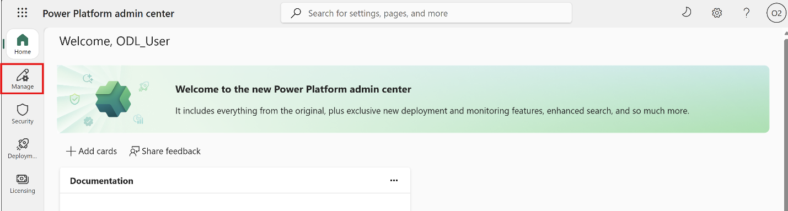
 
 2- Clique na opção Environments:
 
 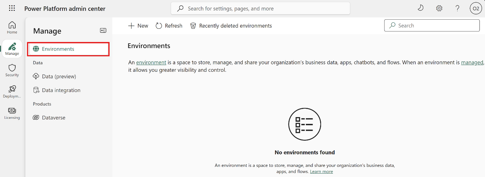
 
 3- Selecione "New" para criar um novo ambiente:
 
 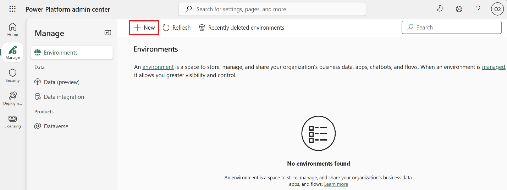

 4- O painel de detalhes do New Environment aparece no lado direito da tela.
 
 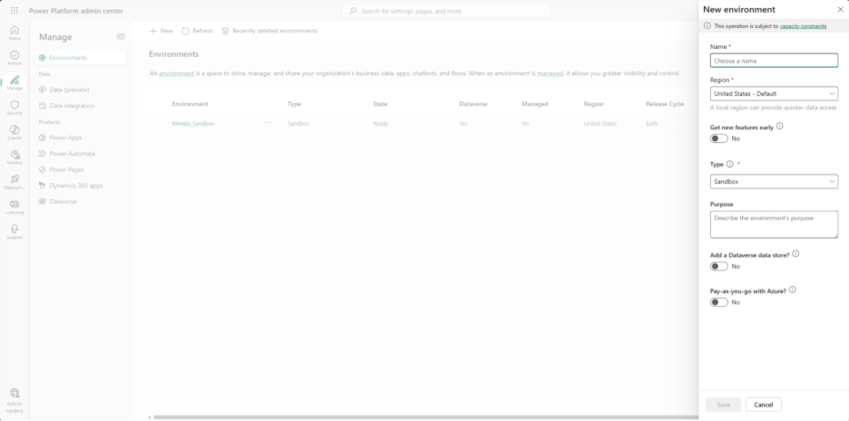

No painel de detalhes do New Environment, insira o seguinte: 
- Nome: **MultiAgentWrkshp** 
- Região:** certifique-se de que "United States - Default" esteja selecionado** 
- Tipo: **Sandbox** 
- Propósito:** este é o ambiente para executar os laboratórios do workshop Multi-Agent** 
- Adicionar um armazenamento de dados do Dataverse? : **ative o interruptor (Toggle) em ON**
- O painel de detalhes do seu novo ambiente deve ficar assim:
 
    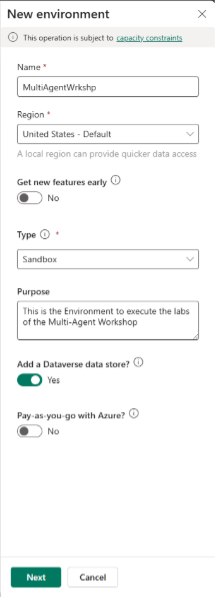

- Clique em "Next" para inserir configurações adicionais para o seu ambiente do Microsoft Copilot Studio.

    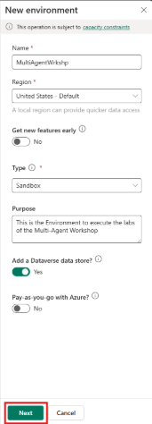

No painel Next, siga os passos da tabela abaixo: 

| Clique em "+ Select" abaixo de "Security Group *" | Selecione a opção "All Company" na seção "Restricted Access" | Os detalhes adicionais do seu novo ambiente devem ficar assim |
| --- | --- | --- |
| 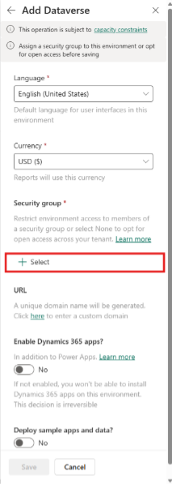 | 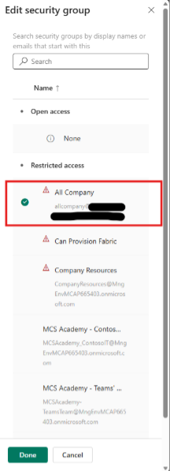 | 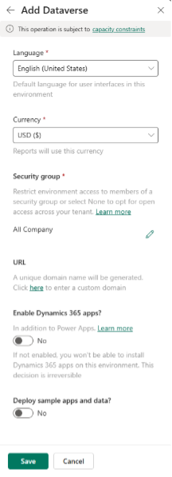 |

Clique em "Save" para criar seu ambiente do Microsoft Copilot Studio.

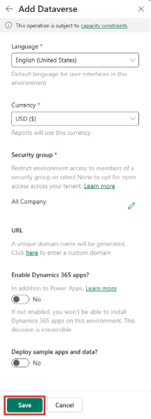

Você deve ver uma tela como a seguinte, indicando que seu ambiente está sendo preparado: 

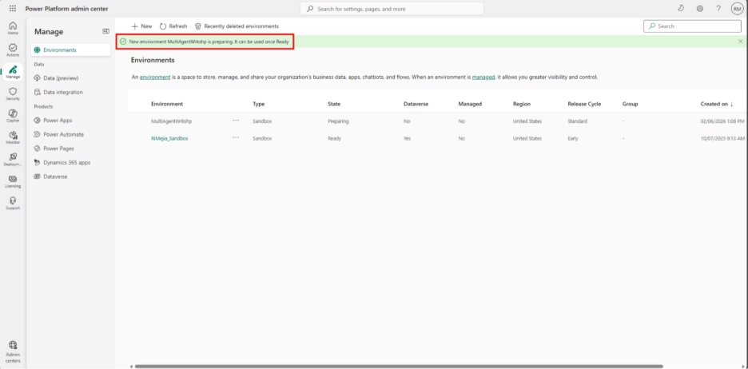

Uma vez totalmente provisionado e pronto, você receberá uma confirmação como a imagem abaixo. Use o botão "Refresh" disponível para atualizar o status de criação do ambiente. 

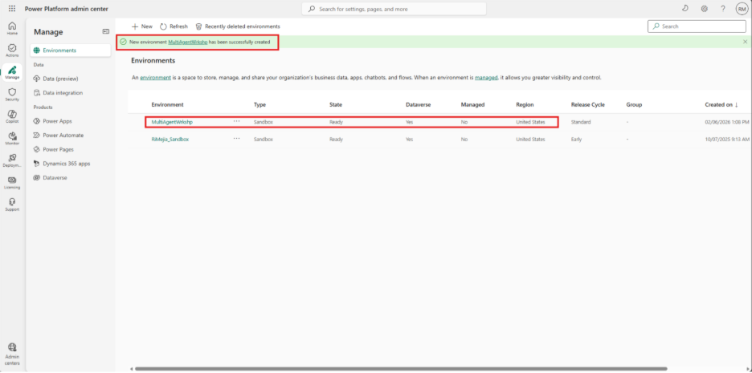

Verifique se as propriedades do seu ambiente recém-criado estão corretas. Principalmente: Name, Type, State=Ready e Dataverse=YES. 

# Crie uma solução para armazenar todos os seus componentes de trabalho

Neste laboratório, você aprenderá a montar uma solução (Solution), o veículo oficial de implementação para os seus agentes do Microsoft Copilot Studio.
Pense nisso como criar uma maleta digital que contém o seu agente e seus artefatos/componentes. 
Cada agente precisa de um lar bem estruturado. É isso que uma solução do Power Platform proporciona: ordem, portabilidade e preparação para produção.  

Mãos à obra. 
1. Acesse o Copilot Studio. Certifique-se de estar no ambiente correto (Environment) = **MultiAgentWrkshp**

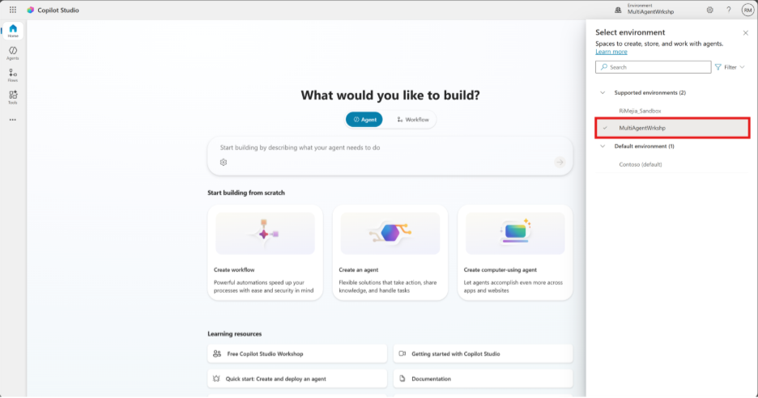

2. Clique em "…" no menu da barra esquerda. 

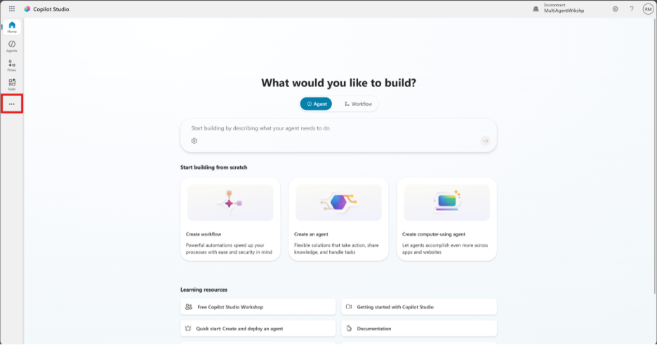

3. Selecione **Solutions**
   
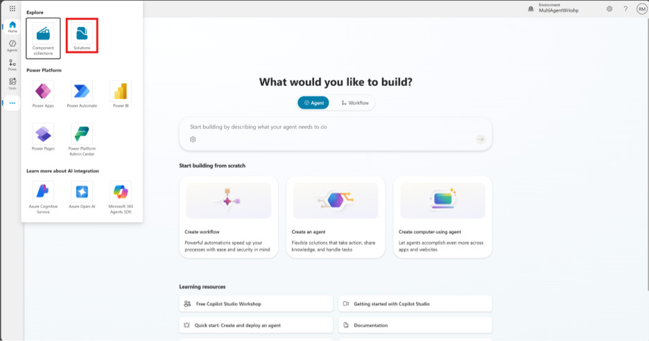

4. Isso abrirá uma nova aba no seu navegador.
5. Agora vamos criar uma <u>Solution</u>. O **Solution Explorer** será carregado no Copilot Studio. Selecione **+ New solution**
   
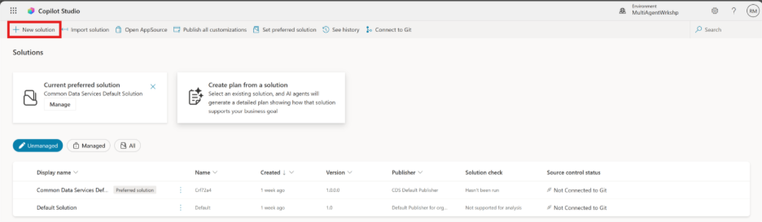

6. O painel New solution aparecerá, onde poderemos definir os detalhes da nossa solução.
   
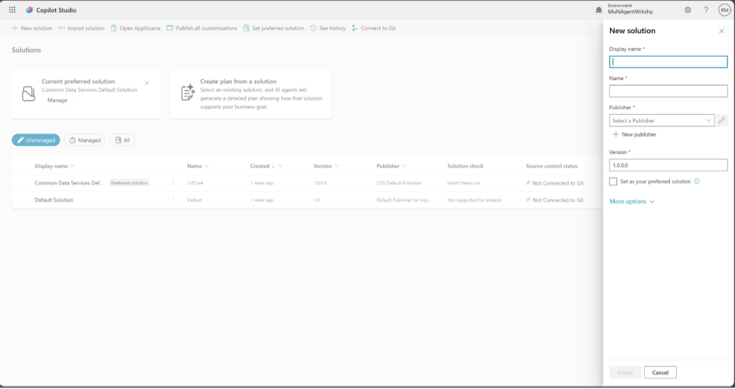

7. Primeiro, precisamos criar um novo publisher. Selecione **+ New publisher**. A aba Properties do painel New publisher aparecerá, com campos obrigatórios e não obrigatórios para preencher na aba Properties. Aqui podemos detalhar as informações do publisher, que será usado como a etiqueta ou marca que identifica quem criou ou é dono da solução.

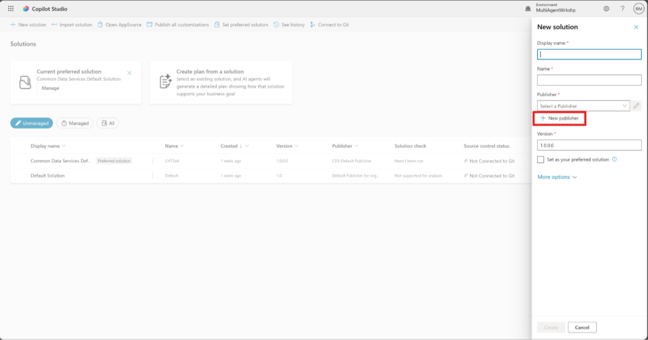

| Propriedade | Descrição | Obrigatório |
| --- | --- | --- |
| Nome de exibição | Nome de exibição do publisher | Sim |
| Nome | O nome único e o nome do esquema para o publisher | Sim |
| Descrição | Descreve o propósito da solução | Não |
| Prefixo | Prefixo do publisher que será aplicado aos componentes recém-criados | Sim |
| Prefixo do valor de opção | Gera um número baseado no prefixo do publisher. Este número é usado quando você adiciona opções a opções (choices) e dá um indicador de qual solução foi usada para adicionar a opção. | Sim |

Copie e cole o seguinte 
- Como **Display name**:  **My Multi Agent Publisher** 
- Como **Name**: **MyMultiAgentPublr** 
- Como **Description**: **This is the publisher for my Multi Agent Workshop Solution**  
- Para o **Prefix**: **mmap** 
- Por padrão, o **Choice value** prefix mostrará um valor inteiro. Atualize este valor inteiro para o milhar mais próximo. Por exemplo, na minha captura de tela abaixo, inicialmente era 77074. Atualize de 77074 para 77000.
  
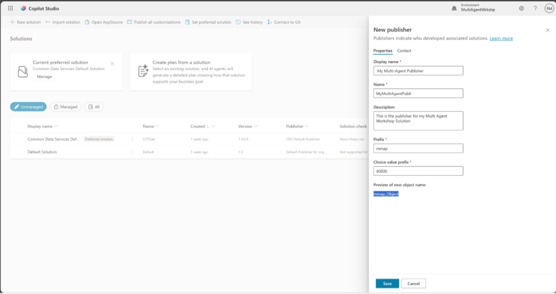

8. Se você quiser fornecer os dados de contato da solução, selecione a aba **Contact** e preencha as colunas mostradas.
   
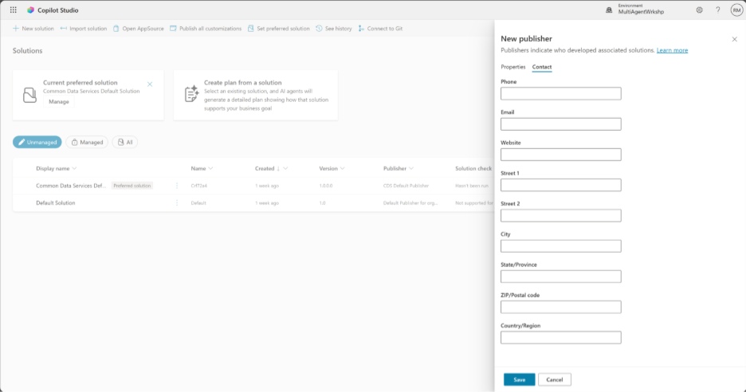

9. Selecione a aba **Properties** e selecione **Save** para criar o publisher.

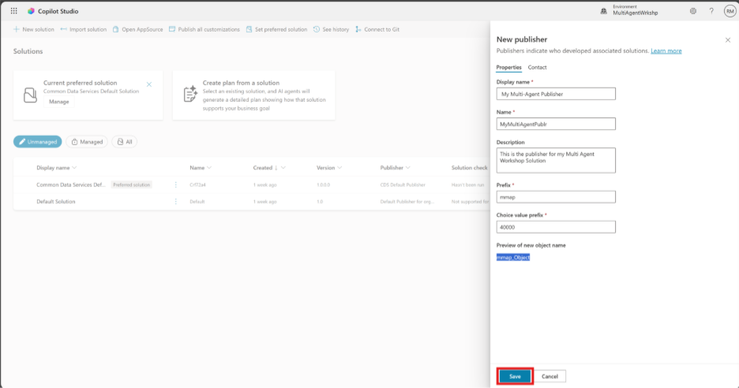

10. O painel New publisher será fechado e você voltará ao painel **New solution** com o publisher recém-criado selecionado.
    
Muito bem, você criou um Solution Publisher! 🙌🏼 

# A seguir, aprenderemos a criar uma nova solução personalizada.
Agora que temos o novo Solution Publisher
Podemos completar o restante do formulário no painel **New solution**. 

1. Copie e cole o seguinte: 
- Como **Display name: My Multi Agent Solution** 
- Como **Name**: **MyMultiAgentSln** 
- Como estamos criando uma solução nova, o número de **Version** por padrão será 1.0.0.0. 
- Marque a caixa **Set as your preferred solution** . 
- Expanda **More options** para ver detalhes adicionais que podem ser fornecidos em uma solução. 

Você verá o seguinte: 
- **Installed on** - a data em que a solução foi instalada. 
- **Configuration page** - os desenvolvedores configuram um recurso web HTML para ajudar os usuários a interagir com sua aplicação, agente ou ferramenta; aparecerá como uma página web na seção Information com instruções ou botões. É usado principalmente em empresas ou por desenvolvedores que criam e compartilham soluções com outras pessoas. 
- **Description** - descreve a solução ou uma descrição de alto nível da configuration page. 

2. Deixaremos em branco para este laboratório.
 
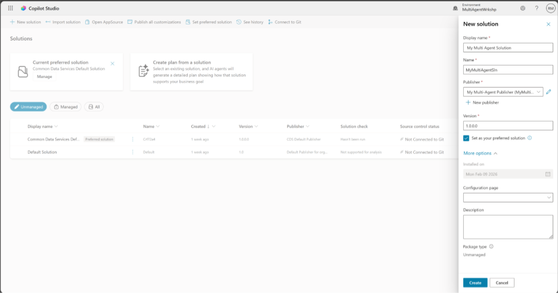

3. Selecione **Create**. 

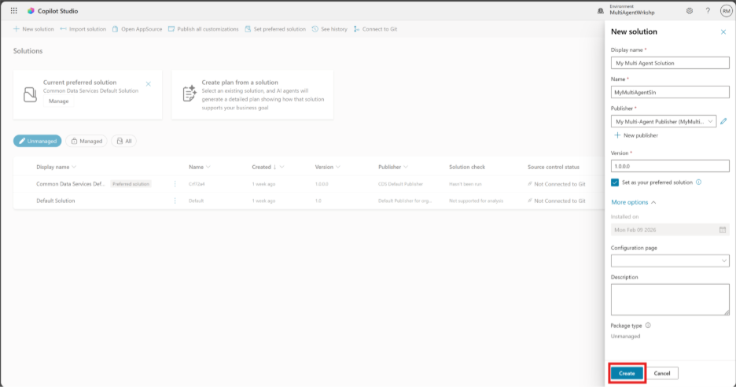

4. A solução **My Multi Agent Solution** já foi criada. Não haverá componentes até que criemos um agente no Copilot Studio. 

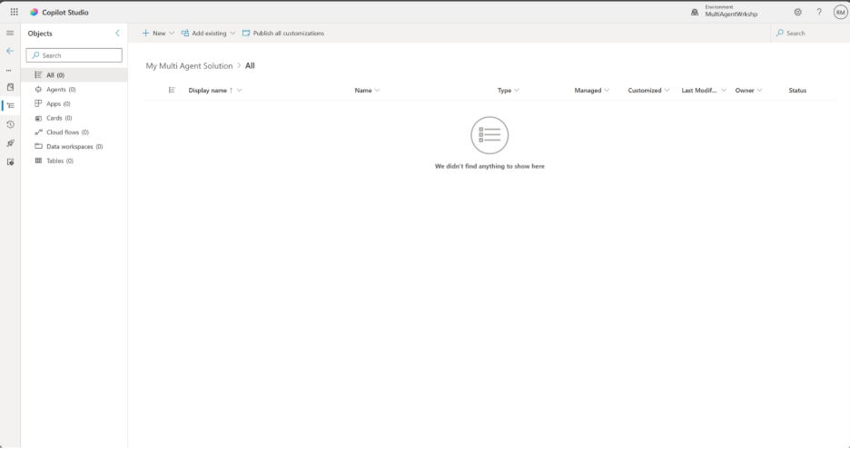

5. Selecione o ícone de seta para trás para voltar ao Solution Explorer.
   
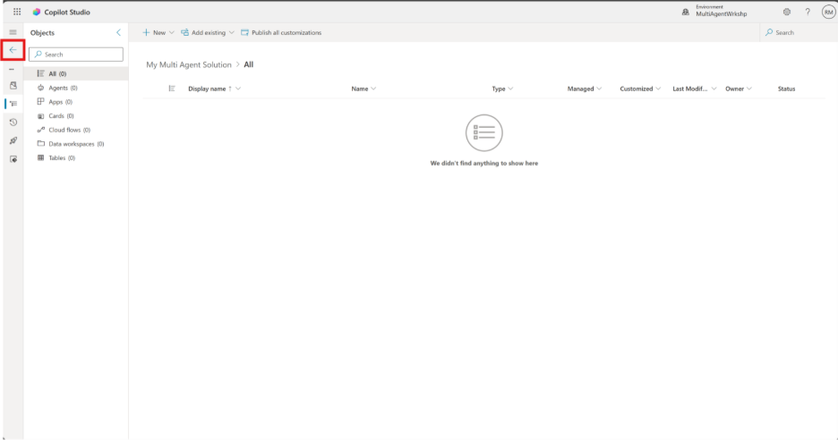

6. Torne sua solução a solução padrão / Confirme
7. Verifique se a sua solução possui a etiqueta "Preferred Solution" ao lado. 

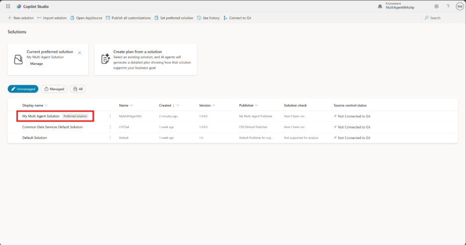

8. Caso contrário, selecione as reticências "…" ao lado da sua solução e depois selecione a opção "Set preferred solution" no menu suspenso, como mostrado abaixo: 

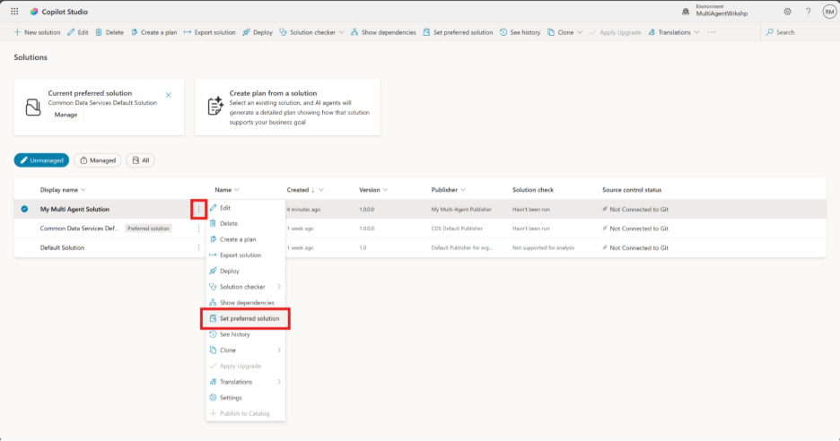

9. Na janela pop-up, clique na lista suspensa e selecione a sua solução "**MyMultiAgentSln**" 

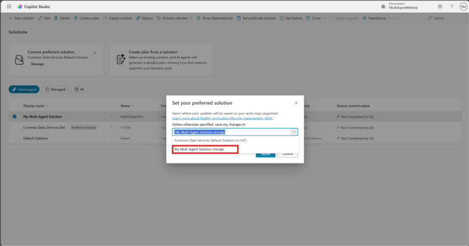

10. Clique em "Apply" para confirmar que deseja estabelecer sua solução "**MyMultiAgentSln**" como a solução preferida. 

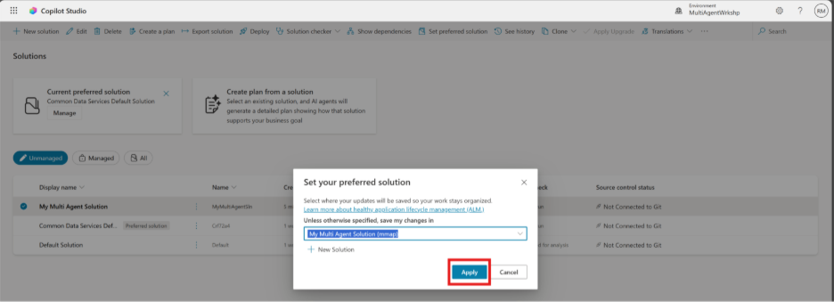

11. Agora sua solução "**MyMultiAgentSln**" deve ter a etiqueta "Preferred solution" ao lado. 

# **🎉** **Missão completada**

✅**Agora você terminou de configurar seu ambiente de laboratório para o Microsoft Copilot Studio.** Parabéns!