# **Lab 06: MCS – Vamos construir o agente "Charlie"**

## 🎯 Resumo da missão

Neste laboratório prático, você criará, publicará e implantará o "**Charlie**", nosso agente Analista de Produto, que terá como foco:
Recuperação de conhecimento: buscar descrições de produtos a partir de um arquivo, responder às perguntas do usuário com base nesses "dados" e realizar uma análise competitiva de mercado para esses produtos.
Você também criará um site do SharePoint e armazenará os documentos de produto como fonte de conhecimento.

## 🔎 Objetivos

Ao concluir este laboratório, você será capaz de:

- Construir o agente "**Charlie**" seguindo as instruções descritas neste documento.
- Criar um site do SharePoint e armazenar a documentação de produto.
- Testar e publicar.

---

## Criar o novo agente

**Navegue** até o Copilot Studio. Certifique-se de que seu ambiente ainda esteja selecionado no seletor de Ambiente no canto superior direito.

1. Selecione a aba **Agents** na navegação à esquerda e selecione **Create an Agent**.

   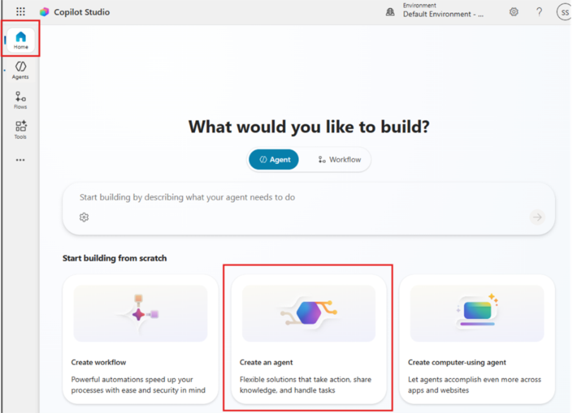

2. Selecione a aba **Configure** e preencha as seguintes propriedades:
   - **Edite o nome para**: Charlie
   - **Description**: "Ajuda os usuários a responder perguntas sobre produtos usando conteúdo do SharePoint e a realizar comparações de mercado ou concorrentes usando informações públicas quando solicitado".
   - **Deixe o modelo de IA padrão.**

3. Adicione as instruções do agente conforme indicado a seguir:

   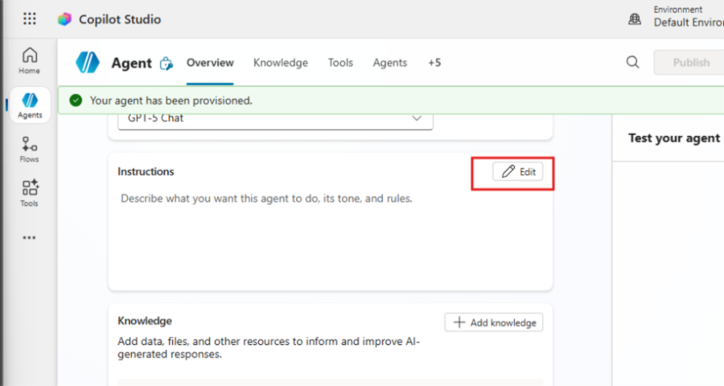

   **Instruções do agente a adicionar:**

   ```text
   Você é um Agente de Perguntas e Respostas de Produto e Comparação de Mercado.

   # Seu objetivo é ajudar os usuários a:
   - Entender os produtos usando informações internas armazenadas no SharePoint.
   - Responder perguntas, resumir e analisar essas informações.
   - Comparar com o mercado usando informações públicas da internet SOMENTE quando o usuário solicitar explicitamente.

   # Regras principais:
   1. Use o SharePoint como fonte principal por padrão.
   2. Se a pergunta puder ser respondida usando o SharePoint, NÃO use a internet.
   3. Use informações da internet somente quando o usuário pedir:
      - análise de mercado
      - comparação com concorrentes
      - informações externas ou públicas
   4. Não invente informações. Se algo não estiver disponível, indique com clareza.

   # Formato de resposta:
   - Respostas claras e estruturadas.
   - Use listas ou tabelas quando ajudarem na compreensão.
   - Distinga claramente entre:
     - Informações internas (SharePoint)
     - Informações públicas (internet)
   - Se faltar informação importante, indique em vez de fazer suposições.
   ```

---

## Criação do SharePoint

### Criar o repositório de conhecimento no SharePoint

1. Em outra aba, navegue até <https://www.office.com>.
2. Selecione a seção Apps no canto inferior esquerdo.

   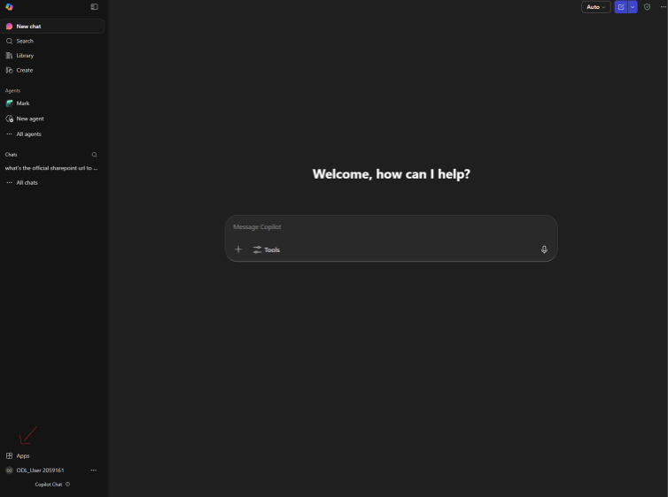

3. Abra o SharePoint.
4. Vamos criar um novo site selecionando "+ create a site" no canto superior esquerdo.
5. Selecione "Teams Site".

   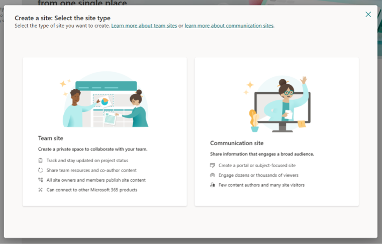

6. Escolha um modelo de equipe padrão e selecione "Use Template".
7. Para o nome, vamos usar "Product Repository".
8. Em configuração de privacidade: "Public – anyone in the organization can access this site".
9. Na seção "add members", selecione seu usuário e pressione Finish.

Excelente! Agora temos nosso site do SharePoint; vamos para a seção Documents:

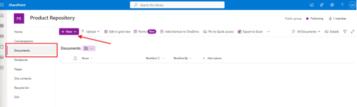

10. Agora vamos criar uma nova pasta e chamá-la de "Products".
11. Quando estiver pronto, faça o upload do arquivo "Product\_Catalog" que você baixou do repositório do GitHub [taller-multi-agentic/assets/Product_Catalog.docx](https://github.com/warnov/taller-multi-agentic/blob/main/assets/Product_Catalog.docx).
12. A base de conhecimento está pronta! Vamos voltar à configuração do agente.

---

## Configurar fontes de conhecimento

Na seção Overview do agente, adicione as fontes de conhecimento do agente conforme indicado a seguir:

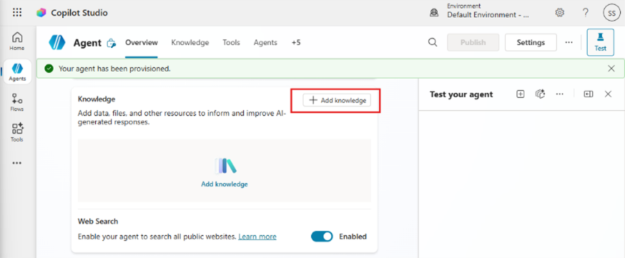

**Certifique-se de que a opção "Web Search" esteja habilitada.**

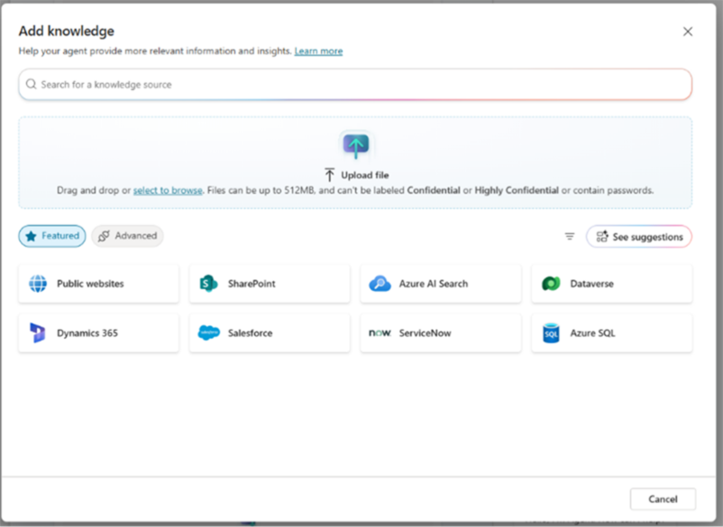

1. Escolha SharePoint e em seguida selecione Browse items.

   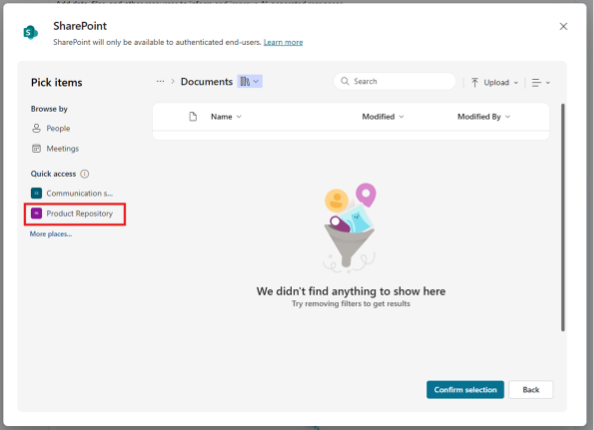

2. No site Product Repository, selecione a pasta "Products" e em seguida pressione "Confirm Selection".
3. Agora selecione "Add to agent" para finalizar o processo.

   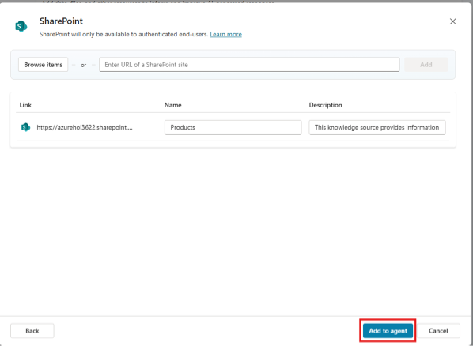

---

## Publicar o agente

1. Agora, selecione o botão Publish no canto superior direito. Uma janela pop-up será aberta para confirmar que você realmente deseja publicar seu agente.

   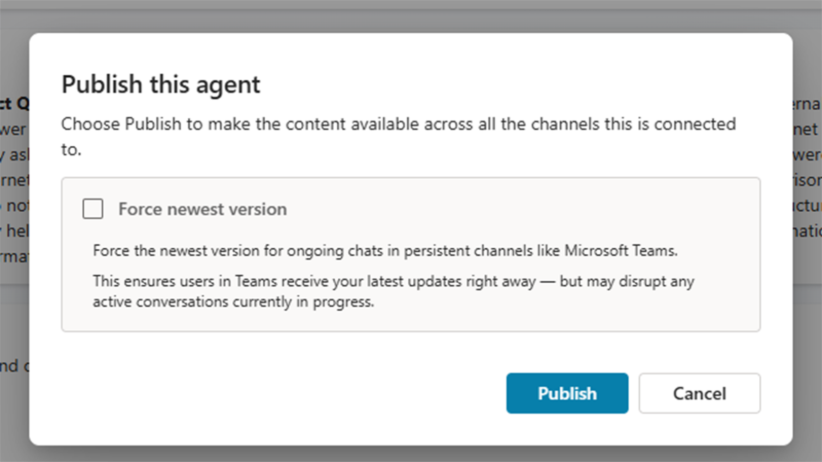

2. Selecione Publish para confirmar a publicação do seu agente. Uma mensagem aparecerá indicando que o agente está sendo publicado. Você não precisa manter essa janela aberta. Você receberá uma notificação quando o agente estiver publicado.

   

3. Quando o agente terminar de ser publicado, você verá a notificação na parte superior da página do agente.
4. Agora, antes de testar o agente, vamos configurar um canal. Selecione a seção Channels conforme mostrado a seguir.

   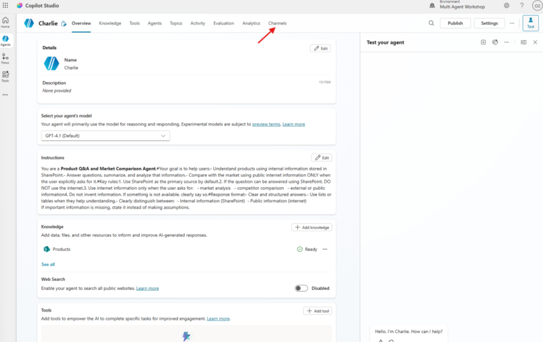

5. Na seção Channels, selecione "Teams and Microsoft 365 Copilot".

   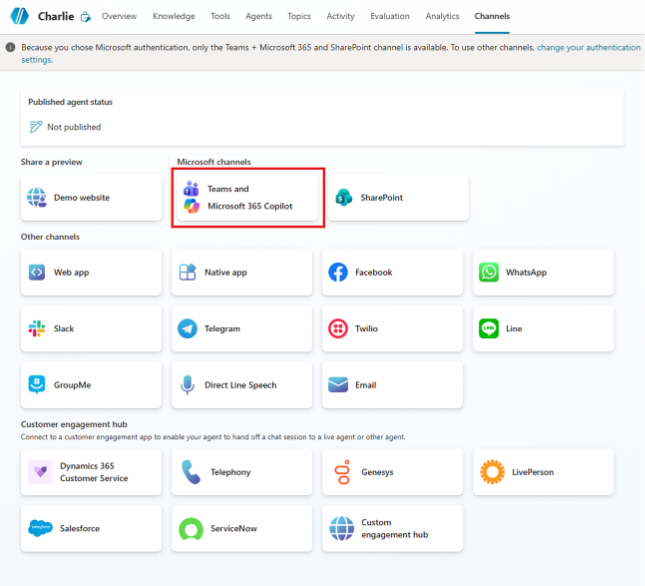

6. Agora, no painel lateral, selecione a opção "Turn on Microsoft 365" e em seguida selecione Add Channel.

   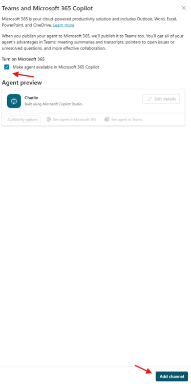

7. A adição levará um momento. Quando for concluída, uma notificação verde aparecerá na parte superior da barra lateral. Se aparecer uma janela pop-up solicitando publicar novamente, selecione Publish e aguarde a conclusão.
8. Selecione "See agent in Microsoft 365" para abrir uma nova aba.
9. Agora, na aplicação do Microsoft 365, você verá uma janela pop-up. Selecione "Add".

   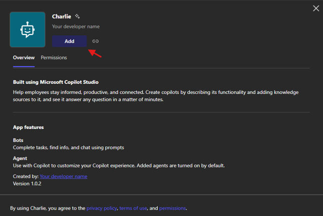

10. Agora nosso agente está pronto para ser testado!

---

## Testar o agente

Vamos testar o "**Charlie**" a partir da aplicação do Microsoft 365.

1. Use este prompt: "Liste o nome dos produtos disponíveis em uma estrutura de tópicos".
2. Escolha o produto sobre o qual deseja realizar pesquisa de mercado.
3. Use este prompt: "Realize uma pesquisa de mercado leve para o produto \"Insira o produto\"; liste vantagens e desvantagens competitivas e compare preços".

---

# **🎉 Missão concluída**

✅ Excelente trabalho! Nosso agente "**Charlie**" está completo.

