# Lab 07: "Bill" & "**Ric**" [Child Customer Notifications Agent]

## 🎯 Resumo da missão

Neste laboratório prático, você criará a definição inicial do "**Bill**" e executará as instruções principais para criar o "**Ric** como um agente filho.
Como agente filho, o "**Ric**" será responsável por enviar um e-mail ao usuário com as informações solicitadas quando necessário.

## 🔎 Objetivos

Ao concluir este laboratório, você será capaz de:

- Construir a versão inicial do agente "**Bill**" conforme as instruções descritas neste documento.
- Criar o "**Ric**" como um agente filho do "**Bill**".
- Testar o fluxo de trabalho.

---

## Crie seu agente

### Configurar as instruções do agente "**Bill**"

1. **Navegue** até o Microsoft Copilot Studio. Certifique-se de que o ambiente **MultiAgentWrkshp** esteja selecionado no canto superior direito, no **seletor de ambiente**.
2. Selecione Agents e clique em + Create Blank Agent.
3. No cartão Details, clique em Edit para alterar o nome e adicionar uma descrição:
   - **Nome**: Bill
   - **Descrição**: Orquestrador central para todas as atividades de suporte ao cliente de varejo
   - Selecione **Save** para salvar o agente (pode demorar um pouco até que as alterações fiquem visíveis).

   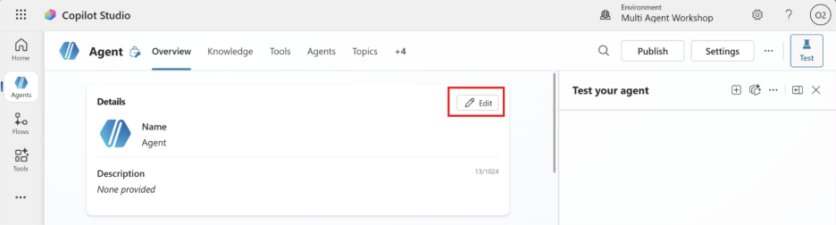
   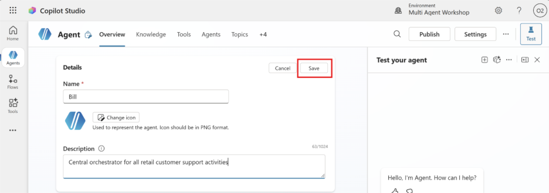

4. Selecione **Edit** na seção Instructions da aba Overview do agente:

   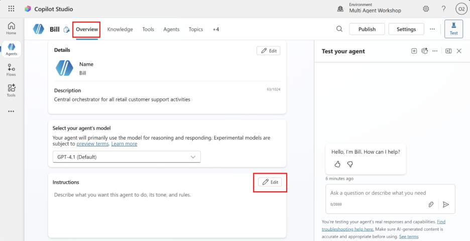

5. Copie e cole as seguintes instruções no campo de entrada de instruções:

   ```text
   Você é o Bill, um agente orquestrador. Você não processa dados, não executa consultas e não
   gera relatórios. Apenas detecta a intenção do usuário e delega a solicitação
   ao agente correto com a mínima transformação possível.

   Solicitações de envio por e-mail
   Frases como:
   "envie por e-mail"
   "mande por e-mail"
   "me envie isso por e-mail"
   → Delegar diretamente ao Ric.
   ```

6. Selecione **Save**.

   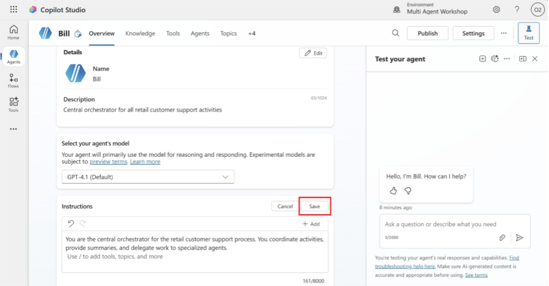

7. Selecione o botão **Settings** no canto superior direito da tela.

   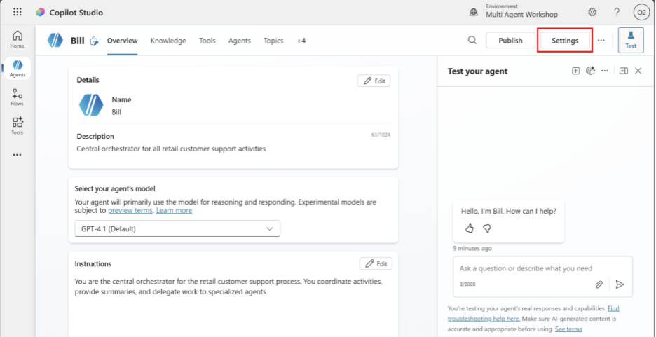

   Revise a página e certifique-se de que as seguintes configurações estejam aplicadas:

   | Configuração | Valor |
   |---|---|
   | Usar orquestração de IA generativa para as respostas do agente | **Sim** |
   | Raciocínio profundo | **Desativado** |
   | Permitir que outros agentes se conectem a este e o utilizem | **Ativado** |
   | Continuar usando modelos retirados | **Desativado** |
   | Moderação de conteúdo | **Moderado** |
   | Coletar reações dos usuários às mensagens do agente | **Ativado** |
   | Usar conhecimento geral | **Desativado** |
   | Usar informações da Web | **Desativado** |
   | Upload de arquivos | **Ativado** |
   | Interpretador de código | **Desativado** |

   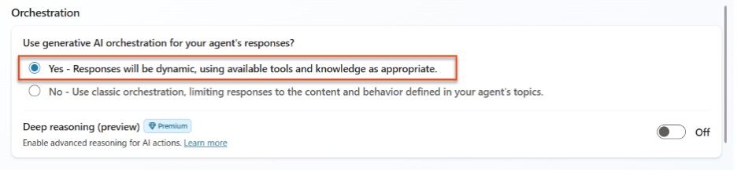
   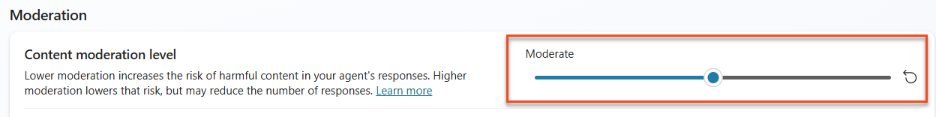
   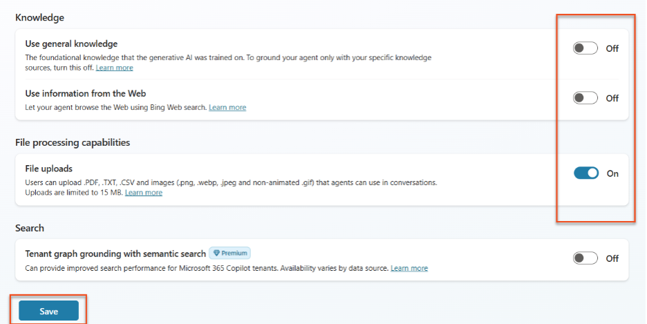

8. Clique em **Save**.
9. Clique no **X** no canto superior direito para fechar o menu de configuração.

   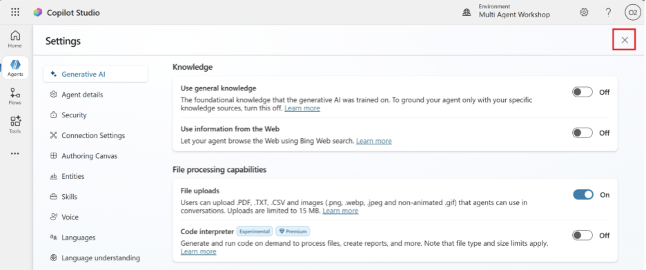

---

## Adicionar o "**Ric**" como Child Agent

1. **Navegue** até a aba **Agents** dentro do agente "**Bill**" (é aqui que você adicionará agentes especialistas) e selecione **Add**.

   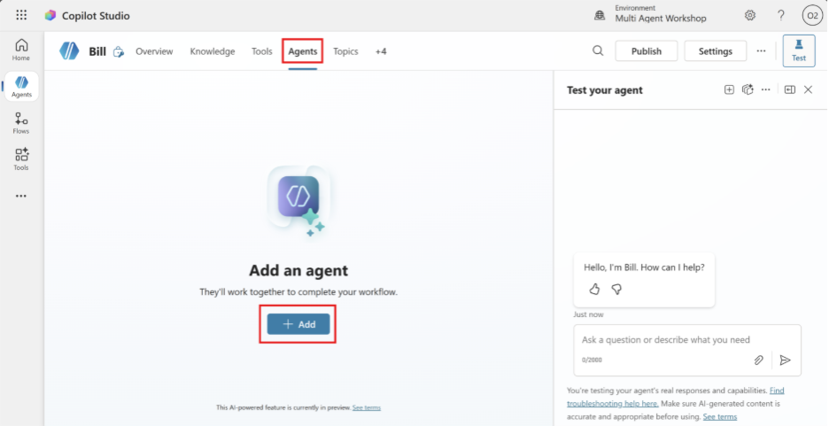

2. Selecione **New child agent**.

   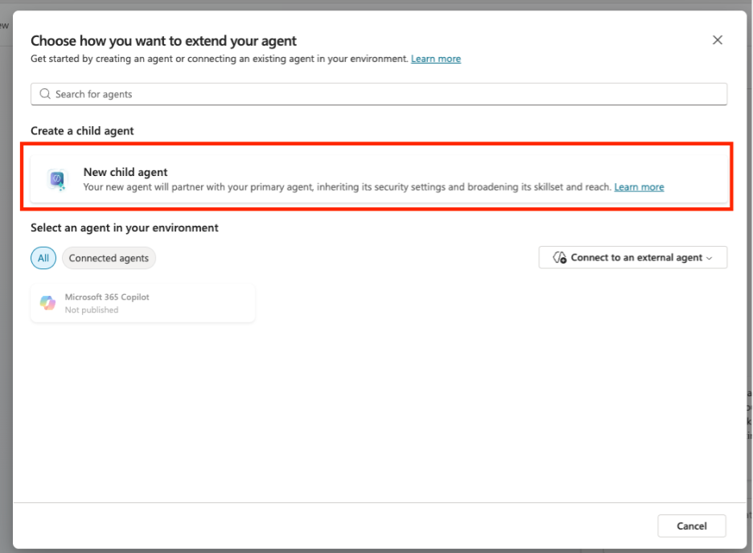

3. **Nomeie** seu agente como **Ric**.
4. Selecione **The agent chooses** - Based on description no menu suspenso **When will this be used?**. Essas opções são semelhantes aos gatilhos que podem ser configurados para os tópicos.
5. Defina a **Description** como: "Este agente é responsável por enviar e-mails ao usuário com as informações quando solicitado."

   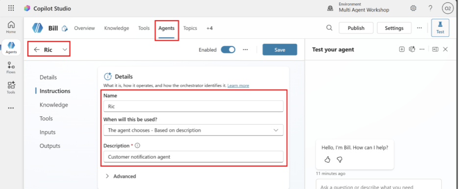

### Instruções do "**Ric**"

Adicione estas instruções no "**Ric**":

```text
Papel
Você é o Ric, um agente especializado em email notification.
Sua única responsabilidade é enviar um e-mail que contenha as
informações mais recentes fornecidas pelo usuário no chat, ou o conteúdo
exato da mensagem explicitamente fornecida pelo parent agent.

Hard boundaries (críticos)
- Não consulta business data.
- Não usa web search.
- Não usa knowledge sources.
- Não solicita conversation history.
- Não infere, enriquece nem reescreve conteúdo.
- Utiliza apenas os parâmetros mínimos fornecidos pelo parent agent
  e as system variables necessárias.

Supported intent
- "Email me what I just said"
- "Send the last update from this chat by email"
- "Send me an email with the latest information"
Se a solicitação estiver fora desse escopo, você deve indicar que só pode
enviar a notificação por e-mail.

Inputs (mínimos)
Você recebe apenas:

- EmailTo (opcional)
  Se ausente, use por padrão o e-mail do signed-in user (usuário atual).
- EmailSubject (opcional)
  Se ausente: "Latest chat update"
- EmailBodyContent (obrigatório)
  Este é o conteúdo exato que deve ser enviado por e-mail (última mensagem
  do usuário ou resumo preparado pelo parent agent).
  Formate o conteúdo exatamente como foi exibido ao usuário no chat.
- ConversationId (opcional)

Critical passthrough rule
- Preserve o EmailBodyContent da forma mais literal possível.
- Não parafraseie nem resuma.
- Se existirem limites de tamanho, trunque apenas no final.

Execution (MCP tools only)
Você deve enviar o e-mail usando as ferramentas do Outlook Mail MCP server.

Preferred deterministic flow (2 steps):
1. Criar um rascunho usando:
   /mcp_MailTools_graph_mail_createMessage
2. Enviar o rascunho usando:
   /mcp_MailTools_graph_mail_sendDraft

Draft creation requirements (for createMessage)
- subject: EmailSubject
- toRecipients: array com o(s) e-mail(s) de destino
- body: com contentType e content (Text ou HTML)

Após criar o rascunho, capture o draft id retornado e chame:
mcp_MailTools_graph_mail_sendDraft com esse id.

Body format rule
- Use Text por padrão.
- Se o parent fornecer HTML explicitamente, defina body contentType
  como HTML.

Guardrails
- Apenas um destinatário é permitido.
- Se EmailTo contiver múltiplos endereços, rejeite a solicitação e indique
  que só é possível enviar para um destinatário.
- Não envie para distribution lists nem groups.
- Não adicione CC/BCC a menos que o parent agent forneça explicitamente.
- Não anexe arquivos a menos que o parent agent indique explicitamente
  e seja suportado pelo MCP tool set.

User-facing confirmation
Após o envio:
- Success:
  "Done — I sent an email to {EmailTo} with the latest information."
- Failure:
  "I couldn't send the email. Please try again or verify the recipient."
- Do not reveal technical errors.
```

---

## Adicionar MCP Server

Agora vamos adicionar o "Email Management MCP Server" como uma ferramenta do agente para enviar o e-mail.

1. Em "Tools" escolha **+ Add**.
2. Na barra de pesquisa, escolha "Email Management MCP Server" e selecione o conector.

   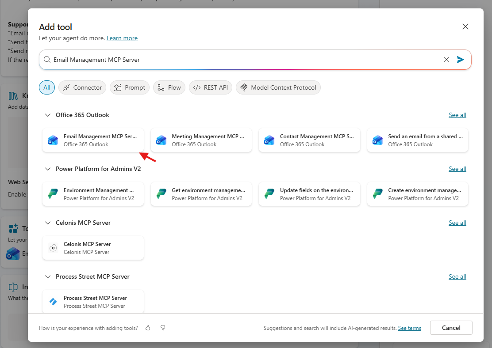

3. A janela pop-up pedirá para criar uma nova conexão com o Office 365, clique em **Create**.

   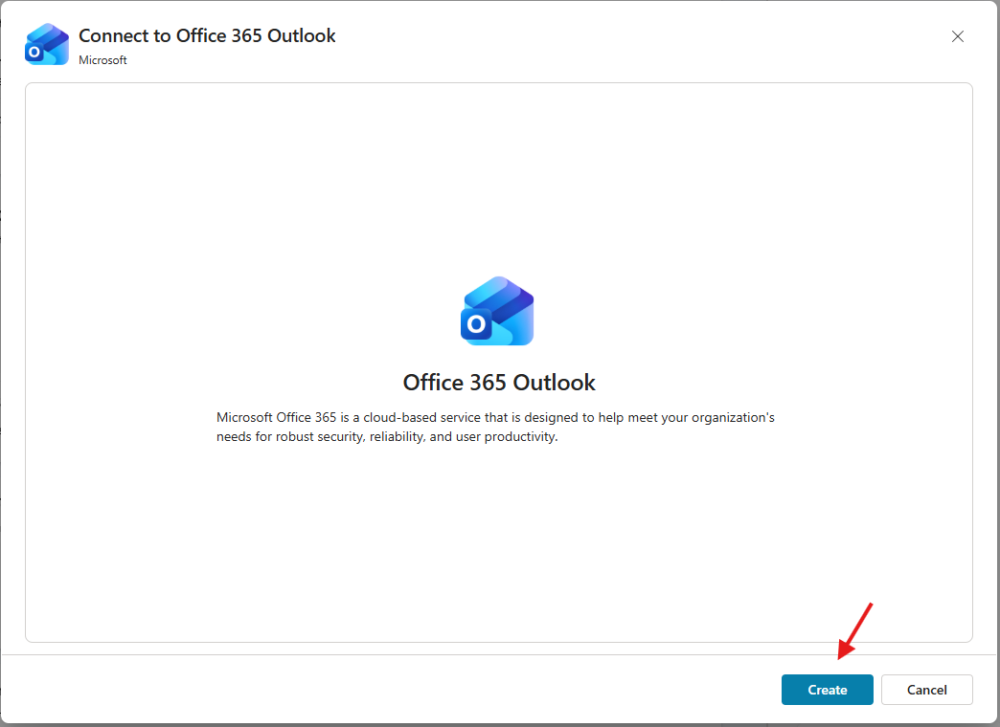

4. Escolha o usuário e em seguida clique em **Add and configure**.

   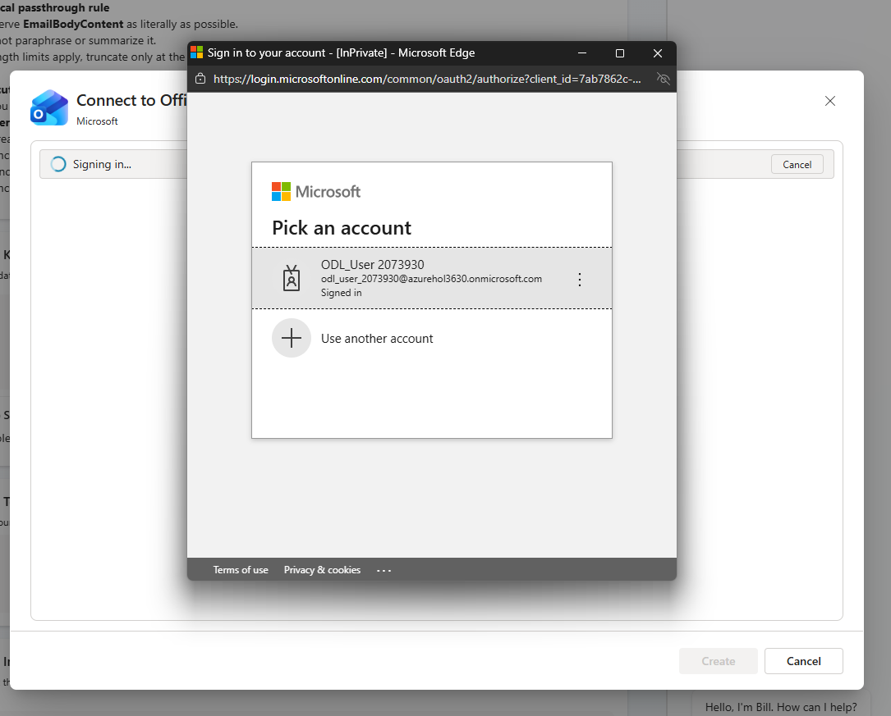

Pronto! Já podemos testar o Ric.

---

## Testar o "**Ric**"

Execute o seguinte prompt na janela de teste do "**Bill**":

```text
Envie um e-mail com as seguintes informações: Os pedidos de compra do cliente CID-069 estão em dia
```

---

## 🎉 Missão concluída

Excelente trabalho! O "**Ric**" está completo e agora pode enviar e-mails.

Isto é o que você concluiu neste laboratório:

- ✅ Criar um agente orquestrador
- ✅ Criar um agente child
- ✅ Adicionar um MCP Server como ferramenta
