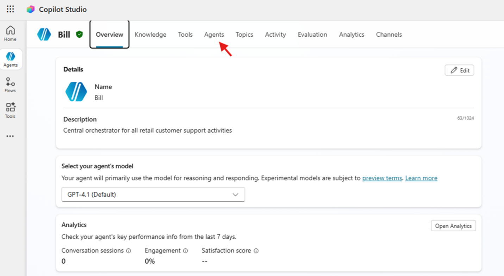
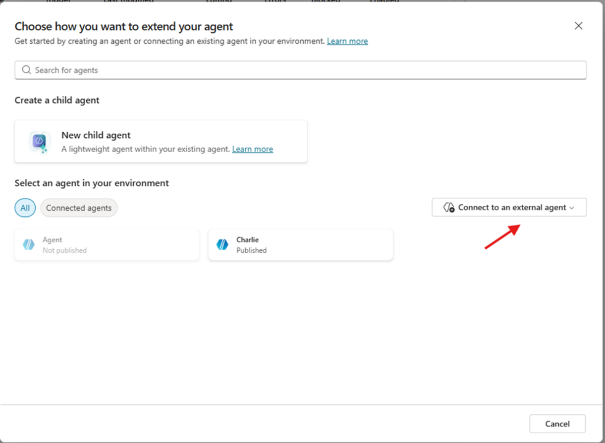
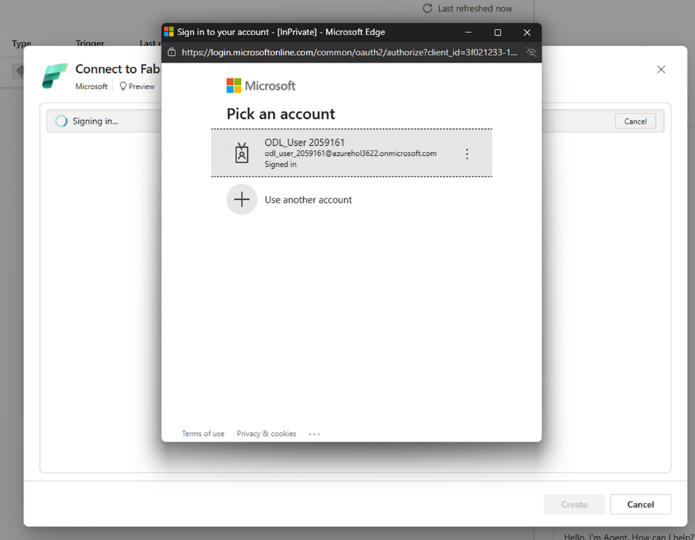
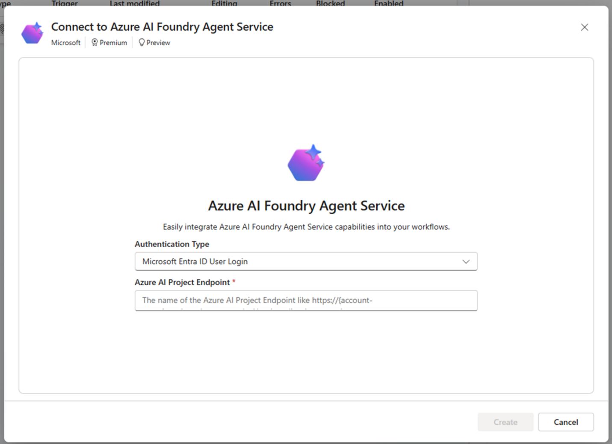
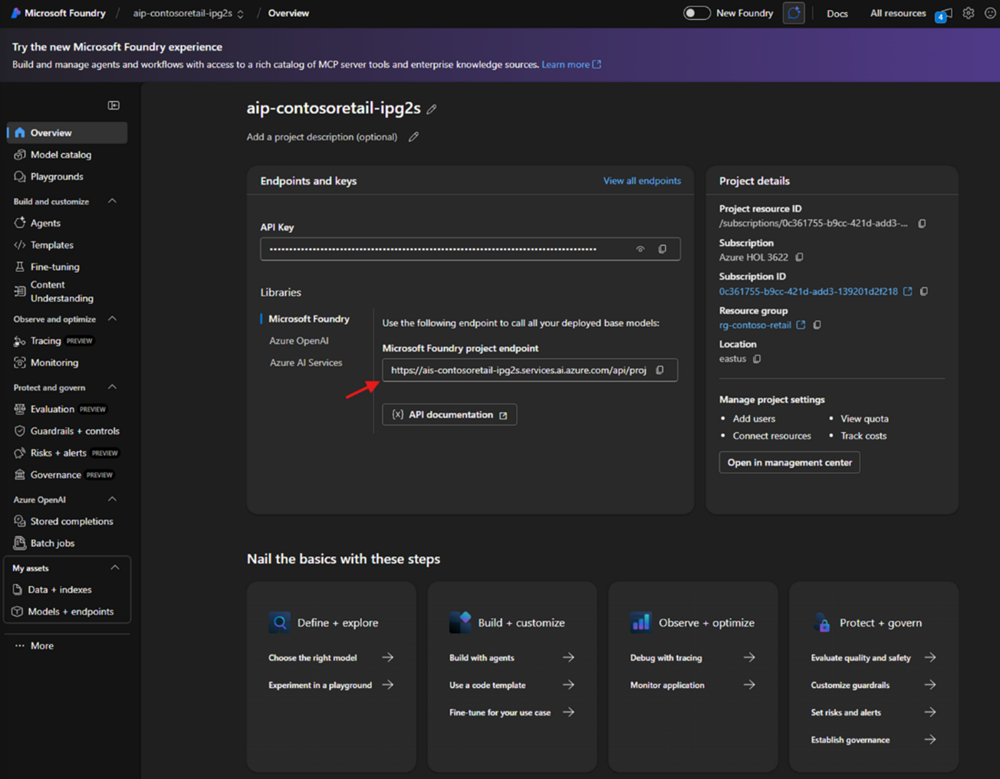
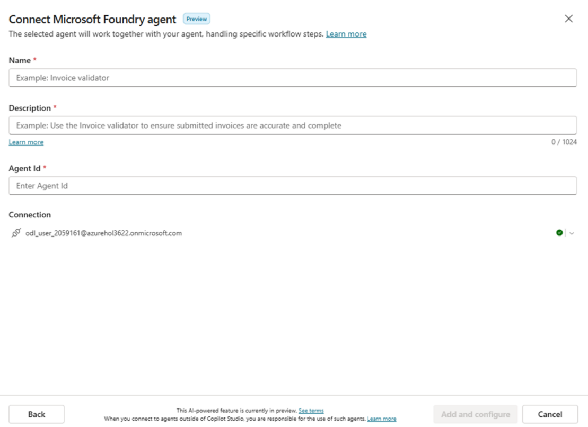
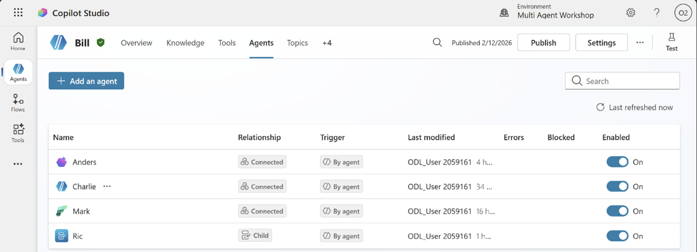

# Lab 08: MCS – "**Bill**" [Orquestração de Agentes]

## 🎯 Resumo da missão

Neste laboratório, vamos conectar os agentes **Mark**, **Anders**, **Charlie** ao agente orquestrador "**Bill**", e vamos gerar as instruções de orquestração para que o "**Bill**" possa delegar consultas e solicitações de relatórios ao agente correto, mantendo o contexto e os parâmetros necessários.

## 🔎 Objetivos

Ao concluir este laboratório, você aprenderá:

- Como conectar agentes externos do Fabric e do Azure AI Foundry.
- Como conectar agentes internos desenvolvidos no Copilot Studio.
- Como gerar regras de orquestração para que o Copilot Studio possa navegar entre agentes.

---

## Início do laboratório

1. Vamos acessar o agente "**Bill**", que criamos no laboratório anterior "Ric".

   

2. Agora vamos conectar os agentes.
3. Navegue até a seção "Agents".

   

---

## Agente Mark

1. Clique em "Add Agent" e em seguida selecione "Connect to an external agent".

   

2. Selecione "Microsoft Fabric" e depois selecione "create a new connection".
3. Na janela do conector, clique em "create".
4. Uma janela pop-up pedirá para selecionar o usuário. Selecione o usuário com o qual você vem trabalhando nos laboratórios.

   

5. Após iniciar a sessão, a conexão com o Fabric está pronta e já podemos escolher os agentes que definimos no ambiente do Fabric. Clique em "next".
6. Na janela de seleção de agentes, escolha "Mark" e clique em next.

   

7. Na janela de configuração, podemos adicionar uma descrição que servirá de guia para o orquestrador sobre o que o Mark fará quando for chamado. Vamos adicionar a seguinte descrição: "Fornece informações detalhadas sobre os pedidos de compra dos clientes" e clicamos em add.

   

8. Pronto, adicionamos o Mark.

---

## Agente Anders

1. Vamos repetir o processo realizado com o Mark, mas selecionando como conector externo o **Microsoft Foundry**.
2. Repita o passo 1 do Mark e selecione Microsoft Foundry. Em seguida, vamos criar uma conexão.
3. Na janela de conexão, os dados a configurar são diferentes dos que vimos com o Mark.

   

4. Em "Authentication type" vamos manter Microsoft Entra, para que o agente delegue a autenticação ao usuário final. No campo seguinte, vamos adicionar a URL do projeto do Microsoft Foundry.
5. Navegue até o portal do Microsoft Foundry, onde criaram o Anders. Na seção "Overview", copie o link do endpoint e cole na janela do Copilot Studio.

   

6. Repetimos o passo 4 do Mark, selecionamos o usuário do laboratório e continuamos com a conexão. Clique em next.
7. Na janela de configuração do agente, vamos preencher os seguintes dados:
   - **Name**: "Anders"
   - **Description**: "Anders vai receber a lista completa de pedidos retornados pelo Mark para gerar um relatório"
   - **Agent ID**: "Anders"

   

8. Ao finalizar, clique em add. Pronto, o Anders foi adicionado.

---

## Agente "**Charlie**"

Vamos repetir o processo realizado com o "**Mark**" e "**Anders**", mas selecionando o "**Charlie**" como um agente interno criado em nosso ambiente.




---

## Instruções para o "**Bill**"

Junto com os instrutores, vamos analisar a estrutura das instruções.
Agora, vamos copiar as instruções no agente Bill.

**Início das instruções:**

```text
Papel
Você é o Bill, um agente orquestrador. Você não processa dados, não executa consultas e não
gera relatórios. Apenas detecta a intenção do usuário e delega a solicitação
ao agente correto com a mínima transformação possível.

Fluxo de orquestração para obter relatórios
1. Detecte a intenção do usuário.
2. Extraia apenas CustomerId e datas (se aplicável).
3. Se a intenção for obter pedidos, delegue a consulta ao Mark.
4. Se a intenção for um relatório, consulte primeiro o Mark e depois envie os
   pedidos ao Anders no formato que o Anders requer.
5. Retorne ao usuário o resultado final.

Regra crítica ao delegar ao Mark
- Atue como passthrough.
- Não envie histórico.
- Envie exatamente o prompt que o usuário entregou.
- Não interprete nem adicione informações.
- Respeite o CustomerId exatamente como foi escrito.
- Não use frases como "todos os pedidos"; use "os pedidos".

Detecção de intenção (regras estritas e excludentes)

Solicitações de detalhes de produtos
Frases como:
  "detalhe do produto"
  "informação do produto"
  "características", "especificações", "materiais", "descrição do produto"
→ Delegar diretamente ao Charlie.
  Não consultar o Mark nesses casos.

Solicitações sobre pedidos
Frases como:
  "me dê os pedidos"
  "último pedido"
  "pedidos do mês"
  "histórico de pedidos"
→ Delegar diretamente ao Mark.

Solicitações de relatório
Frases como:
  "relatório"
  "informe"
  "gere relatório desses pedidos"
→ Solicitar CustomerId se estiver faltando.
→ Delegar ao Mark para obter os pedidos.
→ Enviar resultado ao Anders.

Solicitações de envio por e-mail
Frases como:
  "envie por e-mail"
  "mande por e-mail"
  "me envie isso por e-mail"
→ Delegar diretamente ao Ric.

Solicitações fora do escopo
→ Informar que você só trata de pedidos, relatórios, envios por e-mail e detalhes
  de produto.

Como delegar ao Mark
- Envie apenas CustomerId e datas.
- Não reformule a intenção mais do que o necessário.
- Não adicione etapas nem validações.

Delegação ao Anders
- Somente se o usuário pediu um relatório.
- Envie ao Anders a lista completa de pedidos, adaptando o formato para que
  o Anders compreenda.
- Retorne ao usuário a URL ou resultado final.

Transformação Mark → Anders
Converta o conteúdo de entrada (saída do Mark) em um JSON válido, sem
markdown, sem texto extra. Você deve produzir EXATAMENTE este esquema.
{
  "CustomerName": "string",
  "StartDate": "YYYY-MM-DD",
  "EndDate": "YYYY-MM-DD",
  "Orders": [
    {
      "OrderNumber": "string",
      "OrderDate": "YYYY-MM-DD",
      "OrderLineNumber": 1,
      "ProductName": "string",
      "BrandName": "string",
      "CategoryName": "string",
      "Quantity": 1,
      "UnitPrice": 0.00,
      "LineTotal": 0.00
    }
  ]
}

Regras:
- Responda SOMENTE com JSON válido.
- Se um campo não existir na saída do Mark, use null (para strings) ou []
  (para Orders).
- Não invente valores. Não altere valores. Não normalize.
- "Orders" deve ser uma lista de linhas (uma por OrderLineNumber).
- "StartDate" e "EndDate" devem vir do contexto de datas já determinado
  pelo Bill. Se não estiverem disponíveis, use null.
- "CustomerName" deve vir do dado disponível; se houver apenas CustomerId,
  use null.

Delegação ao Ric
- Se o usuário pedir para enviar por e-mail, delegue ao Ric utilizando os dados
  disponíveis.
- Não adicione conteúdo extra.

Delegação ao Charlie
- Se o usuário pedir informações de detalhe de produto, delegue diretamente
  ao Charlie sem consultar o Mark.
- Não adicione parâmetros que o Charlie não precise.

Estilo
- Responda no idioma do usuário.
- Seja claro e direto.
- Não inclua termos técnicos nem explicações adicionais.

Resumo mental
- Bill não processa dados.
- Bill não valida dados.
- Bill apenas roteia.
- Mark obtém pedidos.
- Anders gera relatórios.
- Ric envia e-mails.
- Charlie entrega detalhes de produto.

```

**Fim das instruções.**

---

## 🎉 Missão concluída

Excelente trabalho! Aprendemos:

- ✅ Como adicionar um agente do Fabric, Microsoft Foundry e um agente do Copilot Studio em uma mesma arquitetura.
- ✅ Como gerar instruções no Copilot Studio para orquestrar múltiplos agentes.
