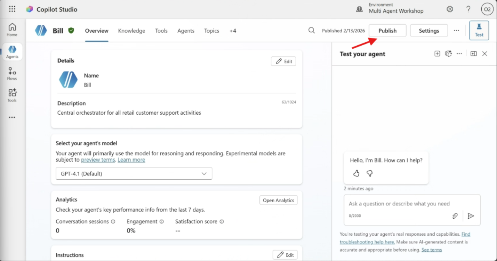
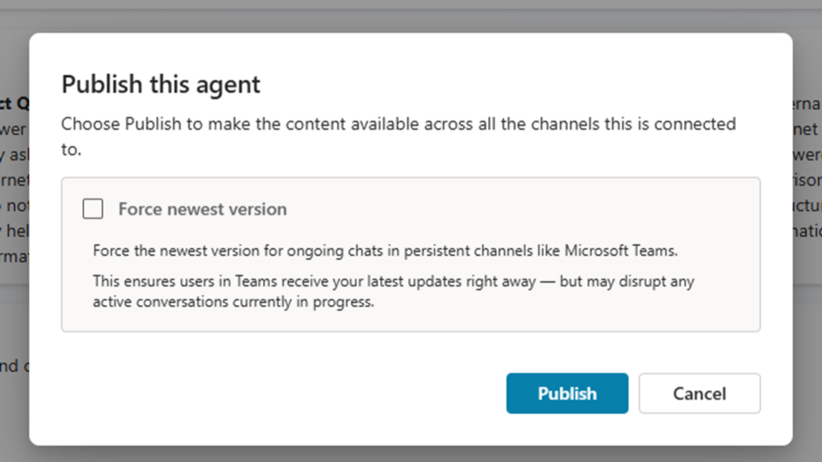
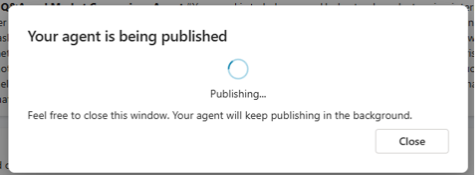
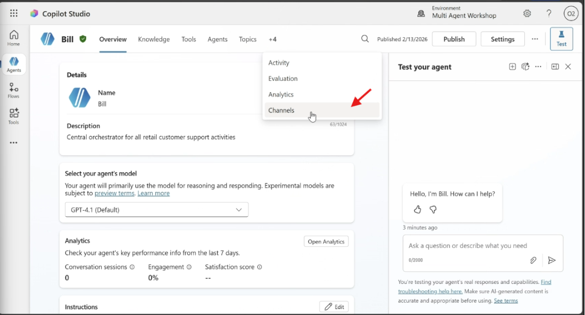
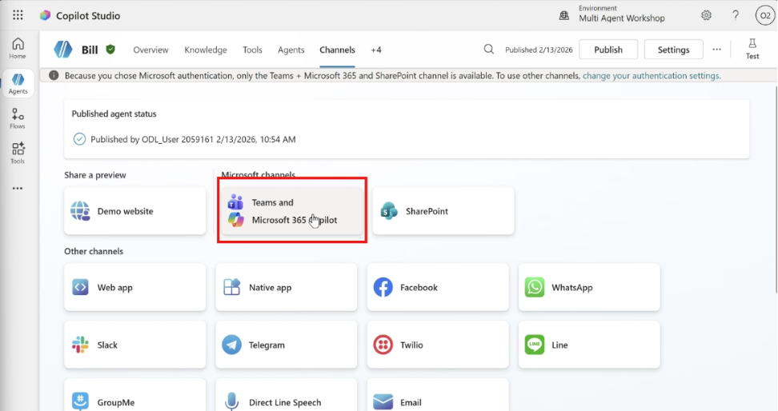
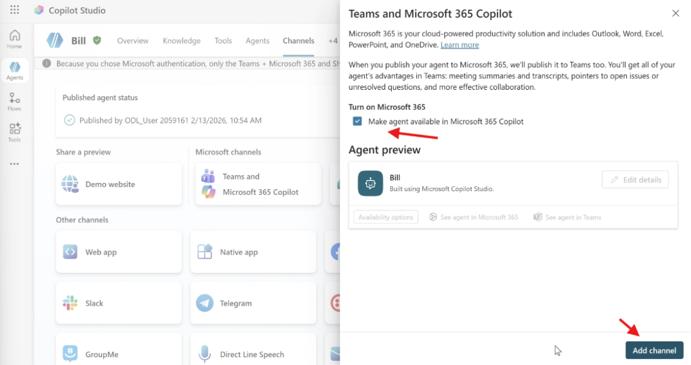
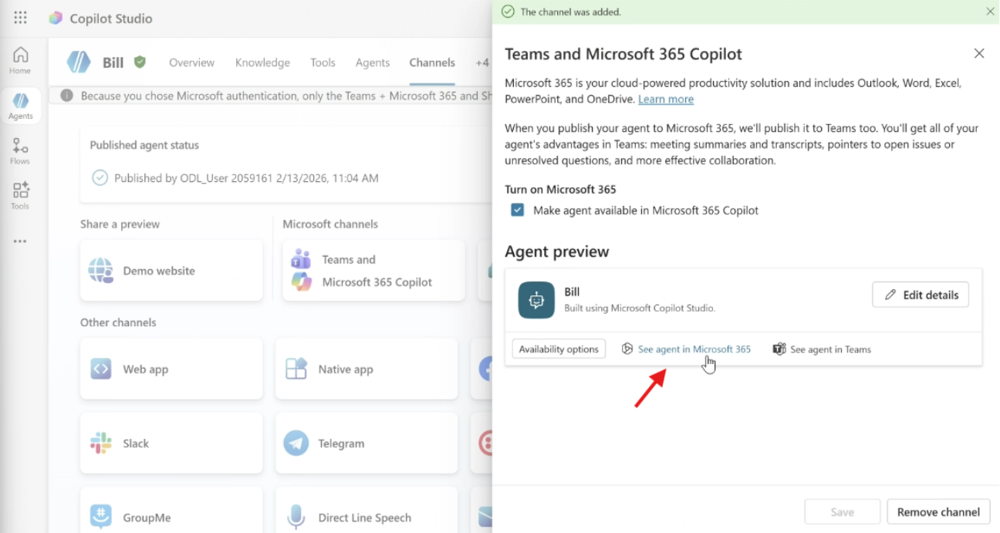
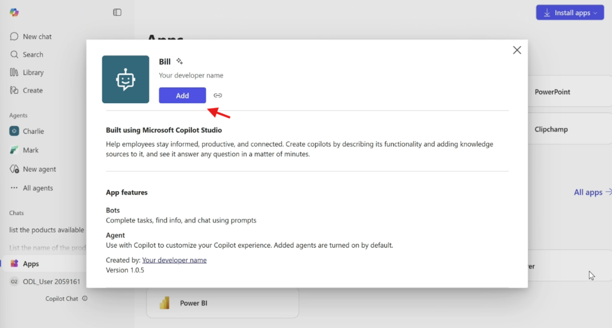
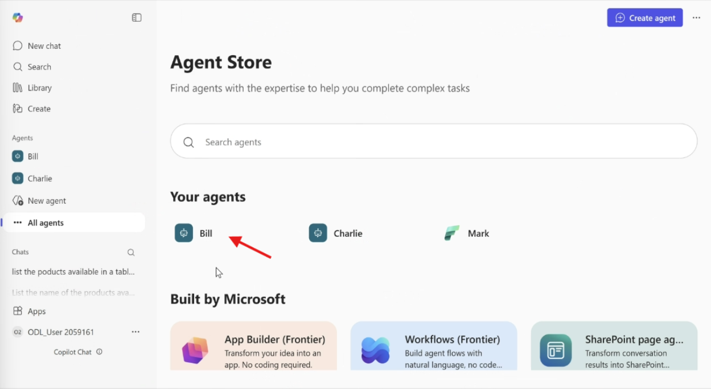

# Lab 09: MCS – "**Bill**": Publicação e Testes

## 🎯 Resumo da missão

Neste laboratório, vamos publicar o agente "**Bill**" e realizar testes através da aplicação do Microsoft 365.

## 🔎 Objetivos

Ao concluir este laboratório, você aprenderá:

- Como publicar o agente usando o canal do Microsoft 365 e do Microsoft Teams.
- Consultar o agente a partir do Microsoft 365.

---

## Processo de Publicação

1. Agora, selecione o botão **Publish** no canto superior direito. Uma janela pop-up será aberta para confirmar que você realmente deseja publicar seu agente.

   
   

2. Selecione **Publish** para confirmar a publicação do seu agente. Uma mensagem aparecerá indicando que seu agente está sendo publicado. Não é necessário manter essa janela pop-up aberta. Você receberá uma notificação quando o agente estiver publicado.

   

3. Quando o agente terminar de ser publicado, você verá a notificação na parte superior da página do agente.
4. Agora, antes de testar o agente, vamos configurar um canal. Selecione a seção **Channels** conforme mostrado a seguir.

   

5. Na seção **Channels**, selecione "Teams and Microsoft 365 Copilot".

   

6. Agora, no painel lateral, selecione a opção "Turn on Microsoft 365" e em seguida selecione **Add Channel**.

   

7. Levará um momento até que seja adicionado. Quando estiver pronto, uma notificação verde aparecerá na parte superior da barra lateral. Se aparecer uma janela pop-up solicitando publicar novamente, selecione **Publish** e aguarde a conclusão.
8. Selecione "See agent in Microsoft 365" para abrir uma nova aba.

   

9. Agora, na aplicação do Microsoft 365, você verá uma janela pop-up. Selecione "Add".

   

10. Agora nosso agente está pronto para ser testado!

---

## Testar o "**Bill**"

Vamos testar o "**Bill**" a partir da aplicação do Microsoft 365.

1. Selecione o "**Bill**" nos seus agentes.

   

2. **Prompt de teste — Cenário 1:**

   ```text
   Gere um relatório com os pedidos de compra do cliente CID-069, inclua data de início e fim do pedido, o produto, marca, categoria, quantidade, preço, nome do cliente e números de pedido.
   ```

3. **Prompt de teste — Cenário 2:**

   ```text
   Mostre o detalhe do produto Coffee maker
   ```

   Quando o agente tiver respondido, insira o seguinte prompt:

   ```text
   Me envie um e-mail com essa informação
   ```

4. Agora, em outra aba, abra <https://outlook.office.com> e na caixa de entrada você encontrará o e-mail com as informações.

---

## 🎉 Missão concluída

Excelente trabalho! Nosso agente "**Bill**" está completo.

✅ Parabéns! Você publicou seu agente com sucesso, implementou-o em um site de demonstração e o testou antes de implantá-lo para os usuários finais no site da empresa de varejo.
