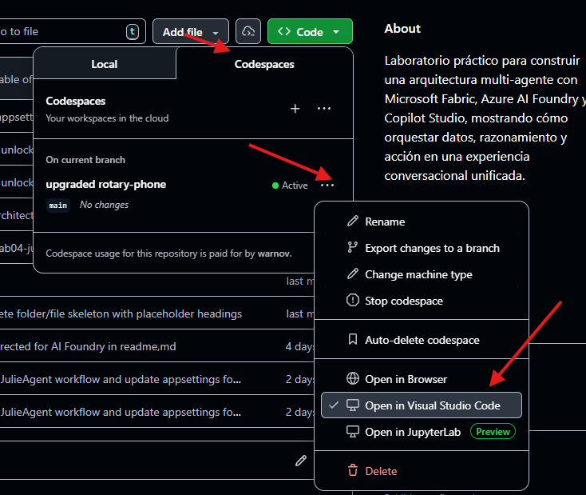

# Microsoft Foundry — Introdução e Configuração de Infraestrutura

## Introdução

Esta seção do workshop cobre a **camada de raciocínio e execução** da arquitetura multi-agente da Contoso Retail, implementada sobre o **Microsoft Foundry**. Aqui são construídos os agentes inteligentes que interpretam dados e planejam ações (executando algumas delas), com base nas informações produzidas pela camada de dados (Microsoft Fabric).

### Agentes desta camada

| Agente | Papel | Descrição |
|--------|-------|-----------|
| **Anders** | Executor Agent | Recebe solicitações de ações operacionais (como geração de relatórios ou renderização de pedidos) e as executa interagindo com serviços externos como a Azure Function `FxContosoRetail`. Tipo: `kind: "prompt"` com ferramenta OpenAPI. |
| **Julie** | Planner Workflow | Orquestra campanhas de marketing personalizadas. Recebe uma descrição de segmento de clientes e executa um fluxo de 5 etapas: (1) extrai o filtro de clientes, (2) chama o **SqlAgent** para gerar T-SQL, (3) executa a consulta no Fabric via **Function App OpenAPI**, (4) chama o **MarketingAgent** (com Bing Search) para gerar mensagens por cliente, (5) organiza o resultado como JSON de campanha de e-mails. Tipo: `kind: "workflow"` com 3 ferramentas (2 agentes + 1 OpenAPI). |

### Arquitetura geral

A camada Foundry está no centro da arquitetura de três camadas:

```
┌─────────────────────┐
│   Copilot Studio    │  ← Camada de interação (Charles, Bill, Ric)
├─────────────────────┤
│  Microsoft Foundry  │  ← Camada de raciocínio (Anders, Julie) ★
├─────────────────────┤
│  Microsoft Fabric   │  ← Camada de dados (Mark, Amy)
└─────────────────────┘
```

Os agentes Anders e Julie utilizam modelos GPT-4.1 implantados no Azure AI Services para raciocinar sobre as informações do negócio. Anders consome diretamente a API `FxContosoRetail` via ferramenta OpenAPI. Julie orquestra um workflow multi-agente: usa o **SqlAgent** (gera T-SQL), uma **Function App** (executa o SQL no Fabric via OpenAPI) e o **MarketingAgent** (gera mensagens personalizadas com Bing Search), coordenando tudo de forma autônoma como um agente do tipo `workflow`.

---

## Configuração com GitHub Codespaces

> 💡 **Prefere trabalhar na sua máquina local?** Consulte [setup.md](setup.md) para instruções de instalação manual com Azure CLI, .NET e PowerShell 7.

O GitHub Codespaces fornece um ambiente de desenvolvimento completo na nuvem, pré-configurado com todas as ferramentas necessárias. Não é necessário instalar nada na sua máquina — apenas um navegador e acesso ao repositório do GitHub.

> [!IMPORTANT]
> **Requisito: conta do GitHub**
> Para usar o GitHub Codespaces você precisa de uma conta do GitHub. Se ainda não tiver uma, pode criar uma conta gratuita seguindo as instruções em [https://docs.github.com/en/get-started/start-your-journey/creating-an-account-on-github](https://docs.github.com/en/get-started/start-your-journey/creating-an-account-on-github).

### O que está incluído no ambiente?

| Ferramenta | Pré-instalada |
|---|---|
| .NET 8 SDK | ✅ |
| Azure CLI (versão mais recente) | ✅ |
| PowerShell 7+ | ✅ |
| C# Dev Kit (extensão VS Code) | ✅ |
| Bicep (extensão VS Code) | ✅ |
| REST Client (extensão VS Code) | ✅ |

---

### Passo 1: Acessar o repositório no GitHub

1. Abra o navegador e navegue até a URL do repositório GitHub do workshop informada pelo instrutor.
2. Faça login no GitHub.

---

### Passo 2: Criar o Codespace

1. Na página principal do repositório, clique no botão verde **`< > Code`**.
2. Selecione a aba **Codespaces**.
3. Clique em **"Create codespace on main"**.

   > 💡 Se aparecer a opção de escolher o tipo de máquina, a opção **2-core** é mais que suficiente para este workshop.

4. Aguarde entre **2 e 4 minutos** enquanto o GitHub constrói o ambiente. Você verá uma tela de carregamento com logs de construção. **Isso só ocorre na primeira vez** — as sessões seguintes iniciam em segundos porque o ambiente fica salvo.

5. Quando o ambiente estiver pronto, o **VS Code abrirá no navegador** com todos os arquivos do repositório já disponíveis no painel esquerdo. Se a conexão pelo navegador for problemática, recomenda-se abrir o Codespace no VS Code local, indicando isso na seção Code do repositório no GitHub:  
   

> 💡 **Prefere o VS Code desktop?** Se você tem o VS Code instalado com a extensão **GitHub Codespaces**, clique no ícone `><` (canto inferior esquerdo) → *Connect to Codespace* para se conectar pelo VS Code local sem perder o ambiente na nuvem.

---

### Passo 3: Verificar se o ambiente está pronto

Abra o terminal integrado com <kbd>Ctrl</kbd>+<kbd>`</kbd> (ou **Terminal → New Terminal**) e execute os três comandos abaixo para confirmar que tudo está instalado:

```bash
dotnet --version
```
Você deve ver algo como `8.0.xxx`.

```bash
az version
```
Você deve ver a versão do Azure CLI instalada (JSON com `"azure-cli": "2.x.x"`).

```bash
pwsh --version
```
Você deve ver `PowerShell 7.x.x`.

Se os três responderem corretamente, restaure as dependências .NET do workshop:

```bash
dotnet restore pt/labs/foundry/code/workshop-multi-agentic.sln
```

O ambiente está pronto para os próximos passos.

---

### Passo 4: Autenticar-se no Azure

> ℹ️ **O sufixo único dos seus recursos é gerado automaticamente** a partir do ID da sua assinatura do Azure (um UUID globalmente único). Não é necessário informar nenhum número de tenant ou identificador manual.

---

No terminal do Codespace, execute:

```bash
az login --use-device-code
```

> ⚠️ É importante usar `--use-device-code` no Codespaces. O fluxo normal (`az login`) tenta abrir um browser local a partir do servidor remoto, o que não funciona corretamente neste ambiente. Lembre-se de abrir a URL de autenticação no seu navegador local, onde você está logado com sua conta de laboratório criada para o workshop (a que termina em `@azurehol<número>.com`).

Você verá uma saída semelhante a esta:

```
To sign in, use a web browser to open the page https://microsoft.com/devicelogin
and enter the code XXXXXXXX to authenticate.
```

Siga estes passos:
1. Abra `https://microsoft.com/devicelogin` no seu navegador (em uma nova aba).
2. Digite o código de 8 caracteres exibido no terminal do Codespace.
3. Selecione a **conta Azure do workshop** (a que termina em `@azurehol<número>.com`).
4. Autorize o acesso quando solicitado.
5. Volte ao terminal do Codespace — em alguns segundos você verá a lista de assinaturas disponíveis.

Verifique se a assinatura ativa está correta:

```bash
az account show --output table
```

Se precisar alterá-la:

```bash
az account set --subscription "nome-ou-id-da-assinatura"
```

---

### Passo 6: Obter os parâmetros do Microsoft Fabric

Para o Lab 4 (Julie/SqlAgent), você precisará de dois valores do Warehouse do Fabric:

- **FabricWarehouseSqlEndpoint**: endpoint SQL do Warehouse, sem `tcp://` ou porta. Exemplo: `xyz.datawarehouse.fabric.microsoft.com`
- **FabricWarehouseDatabase**: nome exato e completo do banco de dados.

Para obtê-los no portal do Fabric, siga o guia [sql-parameters.md](./setup/sql-parameters.md).

> **Nota:** Se ainda não tiver esses valores, pode omiti-los. O deploy continuará sem eles e o restante da infraestrutura será criado corretamente. Você poderá configurar a conexão SQL manualmente mais tarde pelo portal do Azure.

---

### Passo 7: Executar o script de implantação

No terminal do Codespace, navegue até a pasta do script:

```bash
cd /workspaces/multi-agentic-workshop/pt/labs/foundry/setup/op-flex
```

Execute o script de implantação (usando `pwsh` para iniciar o PowerShell 7):

```bash
pwsh ./deployFromAzure.ps1
```

O script solicitará apenas os parâmetros opcionais. Pressione <kbd>Enter</kbd> para aceitar os valores padrão de `Location` e `ResourceGroupName`:

```
Pressione Enter para o padrão.
Location [eastus]:
ResourceGroupName [rg-contoso-retail]:
Deseja configurar a conexão SQL do Fabric para o Lab04 agora? (s/N): s
FabricWarehouseSqlEndpoint (sem protocolo, sem porta): kqbvkknqlijebcyrtw2rgtsx2e-dvthxhg2tsuurev2kck26gww4q.database.fabric.microsoft.com
FabricWarehouseDatabase: retail_sqldatabase_danrdol6ases3c-6d18d61e-43a5-4281-a754-b255fc9a6c9b
```

Você verá a confirmação do plano antes da execução começar:

```
========================================
 Workshop Multi-Agente - Implantação
 Plano: Flex Consumption (FC1 / Linux)
 Modo: Azure Cloud Shell
========================================

  Assinatura:     Minha Assinatura Azure (xxxxxxxx-xxxx-xxxx-xxxx-xxxxxxxxxxxx)
  Sufixo:         ab3f2
  Location:       eastus
  Resource Group: rg-contoso-retail
  Fabric SQL:     kqbvkknqlijebcyrtw2rgtsx2e-...
  Fabric DB:      retail_sqldatabase_...
```

Em seguida, verá o progresso da implantação recurso a recurso:

```
  ⏳ CognitiveServices/accounts/ais-contosoretail-ab3f2 ...
  ✅ Storage/storageAccounts/stcontosoretailab3f2
  ✅ Web/serverFarms/asp-contosoretail-ab3f2
  ✅ Web/sites/func-contosoretail-ab3f2
  ✅ CognitiveServices/accounts/ais-contosoretail-ab3f2
  ✅ Código publicado com sucesso.
```

O processo completo leva entre **5 e 10 minutos**.

> 👁️ **Anote a saída final!** Ao terminar, o script exibe os nomes e URLs de todos os recursos criados. Você precisará desses valores para configurar os agentes nos próximos passos.

---

### Passo 8: Registrar os outputs da implantação

Ao finalizar, anote estes valores da saída do script:

| Output do script | Descrição | Onde é usado |
|---|---|---|
| `Sufixo único` | 5 caracteres, ex: `ab3f2` | Para identificar seus recursos no Azure |
| `Function App Base URL` | URL base da API | `appsettings.json` de Anders e Julie |
| `Foundry Project Endpoint` | Endpoint do projeto Foundry | `appsettings.json` de Anders e Julie |
| `Bing Connection Name` | Nome da conexão Bing | `appsettings.json` de Julie |
| `Bing Connection ID (Julie)` | ID da conexão Bing | `appsettings.json` de Julie |

---

### Passo 9: Configurar os appsettings.json dos agentes

#### Anders (Lab 3)

No painel de arquivos do Codespace, abra:
`pt/labs/foundry/code/agents/AndersAgent/ms-foundry/appsettings.json`

Substitua os valores `<sufixo>` pelo sufixo obtido no passo anterior:

```json
{
  "FoundryProjectEndpoint": "https://ais-contosoretail-<sufixo>.services.ai.azure.com/api/projects/aip-contosoretail-<sufixo>",
  "ModelDeploymentName": "gpt-4.1",
  "FunctionAppBaseUrl": "https://func-contosoretail-<sufixo>.azurewebsites.net/api",
  "TenantId": ""
}
```

> **TenantId**: deixe vazio se tiver apenas uma conta Azure ativa no Codespace (o caso habitual). Se estiver trabalhando localmente e tiver múltiplos tenants, informe o Tenant ID do tenant do workshop:
> ```bash
> az account show --query tenantId -o tsv
> ```

#### Julie (Lab 4)

Abra `pt/labs/foundry/code/agents/JulieAgent/appsettings.json` e preencha todos os valores usando os outputs da implantação anotados no Passo 8.

---

### Passo 10: Atribuir permissões RBAC no Foundry

Para que os agentes possam ser criados e executados, seu usuário precisa da função **Cognitive Services User** no recurso de AI Services. Sem essa função você receberá um erro `PermissionDenied` ao tentar criar agentes.

Execute estes comandos no terminal do Codespace (bash):

```bash
# Obter o Object ID do usuário autenticado (funciona com contas MSA/pessoais e contas corporativas)
objectId=$(az ad signed-in-user show --query id -o tsv 2>/dev/null || \
    az account get-access-token --query accessToken -o tsv | \
    python3 -c "import sys,base64,json; t=sys.stdin.read().strip(); p=t.split('.')[1]; p+='='*(4-len(p)%4); print(json.loads(base64.b64decode(p))['oid'])")

# Obter o nome do recurso AI Services criado pela implantação
aisName=$(az cognitiveservices account list \
    --resource-group rg-contoso-retail \
    --query "[0].name" -o tsv)

# Atribuir a função usando o Object ID (não requer permissões de Graph API)
az role assignment create \
    --assignee-object-id "$objectId" \
    --assignee-principal-type User \
    --role "Cognitive Services User" \
    --scope "/subscriptions/$(az account show --query id -o tsv)/resourceGroups/rg-contoso-retail/providers/Microsoft.CognitiveServices/accounts/$aisName"
```

Aguarde **1 minuto** para que a permissão se propague antes de executar os agentes.

> **Nota:** Se receber um erro `RoleAssignmentExists`, a função já foi atribuída automaticamente pelo script de implantação. Pode continuar.

---

### Passo 11: Verificar a implantação

Confirme que todos os recursos foram criados corretamente:

```bash
az resource list --resource-group rg-contoso-retail --output table
```

O resultado deve incluir estes recursos:

| Recurso             | Nome                            | Descrição |
| ------------------- | ------------------------------- | --------- |
| Storage Account     | `stcontosoretail{suffix}`       | Armazenamento para a Function App |
| App Service Plan    | `asp-contosoretail-{suffix}`    | Plano de hospedagem Flex Consumption |
| Function App        | `func-contosoretail-{suffix}`   | API da Contoso Retail (.NET 8, dotnet-isolated) |
| AI Foundry Resource | `ais-contosoretail-{suffix}`    | AI Services + projetos Foundry com GPT-4.1 |
| AI Foundry Project  | `aip-contosoretail-{suffix}`    | Projeto de trabalho no Foundry |
| Bing Search         | `bing-contosoretail-{suffix}`   | Conexão de busca web para o agente Julie |

> **Nota:** O `{suffix}` é um identificador único de 5 caracteres gerado automaticamente a partir do ID da sua assinatura. Isso garante que os nomes dos recursos não colidam entre participantes.

---

### Gerenciamento do Codespace

#### Pausar (para conservar horas gratuitas)

O Codespace pausa automaticamente após **30 minutos de inatividade**. Você também pode pausá-lo manualmente na aba Codespaces do GitHub. Seus arquivos e configuração são preservados entre sessões.

#### Retomar uma sessão salva

- Vá ao repositório no GitHub → **Code** → **Codespaces** → clique no seu Codespace existente.
- O ambiente reabre em segundos com tudo como você deixou.
- Verifique se a sessão do Azure CLI ainda está ativa com `az account show`. Se tiver expirado, repita o Passo 4.

#### Excluir ao finalizar o workshop

Para liberar as horas da sua cota:
- Vá a `github.com/codespaces`
- Encontre seu Codespace → clique em `···` → **Delete**.

> ⚠️ Ao excluir o Codespace, as alterações locais não commitadas serão perdidas. Se você modificou os arquivos `appsettings.json` e deseja salvá-los, copie-os para algum lugar seguro antes de excluir.

#### Horas gratuitas disponíveis

O GitHub oferece **120 horas/mês** gratuitas em máquinas de 2 cores para contas pessoais. Um workshop de 8 horas consome apenas 7% do limite mensal.

---

## Estrutura do código

```
labs/foundry/
├── setup.md                               ← Guia de configuração na máquina local
├── codespaces-setup.md                    ← Este arquivo (guia Codespaces — recomendado)
├── lab03-anders-executor-agent.md         ← Lab 3: Agente Anders
├── lab04-julie-planner-agent.md           ← Lab 4: Agente Julie
├── setup/
│   ├── op-flex/                           ← ⭐ Opção recomendada (Flex Consumption / Linux)
│   │   ├── main.bicep
│   │   ├── storage-rbac.bicep
│   │   ├── deploy.ps1                     ← Script para máquina local (Windows/macOS/Linux)
│   │   └── deployFromAzure.ps1            ← Script para Codespaces / Azure Cloud Shell
│   └── op-consumption/                    ← Opção clássica (Consumption Y1 / Windows)
│       ├── main.bicep
│       ├── storage-rbac.bicep
│       └── deploy.ps1
└── code/
    ├── api/
    │   └── FxContosoRetail/               ← Azure Function (API)
    │       ├── FxContosoRetail.cs         ← Endpoints: HelloWorld, OrdersReporter, SqlExecutor
    │       ├── Program.cs
    │       ├── Models/
    │       └── ...
    ├── agents/
    │   ├── AndersAgent/                   ← Console App: Agente Anders (kind: prompt + ferramenta OpenAPI)
    │   │   ├── ms-foundry/                ← Versão Responses API (recomendada)
    │   │   │   ├── Program.cs
    │   │   │   └── appsettings.json
    │   │   └── ai-foundry/                ← Versão Persistent Agents API (alternativa)
    │   │       └── ...
    │   └── JulieAgent/                    ← Console App: Agente Julie (kind: workflow)
    │       ├── Program.cs                 ← Cria os 3 agentes + chat com Julie
    │       ├── JulieAgent.cs              ← Julie: workflow com 3 ferramentas (SqlAgent, MarketingAgent, OpenAPI)
    │       ├── SqlAgent.cs                ← Sub-agente: gera T-SQL a partir de linguagem natural
    │       ├── MarketingAgent.cs          ← Sub-agente: gera mensagens com Bing Search
    │       ├── db-structure.txt           ← DDL do BD injetado no SqlAgent
    │       └── appsettings.json
    └── tests/
        ├── bruno/                         ← Coleção Bruno (REST client)
        │   ├── bruno.json
        │   ├── OrdersReporter.bru
        │   └── environments/
        │       └── local.bru
        └── http/
            └── FxContosoRetail.http       ← Arquivo .http (VS Code REST Client)
```

---

## Laboratórios

| Lab   | Arquivo                                                   | Descrição                                                    |
| ----- | --------------------------------------------------------- | ------------------------------------------------------------ |
| Lab 3 | [Anders — Executor Agent](lab03-anders-executor-agent.md) | Criar o agente executor que gera relatórios e interage com os serviços da Contoso Retail. |
| Lab 4 | [Julie — Planner Agent](lab04-julie-planner-agent.md)     | Criar o agente orquestrador de campanhas de marketing usando o padrão workflow com sub-agentes (SqlAgent, MarketingAgent) e ferramenta OpenAPI. |

---

## Próximo passo

Após concluir a configuração, continue com o [Lab 3 — Anders (Executor Agent)](lab03-anders-executor-agent.md).
