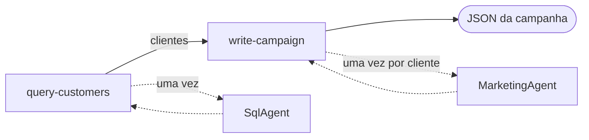
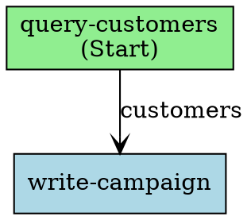
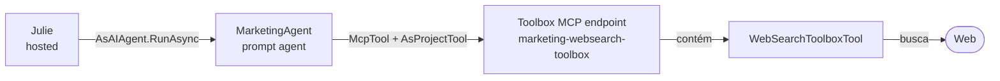

# Lab 4: Julie, a orquestradora de campanhas (agente hospedado)

## Índice

- [Lab 4: Julie, a orquestradora de campanhas (agente hospedado)](#lab-4-julie-a-orquestradora-de-campanhas-agente-hospedado)
	- [Índice](#índice)
	- [Introdução](#introdução)
  - [Advanced Foundry Agents Concepts](#advanced-foundry-agents-concepts)
    - [Workflow Agents](#workflow-agents)
    - [Hosted Agents](#hosted-agents)
    - [Toolbox-Based Tools (MCP)](#toolbox-based-tools-mcp)
    - [Caso de uso implementado: campanhas de varejo personalizadas](#caso-de-uso-implementado-campanhas-de-varejo-personalizadas)
	- [Continuidade da configuração](#continuidade-da-configuração)
	- [Checklist rápido](#checklist-rápido)
		- [1) Verificar valores de conexão SQL](#1-verificar-valores-de-conexão-sql)
		- [2) Alternativa se você não seguir toda a sequência de labs](#2-alternativa-se-você-não-seguir-toda-a-sequência-de-labs)
		- [3) Comportamento quando os valores do Fabric não são fornecidos](#3-comportamento-quando-os-valores-do-fabric-não-são-fornecidos)
	- [Configuração manual de permissões no Fabric (obrigatório para o Lab 4)](#configuração-manual-de-permissões-no-fabric-obrigatório-para-o-lab-4)
		- [Parte A — Acesso ao Workspace](#parte-a--acesso-ao-workspace)
		- [Parte B — Usuário SQL e permissões no banco](#parte-b--usuário-sql-e-permissões-no-banco)
		- [Validação recomendada](#validação-recomendada)
	- [Arquitetura do projeto Julie (detalhe)](#arquitetura-do-projeto-julie-detalhe)
	- [Que tipo de agente a Julie é agora?](#que-tipo-de-agente-a-julie-é-agora)
	- [Como a orquestração é implementada](#como-a-orquestração-é-implementada)
		- [O grafo](#o-grafo)
		- [Modos de dados: funcionar sem o Fabric](#modos-de-dados-funcionar-sem-o-fabric)
		- [O laço: uma mensagem por cliente](#o-laço-uma-mensagem-por-cliente)
		- [Ver o grafo](#ver-o-grafo)
	- [Definição dos agentes especializados](#definição-dos-agentes-especializados)
		- [SqlAgent](#sqlagent)
		- [MarketingAgent](#marketingagent)
		- [Julie (hospedada)](#julie-hospedada)
	- [Toolbox, Web Search e MCP: como o MarketingAgent busca](#toolbox-web-search-e-mcp-como-o-marketingagent-busca)
		- [O que é um Toolbox no Microsoft Foundry?](#o-que-é-um-toolbox-no-microsoft-foundry)
		- [Web Search: o motor por trás do Toolbox](#web-search-o-motor-por-trás-do-toolbox)
		- [MCP: o protocolo que conecta o agente ao Toolbox](#mcp-o-protocolo-que-conecta-o-agente-ao-toolbox)
		- [Da teoria ao nosso caso: como conectamos isso no MarketingAgent](#da-teoria-ao-nosso-caso-como-conectamos-isso-no-marketingagent)
	- [O que o Program.cs faz exatamente?](#o-que-o-programcs-faz-exatamente)
	- [Identidade e permissões do agente hospedado](#identidade-e-permissões-do-agente-hospedado)
	- [Passos do laboratório](#passos-do-laboratório)
		- [Passo 1: Configurar appsettings.json](#passo-1-configurar-appsettingsjson)
		- [Passo 2: Garantir que as permissões do Fabric estão configuradas](#passo-2-garantir-que-as-permissões-do-fabric-estão-configuradas)
		- [Passo 3: Implantar e executar a Julie](#passo-3-implantar-e-executar-a-julie)
		- [Passo 4: Verificar a atribuição de função](#passo-4-verificar-a-atribuição-de-função)
		- [Passo 5: Testar o fluxo end-to-end](#passo-5-testar-o-fluxo-end-to-end)
		- [Validação do laboratório](#validação-do-laboratório)
	- [Solução de problemas](#solução-de-problemas)
	- [Challenges](#challenges)
		- [Challenge 1: Melhorar o prompt do MarketingAgent para campanhas atuais](#challenge-1-melhorar-o-prompt-do-marketingagent-para-campanhas-atuais)
		- [Challenge 2: Criar um agente no-code com Code Interpreter](#challenge-2-criar-um-agente-no-code-com-code-interpreter)

---

## Introdução

Neste laboratório você vai construir e validar a Julie, a orquestradora de campanhas de marketing, como **agente hospedado** no Microsoft Foundry, escrito com o **Microsoft Agent Framework**.

A Julie recebe a descrição em linguagem natural de um segmento de clientes e devolve uma campanha de e-mail em JSON. Ela faz isso como um **workflow determinista**: um grafo explícito de dois nós, cada um envolvendo um agente de prompt, com o `MarketingAgent` chamado uma vez por cliente para que cada destinatário receba uma mensagem sobre a categoria que realmente compra.

- `query-customers` — pede o segmento ao `SqlAgent` (T-SQL executado através da ferramenta OpenAPI `SqlExecutor`), e cai para clientes de demonstração claramente marcados quando o Fabric SQL não está configurado.
- `write-campaign` — percorre esses clientes, pede ao `MarketingAgent` uma mensagem para cada um e monta o JSON final.

> ✅ O laboratório funciona de ponta a ponta **mesmo sem o Fabric**, usando dados de demonstração sempre sinalizados como tais. Veja [Modos de dados](#modos-de-dados-funcionar-sem-o-fabric).

Progressivamente você vai configurar o ambiente, verificar permissões e conectividade SQL, implantar o código-fonte da Julie no Foundry e executar o fluxo end-to-end para obter a saída final de campanha em formato JSON.

## Advanced Foundry Agents Concepts

Este laboratório amplia o cenário da Contoso Retail com três capacidades complementares:

- **Workflow Agents**: orquestração explícita e determinística construída com o Microsoft Agent Framework.
- **Hosted Agents**: aplicações de agentes personalizadas implantadas e operadas pelo Microsoft Foundry.
- **Toolbox-Based Tools (MCP)**: ferramentas gerenciadas de forma centralizada e expostas através de um único endpoint compatível com o Model Context Protocol (MCP).

Juntos, esses conceitos mostram como coordenar agentes especializados, conectá-los a dados e ferramentas empresariais governadas de forma centralizada, e implantar a orquestração como um agente do Foundry.

### Workflow Agents

Um workflow é um grafo explícito de nós e arestas. O grafo define a ordem de execução e os dados que passam entre as etapas.

A Julie usa dois nós:

- `query-customers` obtém o segmento de clientes por meio do `SqlAgent`.
- `write-campaign` invoca o `MarketingAgent` uma vez para cada cliente e produz o JSON da campanha.

O workflow é criado com `WorkflowBuilder` e é representado por um objeto `Workflow`. `Workflow` não é um agente e não expõe um endpoint HTTP. `workflow.AsAIAgent(...)` adapta o grafo à interface `AIAgent` para que ele possa receber solicitações e devolver respostas.

O primeiro nó herda de `ChatProtocolExecutor`. Esse executor do framework adapta o protocolo de chat do Foundry, incluindo os valores `ChatMessage` recebidos e o `TurnToken`, para as mensagens tipadas do workflow. Em seguida, o nó emite um objeto `CustomerQuery` para o próximo nó.

Os agentes de prompt especializados continuam sendo instâncias de `AIAgent` dentro dos nós do workflow. Essa estrutura permite que os nós controlem dados tipados, tratamento de erros, comportamento alternativo e iteração por cliente, mantendo os recursos dos agentes de prompt.

### Hosted Agents

A Julie é implantada como um agente hospedado do Foundry. O projeto hospedado contém uma aplicação web que:

1. Cria o workflow.
2. Converte o workflow em um `AIAgent`.
3. Registra o agente com o protocolo Responses do Foundry.
4. Inicia o servidor web.

O deployer local envia o código-fonte do projeto hospedado usando `CreateAgentVersionFromCodeAsync`. O Foundry executa o build remoto, cria o contêiner gerenciado e expõe o agente hospedado pelo seu endpoint. Esse processo não exige Docker, Dockerfile nem Azure Container Registry.

O Foundry administra o runtime hospedado, a identidade, as versões, o endpoint e a integração operacional. O agente hospedado usa sua identidade gerenciada para acessar o projeto e os agentes de prompt que invoca.

### Toolbox-Based Tools (MCP)

Além das ferramentas embutidas diretamente na definição de um agente (o padrão que o Anders usa com `OpenAPITool`), o Foundry oferece um segundo modelo: um **Toolbox** que centraliza um conjunto de ferramentas atrás de um único endpoint compatível com **MCP** (Model Context Protocol), um padrão aberto para expor ferramentas a agentes de IA.

O `MarketingAgent` usa esse modelo para sua ferramenta de **Web Search**: em vez de uma conexão com chave (como exigia o Grounding with Bing Search), o agente se conecta ao endpoint MCP de um Toolbox através de `McpTool` + `AsProjectTool` — o mesmo mecanismo genérico que você usaria para se conectar a qualquer servidor MCP externo.

Isso habilita um terceiro padrão de integração, além dos de Workflow Agents e Hosted Agents:

- A ferramenta é versionada e governada no nível do **projeto**, não do agente.
- Pode ser substituída ou versionada sem recompilar nem reimplantar o agente que a consome.
- O mesmo mecanismo de conexão (MCP) serve tanto para ferramentas próprias do Foundry (um Toolbox) quanto para servidores MCP de terceiros.

Veja [Toolbox, Web Search e MCP: como o MarketingAgent busca](#toolbox-web-search-e-mcp-como-o-marketingagent-busca) para a teoria completa, os detalhes do protocolo e o passo a passo da implementação.

### Caso de uso implementado: campanhas de varejo personalizadas

A Julie implementa um workflow para campanhas de varejo:

1. O usuário descreve em linguagem natural o segmento de clientes desejado.
2. O `SqlAgent` gera a consulta T-SQL necessária para identificar os clientes e sua categoria de produto preferida.
3. O `SqlExecutor` executa a consulta no Fabric Warehouse.
4. O `query-customers` converte o resultado em registros tipados `Customer`.
5. O `write-campaign` chama o `MarketingAgent` uma vez por cliente, fornecendo o nome e a categoria preferida.
6. A Julie devolve uma mensagem de marketing personalizada por cliente em um documento JSON de campanha.

O `MarketingAgent` usa Web Search (via um Toolbox de Foundry) para incorporar informações atuais às mensagens. O resultado inclui o nome da campanha, a origem dos dados, os indicadores de dados de demonstração, os avisos e as mensagens personalizadas.

O workflow oferece três modos de dados:

- `auto`: usa o Fabric quando disponível e dados de demonstração claramente marcados quando não estiver.
- `real`: exige dados do Fabric e exibe os erros de SQL.
- `demo`: usa os clientes fictícios integrados sem consultar o Fabric.

Os clientes de demonstração usam endereços `@example.invalid`, e a resposta inclui os campos `dataSource`, `isDemoData` e `warning` para que os dados de teste não sejam confundidos com dados de produção.

> **Requisito sobre o tipo de agente:** o `kind` de um agente é imutável. Se um agente existente tiver outro tipo, o deployer o recria como agente hospedado.

## Continuidade da configuração

Este laboratório assume que você já completou:

- A implantação base da infraestrutura do Foundry (`pt/labs/foundry/setup.md` ou `codespaces-setup.md`)
- O fluxo de dados no Fabric do **Lab 1** (`../fabric/lab01-data-setup.md`)

## Checklist rápido

### 1) Verificar valores de conexão SQL

Para a configuração atualizada são usados estes valores:

- `FabricWarehouseSqlEndpoint`
- `FabricWarehouseDatabase`

Eles são obtidos da connection string SQL do Warehouse do Fabric:

- `FabricWarehouseSqlEndpoint` = `Data Source` sem `,1433`
- `FabricWarehouseDatabase` = `Initial Catalog`

### 2) Alternativa se você não seguir toda a sequência de labs

Se você não estiver seguindo toda a sequência de laboratórios, para o Lab 4 também pode usar um banco SQL standalone (por exemplo, Azure SQL Database), ajustando esses dois valores para o host e o nome de banco correspondentes.

### 3) Comportamento quando os valores do Fabric não são fornecidos

Se você não fornecer esses valores durante a configuração, a implantação da infraestrutura não falha, mas a conexão SQL do Lab 4 não é configurada automaticamente e precisa ser ajustada manualmente na Function App.

Nessa situação o `SqlExecutor` devolve um HTTP 400 e o `SqlAgent` não consegue devolver linhas. Com o valor padrão `JULIE_DATA_MODE=auto`, a Julie **ainda assim termina com sucesso** usando clientes de demonstração, e a resposta diz isso explicitamente. Veja [Modos de dados](#modos-de-dados-funcionar-sem-o-fabric).

## Configuração manual de permissões no Fabric (obrigatório para o Lab 4)

Após a implantação, verifique se a Managed Identity da Function App tem acesso ao workspace e ao banco SQL `retail`.

### Parte A — Acesso ao Workspace

1. Abra o workspace onde o banco de dados `retail` foi implantado.
2. Vá em **Manage access**.
3. Clique em **Add people or groups**.
4. Procure e adicione a identidade da Function App.
	- Nome esperado: `func-contosoretail-[sufixo]`
	- Exemplo: `func-contosoretail-siwhb`
5. Na função, selecione **Contributor** (se seu Fabric estiver em inglês) ou **Colaborador** (se estiver em português).
6. Clique em **Add**.

### Parte B — Usuário SQL e permissões no banco

1. Dentro do mesmo workspace, abra o banco de dados `retail`.
2. Clique em **New Query**.
3. Execute o seguinte código T-SQL para criar o usuário externo:

```sql
CREATE USER [func-contosoretail-[sufixo]] FROM EXTERNAL PROVIDER;
```

Exemplo real:

```sql
CREATE USER [func-contosoretail-siwhb] FROM EXTERNAL PROVIDER;
```

4. Em seguida, atribua permissões de leitura:

```sql
ALTER ROLE db_datareader ADD MEMBER [func-contosoretail-[sufixo]];
```

Exemplo real:

```sql
ALTER ROLE db_datareader ADD MEMBER [func-contosoretail-siwhb];
```

### Validação recomendada

- Aguarde de 1 a 3 minutos para a propagação das permissões.

## Arquitetura do projeto Julie (detalhe)

A solução agora está dividida em **dois projetos**:

```text
pt/labs/foundry/code/agents/
├── JulieAgent/            ← deployer + cliente de chat local (executa na sua máquina)
│   ├── SqlAgent.cs             definição do agente de prompt que gera T-SQL
│   ├── MarketingAgent.cs       definição do agente de prompt com Web Search (Toolbox)
│   ├── Program.cs              cria os subagentes, implanta a Julie, concede RBAC, abre o chat
│   ├── db-structure.txt        esquema do banco injetado no SqlAgent
│   └── appsettings.json
└── JulieHosted/           ← a própria agente (executa dentro do Foundry)
    ├── Program.cs              grafo do workflow, protocolo Responses, nós de consulta e laço
    ├── hosted.csproj
    └── appsettings.json
```

> 🔎 O `JulieAgent.cs`, que continha a definição do workflow em CSDL YAML, **não existe mais**. O trabalho dele agora é feito pelo `JulieHosted/Program.cs`.

> ⚠️ O `JulieHosted` é deliberadamente irmão do `JulieAgent`, não uma subpasta. Se estivesse aninhado, o `.csproj` pai absorveria as suas fontes e a compilação falharia com `CS8802` (múltiplos pontos de entrada).

## Que tipo de agente a Julie é agora?

A Julie é um **agente hospedado** cujo comportamento é um **workflow do Agent Framework**: uma aplicação em contêiner que o Foundry compila a partir do seu código-fonte, executa, escala e expõe através do protocolo **Responses**.

- `SqlAgent` e `MarketingAgent` continuam sendo **agentes de prompt**. Eles mantêm as suas instruções, as suas ferramentas (OpenAPI, Web Search) e o seu versionamento, e continuam visíveis e editáveis no playground do portal. A Julie chama cada um deles de dentro de um dos seus nós.
- A própria Julie não tem modelo nem instruções: ela é o grafo mais dois nós de código.

## Como a orquestração é implementada

O `JulieHosted/Program.cs` constrói um `AIAgent` e o registra com as extensões de hosting do Foundry:

```csharp
Workflow workflow = new WorkflowBuilder(queryCustomers)
    .AddEdge(queryCustomers, writeCampaign, label: "clientes")
    .WithOutputFrom(writeCampaign)
    .Build();

AIAgent julie = workflow.AsAIAgent(
    name: "Julie",
    includeExceptionDetails: true,
    includeWorkflowOutputsInResponse: true);

var builder = AgentHost.CreateBuilder(args);
builder.Services.AddFoundryResponses(julie);
builder.RegisterProtocol("responses", endpoints => endpoints.MapFoundryResponses());
```

`Workflow.AsAIAgent(...)` devolve um `AIAgent` comum (um `WorkflowHostAgent`), e é por isso que o workflow pode ser servido pelo mesmo protocolo Responses que qualquer outro agente hospedado.

### O grafo



Dois nós, cada um envolvendo um agente de prompt:

| Nó | O que faz |
|---|---|
| `query-customers` | Pede o segmento ao `SqlAgent`, interpreta as linhas e **cai para clientes de demonstração** quando o Fabric SQL não está disponível |
| `write-campaign` | Percorre os clientes, chama o `MarketingAgent` uma vez para cada um e monta o JSON |

### Modos de dados: funcionar sem o Fabric

O `JULIE_DATA_MODE` decide o que acontece quando o lado SQL não está disponível:

| Modo | Comportamento |
|---|---|
| `auto` (padrão) | Tenta o `SqlAgent`; em caso de falha ou resultado vazio, usa clientes de demonstração claramente marcados |
| `real` | Nunca cai para o plano B — uma falha de SQL faz a execução falhar, que é o que você quer ao diagnosticar |
| `demo` | Nunca consulta o SQL, útil para ensaios offline |

O deployer o repassa a partir do `appsettings.json`:

```json
"JulieDataMode": "auto"
```

O plano B é **explícito, nunca silencioso**. Os clientes de demonstração usam endereços `@example.invalid`, e a campanha carrega `dataSource`, `isDemoData` e um `warning` explicando exatamente por que dados reais não foram usados.

### O laço: uma mensagem por cliente

Esta é a parte que torna a campanha útil. O `write-campaign` chama o `MarketingAgent` **uma vez por cliente**, passando o nome e a categoria favorita daquele cliente:

```csharp
[YieldsOutput(typeof(string))]
internal sealed class WriteCampaign(AIAgent marketingAgent) : Executor<CustomerQuery>("write-campaign")
{
    public override async ValueTask HandleAsync(
        CustomerQuery query, IWorkflowContext context, CancellationToken cancellationToken = default)
    {
        List<object> messages = [];

        foreach (var customer in query.Customers)
        {
            if (string.IsNullOrWhiteSpace(customer.Email)) continue;

            var reply = await marketingAgent.RunAsync(
                $"Cliente: {customer.FullName}. Categoria favorita: {customer.FavoriteCategory}.",
                cancellationToken: cancellationToken);

            messages.Add(new
            {
                to = customer.Email,
                subject = $"{customer.FirstName}, novidades em {customer.FavoriteCategory}",
                body = reply.Text
            });
        }
        // ... serializa a campanha e a emite
    }
}
```

Um cliente que compra **Bikes** recebe uma mensagem sobre um evento de ciclismo; um que compra **Clothing**, uma sobre a semana de moda. Cada destinatário, o seu próprio texto.

> 💡 A API de grafos não tem fan-out dinâmico (N clientes → N invocações paralelas do mesmo nó), então o laço vive dentro do nó. É isso que torna possível hoje a personalização por cliente.

### Ver o grafo

O workflow consegue imprimir a si mesmo como DOT do Graphviz, e o agente faz isso ao iniciar:

```csharp
Console.WriteLine(workflow.ToDotString());
```

Esta é a saída real do grafo da Julie:



Salve como `julie.dot` e renderize com o [Graphviz](https://graphviz.org/download/):

```bash
dot -Tsvg julie.dot -o julie.svg
```

O valor não é o desenho em si: o diagrama é gerado **a partir do grafo em execução**, então ele não pode divergir do código.

### Comportamento durante a inicialização

A aplicação hospedada resolve os agentes de prompt antes de construir o grafo. Se houver uma configuração de inicialização ausente, ela cria um workflow de um único nó que informa o erro pelo mesmo endpoint Responses:

```csharp
catch (Exception ex)
{
    StartupFailure failure = new(ex.Message);
    workflow = new WorkflowBuilder(failure).WithOutputFrom(failure).Build();
}
```

O contêiner inicia e a resposta contém `WORKFLOW_ERROR: ...` com a causa do problema.

O grafo executa a sequência declarada: consulta de clientes, geração da campanha personalizada e saída da campanha. O laço por cliente fica implementado dentro do `write-campaign`.

## Definição dos agentes especializados

### SqlAgent

O `SqlAgent.cs` define um agente do tipo `prompt` com instruções estritas para retornar exatamente 4 colunas (`FirstName`, `LastName`, `PrimaryEmail`, `FavoriteCategory`) e usa o `db-structure.txt` como contexto.

Instruções completas:

```text
Você é SqlAgent, um agente especializado em gerar consultas T-SQL
para o banco de dados da Contoso Retail.

Sua Única responsabilidade é receber uma descrição em linguagem natural
de um segmento de clientes e gerar uma consulta T-SQL válida que retorne
EXATAMENTE estas colunas:
- FirstName (nome do cliente)
- LastName (sobrenome do cliente)
- PrimaryEmail (e-mail do cliente)
- FavoriteCategory (a categoria de produto em que o cliente mais gastou)

Para determinar a FavoriteCategory, faça JOIN entre as tabelas de
pedidos, linhas de pedido e produtos, agrupe por categoria e selecione
a que tiver o maior valor total (SUM de LineTotal).

ESTRUTURA DO BANCO DE DADOS:
{dbStructure}

REGRAS:
1. SEMPRE retorne EXATAMENTE as 4 colunas: FirstName, LastName, PrimaryEmail, FavoriteCategory.
2. Use JOINs adequados entre customer, orders, orderline e product.
   - Para FavoriteCategory, priorize product.CategoryName.
   - NÃO dependa de productcategory, salvo se estritamente necessário.
3. Para FavoriteCategory, use uma subconsulta ou CTE que agrupe por categoria
   e selecione a de maior gasto (SUM(ol.LineTotal)).
4. Inclua somente clientes ativos (IsActive = 1).
5. Inclua somente clientes com PrimaryEmail não nulo e não vazio.
6. NÃO execute a consulta, apenas gere-a.
7. Retorne SOMENTE o código T-SQL, sem explicação, sem markdown,
   sem blocos de código. Apenas o SQL puro.
8. Responda sempre em português se precisar adicionar algum comentário SQL.
9. Use EXATAMENTE os nomes de colunas fornecidos no esquema; não invente colunas.
10. Garanta que a consulta seja compatível com SQL Server/Fabric Warehouse (T-SQL).
```

Racional de design:

- Restringir explicitamente as colunas reduz a ambiguidade na saída.
- Obrigar SQL puro (sem markdown) evita ambiguidade ao encadear a saída com a Julie.
- Injetar o `db-structure.txt` melhora a precisão dos joins e dos nomes de tabelas.

```csharp
return new PromptAgentDefinition(modelDeployment)
{
	Instructions = GetInstructions(dbStructure)
};
```

### MarketingAgent

O `MarketingAgent.cs` também é `prompt`, mas incorpora Web Search através de um Toolbox de Foundry exposto como servidor MCP:

Instruções completas:

```text
Você é MarketingAgent, um agente especializado em criar mensagens de marketing
personalizadas para clientes da Contoso Retail.

Seu fluxo de trabalho é o seguinte:

1. Você recebe o nome completo de um cliente e sua categoria de compra favorita.
2. Use a ferramenta Web Search para buscar eventos recentes ou próximos
   relacionados com essa categoria. Por exemplo:
   - Se a categoria é "Bikes", busque eventos de ciclismo.
   - Se a categoria é "Clothing", busque eventos de moda.
   - Se a categoria é "Accessories", busque eventos de tecnologia ou lifestyle.
   - Se a categoria é "Components", busque eventos de engenharia ou manufatura.
3. Dos resultados da busca, selecione o evento mais relevante e atual.
4. Gere uma mensagem de marketing breve e motivacional (máximo 3 parágrafos) que:
   - Cumprimente o cliente pelo nome.
   - Mencione o evento encontrado e por que é relevante para o cliente.
   - Convide o cliente a visitar o catálogo online da Contoso Retail
     para encontrar os melhores produtos da categoria e estar preparado
     para o evento.
   - Tenha um tom cálido, entusiasmado e profissional.
   - Esteja em português.

5. Retorne SOMENTE o texto da mensagem de marketing. Sem JSON, sem metadata,
   sem explicações adicionais. Apenas a mensagem pronta para envio por e-mail.

IMPORTANTE: Se não encontrar eventos relevantes, gere uma mensagem geral sobre
tendências atuais nessa categoria e convide o cliente a explorar as novidades
da Contoso Retail.
```

Racional de design:

- Separar o marketing em um agente próprio desacopla a criatividade da lógica SQL.
- O Web Search traz contexto atual sem "contaminar" a Julie com buscas na web.
- Limitar o formato/saída facilita a consolidação posterior no JSON de campanha.
- O Toolbox centraliza a ferramenta no nível do projeto: dá para versionar ou trocar o motor de busca sem recompilar o `MarketingAgent`.

```csharp
McpTool mcpTool = ResponseTool.CreateMcpTool(
	serverLabel: "marketing-websearch",
	serverUri: toolboxMcpEndpoint,
	serverDescription: "Toolbox de Foundry com a ferramenta Web Search",
	toolCallApprovalPolicy: GlobalMcpToolCallApprovalPolicy.NeverRequireApproval);
ProjectsAgentTool webSearchTool = ProjectsAgentTool.AsProjectTool(mcpTool);

return new DeclarativeAgentDefinition(modelDeployment)
{
	Instructions = Instructions,
	Tools = { webSearchTool }
};
```

> 🔎 **Toolbox vs. ferramenta direta**: diferente do Anders (`OpenAPITool` embutida diretamente), o MarketingAgent consome Web Search através de um **Toolbox** exposto como servidor MCP. Veja a seção [Toolbox, Web Search e MCP](#toolbox-web-search-e-mcp-como-o-marketingagent-busca) mais abaixo para a explicação completa da teoria e de como isso se integra a este caso de uso.

### Julie (hospedada)

A Julie **não tem instruções nem modelo próprios**. Esse é justamente o sentido da mudança: a orquestração é o grafo, não um prompt. O trabalho do modelo acontece dentro de `SqlAgent` e `MarketingAgent`, cada um com a sua própria implantação e as suas ferramentas.

O que antes era um prompt longo cheio de "primeiro chame isto, depois aquilo" agora é o formato do grafo mais um nó de código:

| Antes (YAML de workflow / ferramentas) | Agora (workflow do Agent Framework) |
|---|---|
| A ordem, escrita em prosa ou em ações YAML | A ordem são as arestas do grafo |
| Um modelo decide se obedece | O runtime executa as arestas |
| O formato de saída é pedido no prompt | A saída é montada pelo `WriteCampaign` em C# |
| Podia inventar destinatários | Não pode: o laço só percorre linhas que vieram do SQL |

O problema das alucinações desaparece por construção. A antiga versão workflow inventava destinatários como *John Doe* e *Jane Smith* quando o SQL não devolvia nada; aqui o laço não tem nada para percorrer, então a campanha volta vazia e com uma nota.

## Toolbox, Web Search e MCP: como o MarketingAgent busca

Esta seção aprofunda a teoria por trás da ferramenta de busca do `MarketingAgent`: o que é um Toolbox, o que é Web Search, como o protocolo MCP os conecta, e como tudo isso se traduz no código real deste laboratório.

### O que é um Toolbox no Microsoft Foundry?

Um **Toolbox** é um recurso do Foundry que agrupa um conjunto curado de ferramentas (busca web, APIs, outros servidores MCP, etc.) atrás de um **único endpoint compatível com MCP**. Em vez de cada agente declarar suas próprias ferramentas uma a uma, o Toolbox as centraliza no nível de **projeto**, e qualquer agente que aponte para esse endpoint as "herda" automaticamente.

A Microsoft descreve o ciclo de vida de um Toolbox em quatro pilares:

| Pilar | O que resolve |
|---|---|
| **Build** | Criar o Toolbox e configurar quais ferramentas ele contém (uma chamada de data-plane via SDK, sem Bicep/ARM envolvido) |
| **Discover** | Qualquer cliente MCP (incluindo um agente) pode listar quais ferramentas o Toolbox expõe sem precisar conhecê-las de antemão |
| **Consume** | Os agentes se conectam ao endpoint MCP do Toolbox para invocar as ferramentas em tempo de execução |
| **Govern** | O Toolbox versiona seu conteúdo (`v1`, `v2`, ...) e centraliza permissões/autenticação no nível do projeto, independentemente de cada agente que o consome |

O ponto-chave de design é que o Toolbox **desacopla a ferramenta do agente**: dá para adicionar, remover ou versionar uma ferramenta dentro do Toolbox sem tocar nem recompilar nenhum agente que o consome — algo impossível com o padrão de "ferramenta embutida diretamente" que o Anders usa.

No SDK .NET isso se reflete em **duas famílias de tipos distintas**:

| Família | Exemplos | Onde pode ser usada |
|---|---|---|
| `ProjectsAgentTool` (ferramenta direta) | `OpenAPITool`, `BingGroundingTool`, `AzureAISearchTool` | Diretamente em `Tools` de um `DeclarativeAgentDefinition` — o padrão do Anders |
| `ToolboxTool` (ferramenta de toolbox) | `WebSearchToolboxTool`, `AzureAISearchToolboxTool`, `OpenApiToolboxTool`, `MCPToolboxTool` | **Somente** dentro de uma versão de Toolbox (`AgentToolboxes.CreateVersion(...)`); nunca diretamente na definição de um agente |

### Web Search: o motor por trás do Toolbox

`WebSearchToolboxTool` é a ferramenta que adicionamos ao Toolbox do `MarketingAgent`. É o motor de busca web **já disponível em caráter geral (GA)** do Microsoft Foundry, administrado inteiramente pela Microsoft:

- **Não exige nenhum recurso externo**: diferente do Grounding with Bing Search (que exigia criar uma conta `Microsoft.Bing/accounts` e uma conexão com chave de API, como fazia a versão anterior deste laboratório), o Web Search não precisa de nenhuma conta, conexão nem credencial própria — a Microsoft gerencia o recurso subjacente por você.
- **Ainda tem custo**: mesmo sem exigir provisionamento, o Web Search é cobrado da mesma forma que o Grounding with Bing Search (são o mesmo motor por trás). Não precisar criar um recurso não significa que seja gratuito.
- **É a recomendação oficial da Microsoft** para substituir o Grounding with Bing Search em novos projetos.
- **Só existe como `ToolboxTool`**: ainda não há um `WebSearchTool` direto para agentes de prompt no SDK — por isso essa mudança exigiu introduzir um Toolbox, e não foi uma simples troca do tipo de ferramenta.

> 💡 Isso é diferente do [**Web IQ**](https://aka.ms/WebIQLearn): ainda funciona com acesso por convite, embora se espere que se torne a opção recomendada no futuro.

### MCP: o protocolo que conecta o agente ao Toolbox

**MCP (Model Context Protocol)** é um padrão aberto, baseado em JSON-RPC 2.0, para expor ferramentas a agentes de IA através de uma interface uniforme: um cliente MCP abre uma sessão contra um servidor MCP, pode listar quais ferramentas ele expõe (`list_tools`) e invocá-las (`call_tool`), independentemente da tecnologia por trás do servidor.

Cada Toolbox do Foundry **é, nem mais nem menos, um servidor MCP** que hospeda as ferramentas que você configurou. Ele expõe duas variantes de endpoint:

| Endpoint | Padrão | Quando usar |
|---|---|---|
| **Developer** (versão específica) | `{project_endpoint}/toolboxes/{nome}/versions/{version}/mcp?api-version=v1` | Testar ou validar uma versão específica antes de promovê-la a default |
| **Consumer** (sempre a versão padrão) | `{project_endpoint}/toolboxes/{nome}/mcp?api-version=v1` | Conectar agentes — usando esse endpoint, promover uma nova versão do Toolbox nunca exige tocar ou recompilar o agente |

A autenticação contra o endpoint do Toolbox usa o Microsoft Entra ID com a própria identidade de quem chama (o agente, no caso de um agente hospedado; o processo que invoca a API, no caso de um agente de prompt) — não é preciso gerenciar tokens nem chaves de API separadamente, já que o Web Search também não precisa se autenticar contra nenhum terceiro.

**Como um agente de *prompt* (não hospedado) se conecta a esse servidor MCP?** Diferente dos agentes hospedados — que usam o `HostedMcpToolboxAITool` do Agent Framework, resolvido em tempo de execução via um esquema lógico `foundry-toolbox://` próprio do sandbox do Foundry —, um agente de prompt como o `MarketingAgent` usa o mecanismo **genérico** de MCP do SDK da OpenAI, em dois passos:

```csharp
// 1) Um McpTool genérico, apontando para QUALQUER servidor MCP por URL http(s)
//    (o endpoint "consumer" do Toolbox é apenas um caso particular)
McpTool mcpTool = ResponseTool.CreateMcpTool(
    serverLabel: "marketing-websearch",
    serverUri: toolboxMcpEndpoint,
    toolCallApprovalPolicy: GlobalMcpToolCallApprovalPolicy.NeverRequireApproval);

// 2) A ponte que a torna compatível com a definição declarativa do agente
ProjectsAgentTool webSearchTool = ProjectsAgentTool.AsProjectTool(mcpTool);
```

Esse detalhe é importante: **o mesmo mecanismo funciona com qualquer servidor MCP externo**, não só com um Toolbox do Foundry. Um Toolbox nada mais é que a implementação própria do Foundry de um servidor MCP, com o benefício adicional de versionamento e governança centralizada no nível do projeto — mas a "fiação" do lado do agente é idêntica à que você usaria para se conectar a qualquer servidor MCP público.

### Da teoria ao nosso caso: como conectamos isso no MarketingAgent

O fluxo completo, desde que o `Program.cs` arranca até o `MarketingAgent` responder com um evento real, é:



Passo a passo, tal como está implementado em [Program.cs](code/agents/JulieAgent/Program.cs) e [MarketingAgent.cs](code/agents/JulieAgent/MarketingAgent.cs):

1. **`Program.cs`** cria (ou reutiliza, se já existir) uma versão de Toolbox chamada `marketing-websearch-toolbox` que contém um único `WebSearchToolboxTool` — sem conexão nem credenciais, assim como criar um agente.
2. Calcula a URL do endpoint **consumer** do Toolbox a partir do endpoint do projeto: `{foundryEndpoint}/toolboxes/marketing-websearch-toolbox/mcp?api-version=v1`.
3. Passa essa URL para `MarketingAgent.GetAgentDefinition(modelDeployment, toolboxMcpEndpoint)`, que constrói o `McpTool` + `AsProjectTool` e o anexa como única ferramenta do agente.
4. Quando a **Julie** (agente hospedado, sem mudanças) invoca o `MarketingAgent` como sub-agente — via `projectClient.AsAIAgent(...).RunAsync(...)`, o mesmo mecanismo que ela usa para chamar o `SqlAgent` —, o modelo do `MarketingAgent` decide invocar a ferramenta de busca; o Foundry abre uma sessão MCP contra o Toolbox, executa a busca com o `WebSearchToolboxTool` e devolve os resultados ao modelo como qualquer outra chamada de ferramenta.

Isso já foi validado de ponta a ponta em produção: ao testar o fluxo completo, a Julie gerou uma campanha de marketing citando um evento real e vigente (*UCI Gran Fondo World Series 2026*) para um cliente do segmento "Bikes" — confirmando que a cadeia completa Toolbox → MCP → agente de prompt → agente hospedado funciona igual ao que funcionava antes com o Bing, mas sem precisar de nenhuma conexão nem recurso externo.

Com isso, o mapa das três formas de consumir ferramentas que convivem neste workshop fica assim:

| Agente | Tipo | Como consome sua ferramenta |
|---|---|---|
| **Anders** | prompt | `OpenAPITool` embutida diretamente na definição do agente |
| **MarketingAgent** | prompt | `McpTool` + `AsProjectTool` apontando para o endpoint MCP de um **Toolbox** |
| **Julie** | hospedado (workflow) | Não tem ferramentas próprias — orquestra `SqlAgent` e `MarketingAgent` como sub-agentes a partir do código |

## O que o Program.cs faz exatamente?

O `JulieAgent/Program.cs` não contém lógica de negócio de campanhas; o seu papel é operacional:

1. Carregar o `appsettings.json`.
2. Ler o `db-structure.txt`.
3. Baixar a spec OpenAPI da Function App (se disponível).
4. Criar ou reutilizar o Toolbox de Web Search usado pelo `MarketingAgent` (sem conexão nem credenciais: é uma chamada de data-plane, assim como criar um agente).
5. Criar ou reutilizar os subagentes de **prompt** no Foundry.
6. Implantar a **Julie** como agente hospedado a partir da pasta de código `JulieHosted`.
7. Conceder à identidade da Julie a função de que ela precisa no projeto.
8. Abrir um chat interativo com a Julie.

O helper `EnsureAgent(...)` implementa o padrão **procurar → decidir sobrescrita → criar versão** para os dois agentes de prompt:

```csharp
await EnsureAgent(SqlAgent.Name, SqlAgent.GetAgentDefinition(modelDeployment, dbStructure, openApiSpecJson));
await EnsureAgent(MarketingAgent.Name, MarketingAgent.GetAgentDefinition(modelDeployment, marketingToolboxEndpoint));
```

A Julie é implantada a partir do código-fonte com `CreateAgentVersionFromCodeAsync`:

```csharp
HostedAgentDefinition julieDefinition = new(cpu: "0.5", memory: "1Gi")
{
    Versions = { new ProtocolVersionRecord(ProjectsAgentProtocol.Responses, "2.0.0") },
    CodeConfiguration = new(
        runtime: "dotnet_10",
        entryPoint: ["dotnet", "julie-hosted.dll"],
        dependencyResolution: CodeDependencyResolution.RemoteBuild)
};
julieDefinition.EnvironmentVariables.Add("FOUNDRY_PROJECT_ENDPOINT", foundryEndpoint);
julieDefinition.EnvironmentVariables.Add("AZURE_AI_MODEL_DEPLOYMENT_NAME", modelDeployment);

ProjectsAgentVersion julieVersion = await agentsClient.CreateAgentVersionFromCodeAsync(
    agentName: julieAgentName,
    filePath: hostedSourcePath,
    metadata: new AgentVersionFromCodeMetadata(julieDefinition));
```

Depois o deployer consulta o status até a versão chegar a `active` e roteia o endpoint do agente para ela:

```csharp
await agentsClient.PatchAgentAsync(julieAgentName, new PatchAgentOptions
{
    AgentEndpoint = new AgentEndpointConfiguration
    {
        VersionSelector = new([new FixedRatioVersionSelectionRule(julieVersion.Version, 100)]),
        ProtocolConfiguration = new() { Responses = new ResponsesProtocolConfiguration() }
    }
});
```

Por fim, o chat aponta para o endpoint do agente hospedado:

```csharp
ProjectResponsesClient responseClient = projectClient.ProjectOpenAIClient
    .GetProjectResponsesClientForAgentEndpoint(julieAgentName);
```

> ⚠️ **A saída de build local quebra a compilação remota.** O SDK envia a pasta como está; um `bin/` ou `obj/` desatualizado faz a compilação remota falhar com `CS2001`. O deployer apaga as duas pastas antes de empacotar. Pelo mesmo motivo, os arquivos remanescentes de `dotnet new web` (como a pasta `Properties/`) foram removidos: as subpastas não são enviadas, mas o build ainda as procura e falha com `MSB3030`.

> ⚠️ **Versões de pacotes.** O quickstart oficial fixa `Azure.AI.Projects 2.1.0-beta.4`, que é **incompatível** com o Agent Framework e produz `NU1605`. Os dois projetos deste laboratório usam `Azure.AI.Projects 3.0.0-beta.2`.

## Identidade e permissões do agente hospedado

Um agente hospedado executa com **a sua própria identidade do Microsoft Entra**, exposta como `instance_identity.principal_id` no objeto agente. Essa identidade nasce **sem nenhuma função**, então a Julie nem sequer consegue ler as definições de `SqlAgent` e `MarketingAgent` até você conceder acesso a ela.

Sintoma quando a função está faltando:

```text
HTTP 403: Forbidden
Identity(object id: ...) does not have permissions for
Microsoft.CognitiveServices/accounts/AIServices/agents/read actions.
```

Duas coisas vale a pena saber:

| Função | O que concede | Suficiente para a Julie? |
|---|---|---|
| `Foundry Agent Consumer` | apenas `.../endpoints/interact/action` | ❌ Não — a Julie continua recebendo 403 em `agents/read` |
| `Foundry User` | data actions `Microsoft.CognitiveServices/*` | ✅ Sim |

- A função precisa ser atribuída no escopo do **projeto** (`.../accounts/<conta>/projects/<projeto>`). Atribuí-la somente no escopo da conta não foi suficiente na prática.
- O `principal_id` **muda toda vez que o objeto agente é apagado e recriado**, que é exatamente o que acontece ao migrar a Julie de `workflow` para `hosted`.

Por causa desse último ponto, **o deployer faz a atribuição ele mesmo** em cada execução, logo após a Julie ficar ativa:

```text
[RBAC] Concedendo 'Foundry User' à identidade da Julie 95c37595-306b-434c-9033-da90333cc2bd...
[RBAC] Papel atribuído. Pode levar cerca de um minuto para fazer efeito.
```

Se a sua conta não puder criar atribuições de função, o deployer não quebra: ele imprime o comando exato para você executar.

```bash
az role assignment create \
  --role "Foundry User" \
  --assignee-object-id <principal-id> \
  --assignee-principal-type ServicePrincipal \
  --scope "/subscriptions/<sub>/resourceGroups/rg-contoso-retail/providers/Microsoft.CognitiveServices/accounts/ais-contosoretail-<suffix>/projects/aip-contosoretail-<suffix>"
```

> 🔐 Para que o deployer possa fazer isso por você, a sua própria conta precisa de **Foundry Project Manager** no projeto ou **Owner** no grupo de recursos. Veja o `setup.md`.

## Passos do laboratório

### Passo 1: Configurar appsettings.json

Abra `pt/labs/foundry/code/agents/JulieAgent/appsettings.json` e substitua todos os valores `<suffix>` pelos outputs da implantação:

```json
{
  "FoundryProjectEndpoint": "https://ais-contosoretail-<suffix>.services.ai.azure.com/api/projects/aip-contosoretail-<suffix>",
  "ModelDeploymentName": "gpt-deployment",
  "FunctionAppBaseUrl": "https://func-contosoretail-<suffix>.azurewebsites.net/api",
  "SubscriptionId": "<subscription-id>",
  "ResourceGroupName": "rg-contoso-retail",
  "JulieDataMode": "auto"
}
```

Todos esses valores são obtidos da saída do script de implantação (ou do portal → recurso de AI Foundry → **Project settings** → **Overview**). `SubscriptionId` e `ResourceGroupName` só são usados para conceder à Julie o papel **Foundry User** sobre o projeto; não têm relação com a ferramenta de Web Search do `MarketingAgent`, que não precisa de nenhuma conexão nem credencial.

### Passo 2: Garantir que as permissões do Fabric estão configuradas

Antes de executar, confirme que você já completou a seção **Configuração manual de permissões no Fabric** deste documento (Partes A e B). Se não tiver feito, a Function App não conseguirá executar SQL contra o Warehouse e o `SqlAgent` falhará.

### Passo 3: Implantar e executar a Julie

No terminal, a partir da raiz do repositório:

```bash
cd /workspaces/multi-agentic-workshop/pt/labs/foundry/code/agents/JulieAgent
dotnet run
```

Ao iniciar, o programa:

1. Baixa a spec OpenAPI da Function App (pode levar alguns segundos).
2. Pergunta se você quer recriar `SqlAgent` e `MarketingAgent`. Responda `n` para manter os existentes.
3. Verifica o `kind` da `Julie` existente. Se ela ainda for um `workflow`, pede permissão para apagá-la, porque o `kind` não pode ser alterado no lugar.
4. Envia a pasta `JulieHosted` e aguarda o Foundry compilar e provisionar.
5. Atribui a função `Foundry User` à nova identidade da Julie.
6. Abre um chat interativo no terminal.

Saída esperada:

```text
[Foundry] Procurando o agente 'SqlAgent'...
[Foundry] Agente 'SqlAgent' encontrado
[Foundry] Apagar 'SqlAgent' e recriá-lo do zero? (s/N): n
[Foundry] O 'SqlAgent' existente será mantido.
...
[Foundry] Agente 'Julie' não encontrado. Um novo será criado.
[Foundry] Enviando o código do agente hospedado Julie a partir de .../JulieHosted...
[Foundry] Versão 1 da Julie criada. Aguardando o provisionamento...
[Foundry] Status do provisionamento: creating (1/60)
[Foundry] Status do provisionamento: creating (2/60)
[Foundry] Status do provisionamento: active (3/60)
[Foundry] Endpoint da Julie roteado para a versão 1
[RBAC] Concedendo 'Foundry User' à identidade da Julie 95c37595-...
[RBAC] Papel atribuído. Pode levar cerca de um minuto para fazer efeito.

[Foundry] Todos os agentes estão prontos.

=== Chat com Julie (digite 'sair' para terminar) ===
```

> ⏱️ A primeira implantação leva alguns minutos porque o Foundry compila o projeto remotamente. As execuções seguintes com o código inalterado são muito mais rápidas.

### Passo 4: Verificar a atribuição de função

```bash
az role assignment list \
  --scope "/subscriptions/<sub>/resourceGroups/rg-contoso-retail/providers/Microsoft.CognitiveServices/accounts/ais-contosoretail-<suffix>/projects/aip-contosoretail-<suffix>" \
  --query "[?roleDefinitionName=='Foundry User'].{principal:principalId, role:roleDefinitionName}" -o table
```

O `principal_id` da Julie precisa aparecer na lista. Se não aparecer, execute o comando `az role assignment create` da seção anterior.

### Passo 5: Testar o fluxo end-to-end

Escreva um prompt descrevendo o segmento de clientes para a campanha. Por exemplo:

```text
Crie uma campanha para clientes que compraram bicicletas
```

```text
Gere uma campanha para clientes cuja categoria favorita seja Clothing
```

O grafo executa em ordem: o `query-customers` obtém o segmento e o `write-campaign` pede ao `MarketingAgent` uma mensagem por cliente:

```json
{
  "campaignName": "Campanha da Contoso Retail",
  "dataSource": "fabric",
  "isDemoData": false,
  "warning": null,
  "messageCount": 2,
  "messages": [
    {
      "to": "ana.torres@exemplo.com",
      "subject": "Ana, novidades em Bikes",
      "body": "Olá Ana Torres, o Tour de France 2026, de 4 a 26 de julho..."
    },
    {
      "to": "luis.garcia@exemplo.com",
      "subject": "Luis, novidades em Clothing",
      "body": "Olá Luis Garcia, a Semana de Moda de Milão, de 22 a 28 de setembro de 2026..."
    }
  ]
}
```

> ✅ Os dois corpos são **diferentes**: um fala de ciclismo e o outro de moda, porque cada um veio da sua própria chamada ao `MarketingAgent` com a categoria daquele cliente.

**Sem o Fabric configurado**, a execução continua bem-sucedida. Esta é saída real do ambiente do laboratório:

```json
{
  "campaignName": "Campanha da Contoso Retail (DADOS DE DEMONSTRAÇÃO)",
  "dataSource": "demo",
  "isDemoData": true,
  "warning": "O Fabric SQL não está disponível (HTTP 400 (invalid_request_error: tool_user_error)). Estes clientes são fictícios.",
  "messageCount": 3,
  "messages": [
    { "to": "ana.torres@example.invalid",  "subject": "Ana, novidades em Bikes",        "body": "...Tour de France 2026..." },
    { "to": "luis.garcia@example.invalid", "subject": "Luis, novidades em Clothing",    "body": "...semanas de moda de Nova York, Londres, Milão e Paris..." },
    { "to": "mia.chen@example.invalid",    "subject": "Mia, novidades em Accessories",  "body": "...CES 2026, fones com IA, smartwatches de nova geração..." }
  ]
}
```

A metade de marketing funciona exatamente como funcionaria com dados reais — três clientes, três temas diferentes — enquanto `dataSource`, `isDemoData` e `warning` tornam impossível confundir o resultado com clientes reais.

Com `JULIE_DATA_MODE=real` a mesma situação falha em vez de continuar, com status `Failed` e o erro completo do `SqlExecutor`, que é o que você quer enquanto diagnostica a conexão:

```text
[DEBUG] Status: Failed
"Message": "{ \"error\": \"Validation Error\", \"message\": \"('HTTP error 400: Bad Request', ...
            \"func_call_name\": \"sqlExecutor\", \"spec_id\": \"SqlExecutor\" ... }"
```

### Validação do laboratório

O laboratório é considerado completo quando:

- [ ] `SqlAgent`, `MarketingAgent` e `Julie` aparecem no portal do Foundry (AI Foundry → seu projeto → **Agents**).
- [ ] A `Julie` aparece como agente **hosted** com uma versão `active`.
- [ ] A identidade da Julie possui a função `Foundry User` no projeto.
- [ ] Os logs do agente mostram o grafo DOT impresso na inicialização, com os dois nós.
- [ ] Um prompt de campanha devolve uma mensagem **por cliente**, cada uma sobre a sua própria categoria.
- [ ] Com o Fabric configurado, a resposta carrega `"dataSource": "fabric"`.
- [ ] Sem o Fabric, a execução continua bem-sucedida e carrega `"isDemoData": true` mais um aviso — nada é apresentado como real.

---

## Solução de problemas

| Sintoma | Causa | Solução |
|---|---|---|
| A resposta volta **vazia** mas nada falhou | `includeWorkflowOutputsInResponse` ficou no valor padrão `false` | Coloque `true` em `AsAIAgent(...)` |
| `Workflow does not support ChatProtocol` | O nó inicial só aceita `List<ChatMessage>` | Faça o nó inicial herdar de `ChatProtocolExecutor`, que também trata `TurnToken` |
| A campanha aparece **duas vezes** em uma resposta | Um nó agente reencaminhou as suas mensagens recebidas, então o grafo rodou pelo turno do usuário e de novo pela resposta | Envolva o agente dentro de um nó, ou defina `ForwardIncomingMessages = false` |
| Todos os clientes recebem o mesmo texto genérico | O `MarketingAgent` está sendo chamado uma vez para todo o segmento | Chame-o dentro do laço, uma vez por cliente, como faz o `WriteCampaign` |
| `"isDemoData": true` inesperadamente | O Fabric SQL está inacessível e o `JULIE_DATA_MODE=auto` caiu para o plano B | Leia o campo `warning`; defina `JULIE_DATA_MODE=real` para ver a falha crua |
| Um nó próprio entre dois nós agente é ignorado | Não é suportado pela API de grafos | Envolva cada agente dentro de um nó próprio |
| `HTTP 424 session_not_ready` | O contêiner morreu na inicialização | Mantenha a construção do grafo dentro do `try/catch` que cai no workflow de erro de um único nó |
| `HTTP 403 ... agents/read` | A identidade da Julie não tem função, ou só tem `Foundry Agent Consumer` | Atribua `Foundry User` no escopo do **projeto** e aguarde ~1 minuto |
| Status `Failed` mencionando `SqlExecutor` | O Fabric SQL não está configurado **e** `JULIE_DATA_MODE=real` | Complete a seção do Fabric, ou volte para `auto` para manter o laboratório funcionando |
| O build remoto falha com `CS2001` | Um `bin/` ou `obj/` local foi enviado | O deployer os apaga; não os recrie entre a compilação e o envio |
| O build remoto falha com `MSB3030` | O projeto referencia uma subpasta que não é enviada (por exemplo `Properties/`) | Remova os arquivos remanescentes gerados por `dotnet new web` |
| `NU1605` package downgrade | `Azure.AI.Projects 2.1.0-beta.4` do quickstart | Use `3.0.0-beta.2` nos dois projetos |
| `CS8802` múltiplos pontos de entrada | `JulieHosted` aninhado dentro de `JulieAgent` | Mantenha o `JulieHosted` como pasta irmã |
| A Julie não consegue mudar de workflow para hosted | O `kind` de um agente é imutável | Deixe o deployer apagar e recriar o objeto agente |

---

## Challenges

### Challenge 1: Melhorar o prompt do MarketingAgent para campanhas atuais

#### Contexto

Ao testar o fluxo da Julie, é possível que o MarketingAgent gere mensagens baseadas em notícias ou eventos desatualizados (por exemplo, eventos de anos anteriores). Isso acontece porque o prompt atual não restringe o Web Search para filtrar por data, nem indica ao agente que descarte resultados antigos.

#### Objetivo

Fazer com que o MarketingAgent **sempre** gere mensagens de marketing baseadas em eventos atuais ou futuros, nunca em eventos já passados.

#### Parte A — Iterar o prompt no Playground

1. Abra o portal do **Azure AI Foundry** em [https://ai.azure.com](https://ai.azure.com).
2. Navegue até o seu projeto e abra a seção **Agents**.
3. Localize o agente **MarketingAgent** e abra-o.
4. No painel **Instructions**, modifique o prompt para resolver o problema dos eventos desatualizados.
5. Use o painel **Chat** do playground para testar iterativamente. Envie mensagens como:
   - `"Gere uma mensagem de marketing para João Pereira, cuja categoria favorita é Bikes"`
   - `"Gere uma mensagem para Maria Lopes, categoria Clothing"`
6. Itere o prompt até que **todas** as respostas façam referência a eventos vigentes ou futuros.

> 💡 **Dica:** O playground permite modificar e testar o prompt imediatamente, sem recompilar nem reimplantar. Use-o para experimentar rapidamente.

#### Parte B — Levar o prompt melhorado para o código

Assim que você tiver um prompt que funcione corretamente no playground:

1. Copie as instruções finais do playground.
2. Abra o arquivo `MarketingAgent.cs` no projeto `JulieAgent`.
3. Substitua o conteúdo da propriedade `Instructions` pelo prompt melhorado.
4. Execute `dotnet run` e sobrescreva o MarketingAgent quando for perguntado.
5. Verifique que o comportamento é idêntico ao que você validou no playground.

#### Critério de sucesso

- No playground, o MarketingAgent gera mensagens que só referenciam eventos atuais ou futuros.
- O mesmo prompt, levado para o código, produz o mesmo resultado ao executar a Julie end-to-end.

---

### Challenge 2: Criar um agente no-code com Code Interpreter

#### Contexto

O Azure AI Foundry oferece uma experiência visual **no-code/low-code** para criar agentes diretamente do portal. Além do Web Search (que já usamos no `MarketingAgent`), o Foundry oferece outras ferramentas integradas. Neste challenge você vai usar o **Code Interpreter** — uma ferramenta que permite ao agente escrever e executar código Python para analisar dados, fazer cálculos e gerar gráficos.

#### Objetivo

Criar um agente chamado **"SalesAnalyst"** a partir da interface visual do Azure AI Foundry que analise dados de vendas da Contoso Retail e gere visualizações.

#### Passos

1. Abra o portal do **Azure AI Foundry** em [https://ai.azure.com](https://ai.azure.com).
2. Navegue até o seu projeto (`aip-contosoretail-<suffix>`).
3. No menu lateral, vá em **Agents**.
4. Clique em **+ New Agent**.
5. Configure o agente:
   - **Nome:** `SalesAnalyst`
   - **Model:** Selecione `gpt-deployment`
   - **Instructions:** Copie e cole as seguintes instruções:

```text
Você é SalesAnalyst, um analista de dados de vendas da Contoso Retail.

Seu papel é receber dados de vendas (em texto, CSV ou como descrição),
analisá-los e gerar insights úteis para a equipe comercial.

Capacidades:
1. Quando receber dados de vendas, use o Code Interpreter para:
   - Calcular totais, médias e tendências.
   - Gerar gráficos de barras, linhas ou pizza conforme apropriado.
   - Identificar os produtos ou categorias mais vendidos.
2. Apresente os resultados de forma clara e executiva.
3. Se o usuário enviar um arquivo CSV, analise-o automaticamente.

Regras:
- Responda sempre em português.
- Gere gráficos sempre que os dados permitirem.
- Inclua sempre um resumo executivo em texto além do gráfico.
- Use cores profissionais nas visualizações.
```

6. Na seção **Tools**, clique em **+ Add tool**.
7. Selecione **Code Interpreter**.
8. Clique em **Save** (ou **Create**).

#### Testes

Use o painel **Chat** para testar com estas conversas:

a. `"Tenho estas vendas por categoria: Bikes $45,000, Clothing $12,000, Accessories $8,500, Components $23,000. Gere um gráfico de pizza e me diga qual é a categoria mais forte."`

b. `"Compare as vendas do Q1 vs Q2: Q1 — Bikes: 120 unidades, Clothing: 340, Accessories: 210. Q2 — Bikes: 155, Clothing: 290, Accessories: 380. Gere um gráfico comparativo e analise a tendência."`

c. `"Calcule o crescimento percentual de cada categoria entre Q1 e Q2 e ordene-as do maior para o menor crescimento."`

#### Critério de sucesso

- O agente gera **código Python** que executa dentro da conversa.
- As respostas incluem **gráficos** visíveis diretamente no chat.
- O agente fornece um **resumo executivo** em português junto com cada visualização.
- A ferramenta **Code Interpreter** aparece como habilitada na configuração do agente.

#### Reflexão

- Em que o Code Interpreter difere das outras ferramentas (Web Search, OpenAPI)?
- Que tipo de tarefas de negócio você poderia automatizar com um agente que executa código?
- Compare a experiência de criar este agente visualmente vs. a criação programática dos agentes anteriores:
  - Que vantagens tem cada abordagem?
  - Que limitações a abordagem no-code tem que o SDK não tem?
