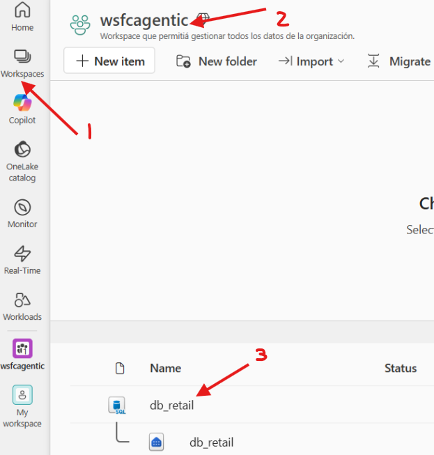
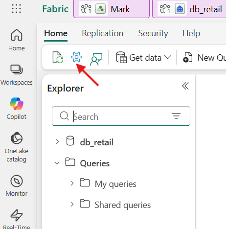
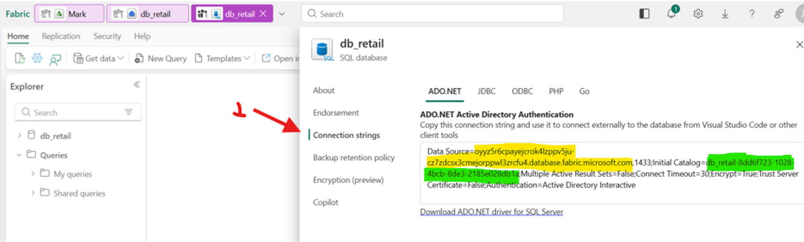

# Como obter os parâmetros do SQL Database para nossos Agentes?

Se você está seguindo todos os laboratórios do workshop em ordem, esses valores são obtidos do ambiente do Fabric implantado no [Lab 1](../../fabric/lab01-data-setup.md). Caso contrário, use o endpoint e a identificação do seu próprio banco de dados.

## Obtendo os parâmetros do Microsoft Fabric

### Passo 1 — Navegue ao workspace e abra o banco de dados

No menu lateral do Fabric, clique em **Workspaces** e selecione seu workspace. Localize o item do tipo **SQL database** (por exemplo, `db_retail`) e abra-o.



<br clear="left" />

---

### Passo 2 — Abra as configurações do banco de dados

Dentro do banco de dados, clique no ícone de **configurações** (engrenagem) na barra de ferramentas superior.



<br clear="left" />

---

### Passo 3 — Copie a connection string

No painel de configurações, selecione **Connection strings** e localize a cadeia **ADO.NET**. Dela extraia os dois valores necessários:

- `FabricWarehouseSqlEndpoint` = valor de **`Data Source`** (marcado em amarelo), **sem** o `,1433` no final
- `FabricWarehouseDatabase` = valor de **`Initial Catalog`** (marcado em verde)

```text
Data Source=xxxxx.database.fabric.microsoft.com,1433;Initial Catalog=retail_sqldatabase_xxx;...
```



<br clear="left" />

---

### Exemplo de valores resultantes

- `FabricWarehouseSqlEndpoint`:
  - `kqbvkknqlijebcyrtw2rgtsx2e-dvthxhg2tsuurev2kck26gww4q.database.fabric.microsoft.com`

- `FabricWarehouseDatabase`:
  - `retail_sqldatabase_danrdol6ases3c-6d18d61e-43a5-4281-a754-b255fc9a6c9b`

> [!TIP]
> Para a execução deste laboratório, apenas o banco de dados do Contoso Retail é necessário. Se você não está seguindo toda a sequência de laboratórios, não é necessário ter o Microsoft Fabric implantado. Assim, para as consultas do Lab 4 (Julie), você pode apontar diretamente para um banco SQL standalone (por exemplo, Azure SQL Database) usando:
>
> - `FabricWarehouseSqlEndpoint` = host SQL do seu banco standalone
> - `FabricWarehouseDatabase` = nome do seu banco
>
> Se você não fornecer esses valores, a implantação não falha: ela omite a configuração do banco de dados para o Lab 4 e exibirá um aviso para configurá-la manualmente depois.
